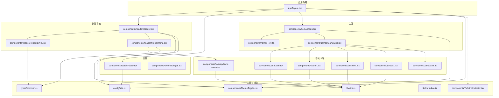
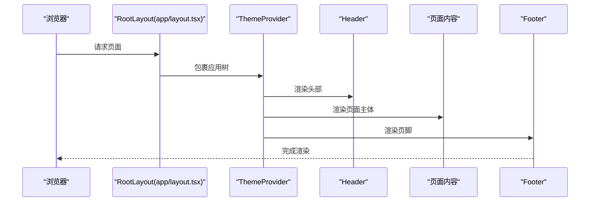
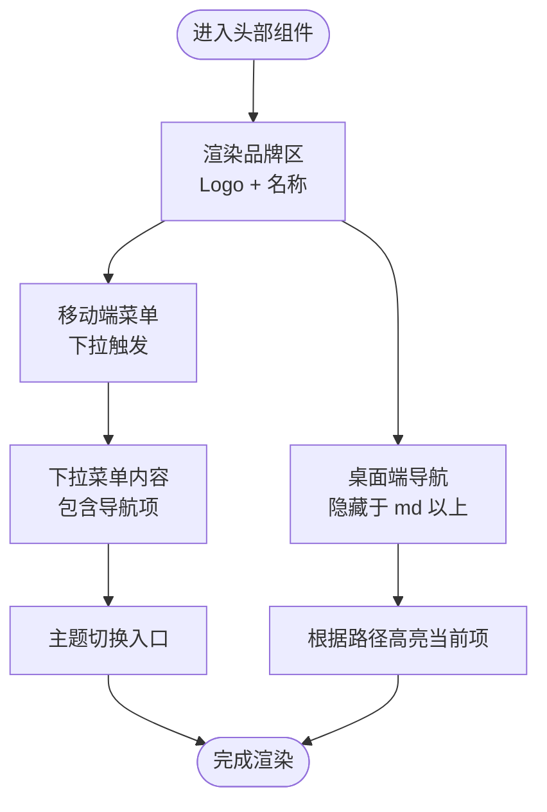
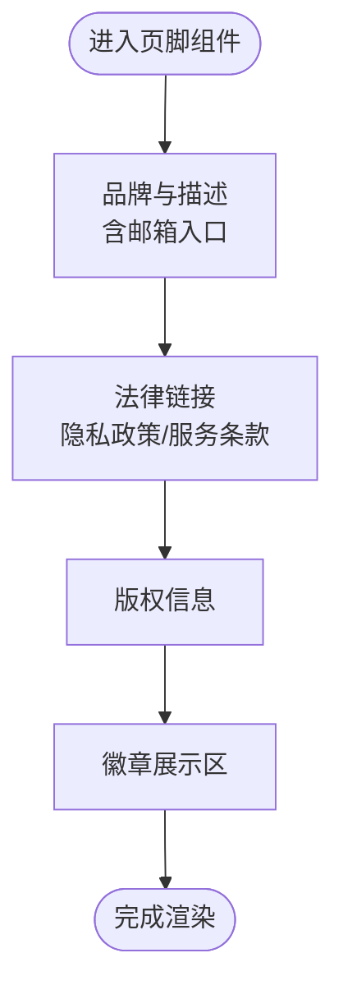
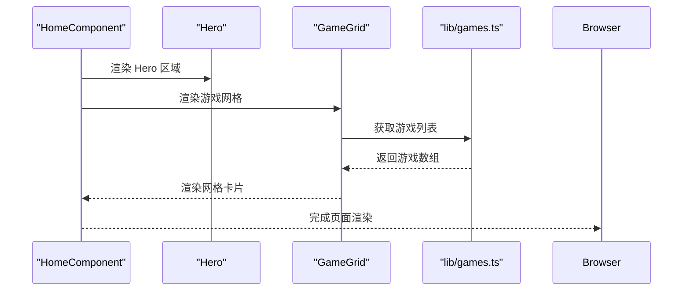
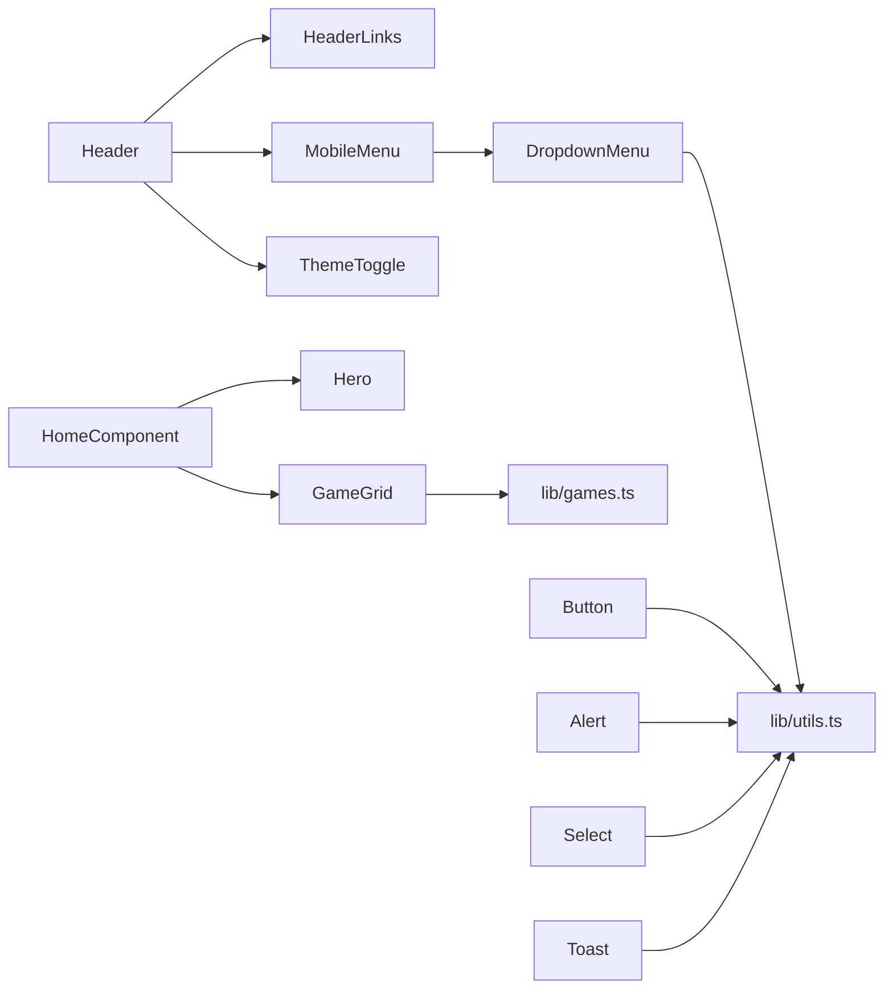

# 用户界面组件

<cite>
**本文引用的文件**
- [app/layout.tsx](file://app/layout.tsx)
- [components/header/Header.tsx](file://components/header/Header.tsx)
- [components/header/HeaderLinks.tsx](file://components/header/HeaderLinks.tsx)
- [components/header/MobileMenu.tsx](file://components/header/MobileMenu.tsx)
- [components/footer/Footer.tsx](file://components/footer/Footer.tsx)
- [components/footer/Badges.tsx](file://components/footer/Badges.tsx)
- [components/home/index.tsx](file://components/home/index.tsx)
- [components/home/Hero.tsx](file://components/home/Hero.tsx)
- [components/games/GameGrid.tsx](file://components/games/GameGrid.tsx)
- [components/ui/button.tsx](file://components/ui/button.tsx)
- [components/ui/alert.tsx](file://components/ui/alert.tsx)
- [components/ui/dropdown-menu.tsx](file://components/ui/dropdown-menu.tsx)
- [components/ui/select.tsx](file://components/ui/select.tsx)
- [components/ui/toast.tsx](file://components/ui/toast.tsx)
- [components/ui/toaster.tsx](file://components/ui/toaster.tsx)
- [components/ThemeToggle.tsx](file://components/ThemeToggle.tsx)
- [components/TailwindIndicator.tsx](file://components/TailwindIndicator.tsx)
- [config/site.ts](file://config/site.ts)
- [lib/utils.ts](file://lib/utils.ts)
- [lib/metadata.ts](file://lib/metadata.ts)
- [types/common.ts](file://types/common.ts)
</cite>

## 目录
1. [简介](#简介)
2. [项目结构](#项目结构)
3. [核心组件](#核心组件)
4. [架构总览](#架构总览)
5. [详细组件分析](#详细组件分析)
6. [依赖关系分析](#依赖关系分析)
7. [性能考虑](#性能考虑)
8. [故障排查指南](#故障排查指南)
9. [结论](#结论)
10. [附录](#附录)

## 简介
本文件系统化梳理该 Next.js 项目的用户界面组件体系，覆盖头部导航、页脚、基础 UI 组件库以及主页组件的设计与实现。内容包括组件的视觉外观、行为模式、交互方式、属性/事件/插槽/自定义选项、使用示例、响应式与无障碍建议、状态与动画、样式自定义与主题支持，以及跨浏览器与性能优化策略。

## 项目结构
该应用采用分层与功能模块结合的组织方式：页面布局在 app 目录，通用 UI 组件集中在 components/ui，业务组件（如游戏列表）位于 components/games，页面级容器位于 components/home，站点配置与工具函数位于 config、lib、types 等目录。



图表来源
- [app/layout.tsx](file://app/layout.tsx#L32-L77)
- [components/header/Header.tsx](file://components/header/Header.tsx#L1-L45)
- [components/header/HeaderLinks.tsx](file://components/header/HeaderLinks.tsx#L1-L46)
- [components/header/MobileMenu.tsx](file://components/header/MobileMenu.tsx#L1-L70)
- [components/footer/Footer.tsx](file://components/footer/Footer.tsx#L1-L67)
- [components/footer/Badges.tsx](file://components/footer/Badges.tsx#L1-L15)
- [components/home/index.tsx](file://components/home/index.tsx#L1-L12)
- [components/home/Hero.tsx](file://components/home/Hero.tsx#L1-L13)
- [components/games/GameGrid.tsx](file://components/games/GameGrid.tsx#L1-L15)
- [components/ui/button.tsx](file://components/ui/button.tsx#L1-L58)
- [components/ui/alert.tsx](file://components/ui/alert.tsx#L1-L60)
- [components/ui/dropdown-menu.tsx](file://components/ui/dropdown-menu.tsx#L1-L202)
- [components/ui/select.tsx](file://components/ui/select.tsx#L1-L160)
- [components/ui/toast.tsx](file://components/ui/toast.tsx#L1-L130)
- [components/ui/toaster.tsx](file://components/ui/toaster.tsx#L1-L200)
- [components/ThemeToggle.tsx](file://components/ThemeToggle.tsx#L1-L200)
- [components/TailwindIndicator.tsx](file://components/TailwindIndicator.tsx#L1-L200)
- [config/site.ts](file://config/site.ts#L1-L200)
- [lib/utils.ts](file://lib/utils.ts#L1-L200)
- [lib/metadata.ts](file://lib/metadata.ts#L1-L200)
- [types/common.ts](file://types/common.ts#L1-L200)

章节来源
- [app/layout.tsx](file://app/layout.tsx#L32-L77)

## 核心组件
- 头部导航：包含品牌标识、主导航链接、主题切换与移动端菜单。
- 页脚：版权信息、法律链接与徽章展示。
- 基础 UI 组件库：按钮、警示框、下拉菜单、选择器、吐司与吐司容器。
- 主页组件：Hero 区域与游戏网格展示。

章节来源
- [components/header/Header.tsx](file://components/header/Header.tsx#L1-L45)
- [components/footer/Footer.tsx](file://components/footer/Footer.tsx#L1-L67)
- [components/ui/button.tsx](file://components/ui/button.tsx#L1-L58)
- [components/ui/alert.tsx](file://components/ui/alert.tsx#L1-L60)
- [components/ui/dropdown-menu.tsx](file://components/ui/dropdown-menu.tsx#L1-L202)
- [components/ui/select.tsx](file://components/ui/select.tsx#L1-L160)
- [components/ui/toast.tsx](file://components/ui/toast.tsx#L1-L130)
- [components/ui/toaster.tsx](file://components/ui/toaster.tsx#L1-L200)
- [components/home/Hero.tsx](file://components/home/Hero.tsx#L1-L13)
- [components/games/GameGrid.tsx](file://components/games/GameGrid.tsx#L1-L15)

## 架构总览
应用通过根布局注入全局主题、头部与页脚，页面内容由路由驱动。主页容器负责组织 Hero 与游戏网格；游戏网格从数据层读取游戏列表并渲染卡片。



图表来源
- [app/layout.tsx](file://app/layout.tsx#L32-L77)

## 详细组件分析

### 头部导航系统
- 结构组成
  - 品牌区：包含 Logo 与站点名称，支持深浅色主题下的文字颜色。
  - 桌面端导航：隐藏于 md 断点之上，高亮当前路径。
  - 移动端菜单：使用下拉菜单承载导航项，包含品牌区入口。
  - 主题切换：在桌面端与移动端均提供切换入口。
- 行为模式
  - 路径高亮：基于当前路径动态计算激活态。
  - 移动端菜单：点击触发下拉，支持品牌区直达首页。
- 可访问性
  - 使用语义化标题与标签，确保键盘可达与屏幕阅读器友好。
- 响应式
  - 使用断点控制导航显示与隐藏，保证移动端体验。
- 自定义与扩展
  - 导航项通过类型定义约束，便于扩展新链接。
  - 主题切换与品牌区可独立替换或扩展。



图表来源
- [components/header/Header.tsx](file://components/header/Header.tsx#L1-L45)
- [components/header/HeaderLinks.tsx](file://components/header/HeaderLinks.tsx#L1-L46)
- [components/header/MobileMenu.tsx](file://components/header/MobileMenu.tsx#L1-L70)

章节来源
- [components/header/Header.tsx](file://components/header/Header.tsx#L1-L45)
- [components/header/HeaderLinks.tsx](file://components/header/HeaderLinks.tsx#L1-L46)
- [components/header/MobileMenu.tsx](file://components/header/MobileMenu.tsx#L1-L70)
- [types/common.ts](file://types/common.ts#L1-L200)

### 页脚组件
- 结构组成
  - 品牌与描述区域，包含社交邮箱入口。
  - 法律链接：隐私政策与服务条款。
  - 版权信息与徽章展示区。
- 视觉与交互
  - 使用栅格布局适配多列展示，移动端堆叠。
  - 徽章区域用于外部链接占位。
- 可访问性
  - 链接具备标题与标签，满足可感知性要求。
- 自定义
  - 社交链接与版权文案来自站点配置，便于统一管理。



图表来源
- [components/footer/Footer.tsx](file://components/footer/Footer.tsx#L1-L67)
- [components/footer/Badges.tsx](file://components/footer/Badges.tsx#L1-L15)
- [config/site.ts](file://config/site.ts#L1-L200)

章节来源
- [components/footer/Footer.tsx](file://components/footer/Footer.tsx#L1-L67)
- [components/footer/Badges.tsx](file://components/footer/Badges.tsx#L1-L15)
- [config/site.ts](file://config/site.ts#L1-L200)

### 基础 UI 组件库
- 按钮 Button
  - 支持多种变体与尺寸，通过变体系统统一风格。
  - 支持作为包裹元素渲染，便于组合其他组件。
  - 属性：变体、尺寸、是否包裹子元素等。
  - 事件：原生按钮事件透传。
  - 插槽：无插槽，通过子元素组合。
- 警示框 Alert
  - 提供标题与描述子组件，支持破坏性样式。
  - 属性：变体。
- 下拉菜单 Dropdown
  - 提供触发器、内容、分组、子菜单、复选/单选项、标签、分隔符等。
  - 动画：内置开合与缩放/滑入动画。
  - 属性：对齐、宽度、位置等。
- 选择器 Select
  - 支持滚动按钮、视口、标签、分隔符与选项。
  - 动画：弹出时的开合与位移动画。
  - 属性：位置、尺寸等。
- 吐司 Toast 与吐司容器 Toaster
  - 提供提供者、视口、标题、描述、关闭与动作按钮。
  - 动画：滑入/滑出与淡入/淡出，支持滑动关闭。
  - 属性：变体（默认/破坏性）。

```mermaid
classDiagram
class Button {
+变体 : "default|destructive|outline|secondary|ghost|link"
+尺寸 : "default|sm|lg|icon"
+asChild : boolean
}
class Alert {
+变体 : "default|destructive"
}
class Dropdown {
+DropdownTrigger
+DropdownContent
+DropdownMenuGroup
+DropdownMenuItem
+DropdownMenuLabel
+DropdownMenuSeparator
}
class Select {
+SelectTrigger
+SelectContent
+SelectItem
+SelectLabel
+SelectSeparator
}
class Toast {
+variant : "default|destructive"
+ToastViewport
+ToastTitle
+ToastDescription
+ToastClose
+ToastAction
}
Button --> "使用" Utils["lib/utils.ts"]
Alert --> "使用" Utils
Dropdown --> "使用" Utils
Select --> "使用" Utils
Toast --> "使用" Utils
```

图表来源
- [components/ui/button.tsx](file://components/ui/button.tsx#L1-L58)
- [components/ui/alert.tsx](file://components/ui/alert.tsx#L1-L60)
- [components/ui/dropdown-menu.tsx](file://components/ui/dropdown-menu.tsx#L1-L202)
- [components/ui/select.tsx](file://components/ui/select.tsx#L1-L160)
- [components/ui/toast.tsx](file://components/ui/toast.tsx#L1-L130)
- [lib/utils.ts](file://lib/utils.ts#L1-L200)

章节来源
- [components/ui/button.tsx](file://components/ui/button.tsx#L1-L58)
- [components/ui/alert.tsx](file://components/ui/alert.tsx#L1-L60)
- [components/ui/dropdown-menu.tsx](file://components/ui/dropdown-menu.tsx#L1-L202)
- [components/ui/select.tsx](file://components/ui/select.tsx#L1-L160)
- [components/ui/toast.tsx](file://components/ui/toast.tsx#L1-L130)
- [components/ui/toaster.tsx](file://components/ui/toaster.tsx#L1-L200)
- [lib/utils.ts](file://lib/utils.ts#L1-L200)

### 主页组件
- 主页容器 HomeComponent
  - 将内容限制在最大宽度并设置内边距，居中布局。
- Hero 组件
  - 居中标题与描述，响应式字号与间距。
- 游戏网格 GameGrid
  - 响应式网格布局，按列数自适应。
  - 从数据层获取游戏列表并渲染卡片。



图表来源
- [components/home/index.tsx](file://components/home/index.tsx#L1-L12)
- [components/home/Hero.tsx](file://components/home/Hero.tsx#L1-L13)
- [components/games/GameGrid.tsx](file://components/games/GameGrid.tsx#L1-L15)
- [lib/games.ts](file://lib/games.ts#L1-L200)

章节来源
- [components/home/index.tsx](file://components/home/index.tsx#L1-L12)
- [components/home/Hero.tsx](file://components/home/Hero.tsx#L1-L13)
- [components/games/GameGrid.tsx](file://components/games/GameGrid.tsx#L1-L15)

## 依赖关系分析
- 组件耦合
  - 头部与移动端菜单依赖下拉菜单组件以实现菜单功能。
  - 主题切换组件贯穿头部与移动端菜单，保持一致的主题体验。
  - 主页容器依赖 Hero 与 GameGrid，GameGrid 依赖数据层。
  - 基础 UI 组件广泛使用工具函数进行类名合并与样式变体。
- 外部依赖
  - 主题系统通过第三方库提供深浅色主题切换。
  - 元数据生成与 SEO 相关逻辑集中于工具函数。
- 可能的循环依赖
  - 当前结构未见直接循环导入；若未来扩展，需避免组件间相互依赖。



图表来源
- [components/header/Header.tsx](file://components/header/Header.tsx#L1-L45)
- [components/header/HeaderLinks.tsx](file://components/header/HeaderLinks.tsx#L1-L46)
- [components/header/MobileMenu.tsx](file://components/header/MobileMenu.tsx#L1-L70)
- [components/ui/dropdown-menu.tsx](file://components/ui/dropdown-menu.tsx#L1-L202)
- [components/ui/button.tsx](file://components/ui/button.tsx#L1-L58)
- [components/ui/alert.tsx](file://components/ui/alert.tsx#L1-L60)
- [components/ui/select.tsx](file://components/ui/select.tsx#L1-L160)
- [components/ui/toast.tsx](file://components/ui/toast.tsx#L1-L130)
- [components/home/index.tsx](file://components/home/index.tsx#L1-L12)
- [components/home/Hero.tsx](file://components/home/Hero.tsx#L1-L13)
- [components/games/GameGrid.tsx](file://components/games/GameGrid.tsx#L1-L15)
- [lib/utils.ts](file://lib/utils.ts#L1-L200)

章节来源
- [lib/utils.ts](file://lib/utils.ts#L1-L200)
- [lib/metadata.ts](file://lib/metadata.ts#L1-L200)
- [config/site.ts](file://config/site.ts#L1-L200)

## 性能考虑
- 渲染优化
  - 使用响应式断点减少不必要的 DOM 结构与样式计算。
  - 下拉与选择器内容在打开时才挂载到 Portal，降低初始渲染压力。
- 动画与过渡
  - 吐司与下拉菜单、选择器使用轻量动画，注意在低端设备上可能影响性能。
- 资源加载
  - 图片使用 Next.js Image，自动优化尺寸与格式。
- 代码分割
  - 页面按路由拆分，组件按功能模块拆分，有利于懒加载与缓存复用。

## 故障排查指南
- 主题不生效
  - 检查主题提供器配置与默认主题设置。
  - 确认深浅色样式类是否正确注入。
- 移动端菜单无法打开
  - 检查下拉菜单触发器与内容是否正确引入与渲染。
  - 确认移动端断点与样式类是否正确。
- 链接跳转异常
  - 检查导航项的 href 与 target 设置，确保相对/绝对路径正确。
- 吐司不显示
  - 确认吐司提供器已包裹应用树，且调用栈正确触发。
- 图标或图片不显示
  - 检查资源路径与 Next.js Image 的宽高设置。

章节来源
- [components/ThemeToggle.tsx](file://components/ThemeToggle.tsx#L1-L200)
- [components/ui/dropdown-menu.tsx](file://components/ui/dropdown-menu.tsx#L1-L202)
- [components/ui/toaster.tsx](file://components/ui/toaster.tsx#L1-L200)
- [components/header/HeaderLinks.tsx](file://components/header/HeaderLinks.tsx#L1-L46)
- [components/header/MobileMenu.tsx](file://components/header/MobileMenu.tsx#L1-L70)

## 结论
该组件系统以清晰的分层与模块化设计为基础，头部导航与页脚提供一致的品牌与导航体验，基础 UI 组件库通过变体系统与动画增强可用性，主页组件聚焦内容呈现与响应式布局。通过主题系统与工具函数，组件具备良好的可定制性与可维护性。建议在后续迭代中持续关注动画性能与无障碍细节，以提升整体用户体验。

## 附录
- 使用示例与最佳实践
  - 在页面容器中优先使用组件提供的变体与尺寸，避免硬编码样式。
  - 对需要高亮的导航项，使用路径匹配逻辑动态高亮。
  - 吐司用于非阻塞反馈，避免频繁触发导致干扰。
- 响应式与无障碍建议
  - 使用语义化标签与标题属性，确保键盘可达与屏幕阅读器友好。
  - 在小屏设备上优先使用下拉菜单承载导航项。
- 样式自定义与主题支持
  - 通过变体系统与 Tailwind 类组合实现主题切换与样式覆盖。
  - 使用站点配置集中管理品牌与社交链接等信息。