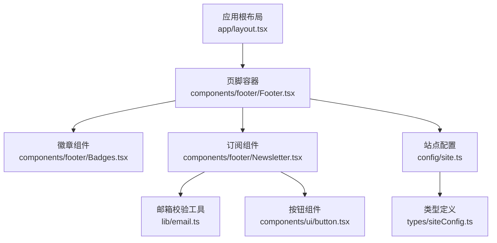
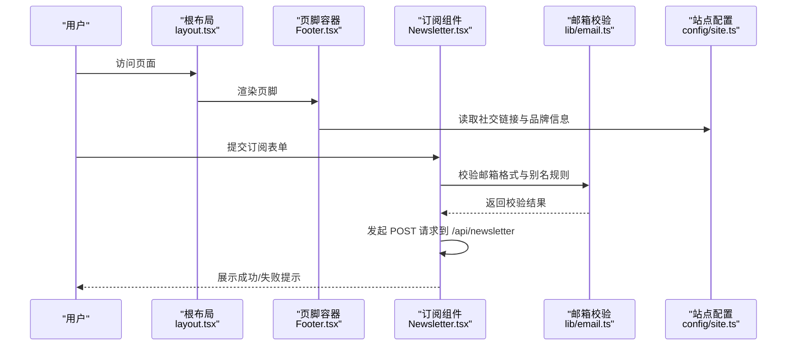
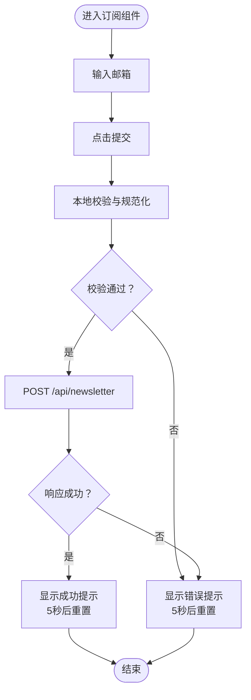
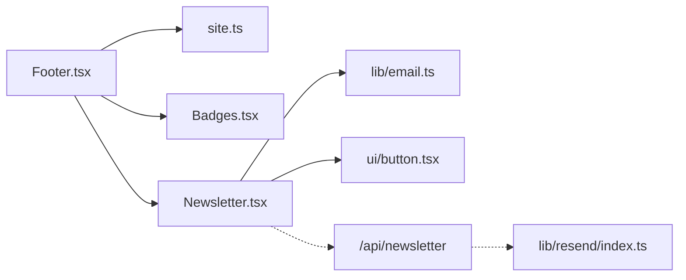

# 页脚系统

<cite>
**本文引用的文件**
- [components/footer/Footer.tsx](file://components/footer/Footer.tsx)
- [components/footer/Badges.tsx](file://components/footer/Badges.tsx)
- [components/footer/Newsletter.tsx](file://components/footer/Newsletter.tsx)
- [app/layout.tsx](file://app/layout.tsx)
- [config/site.ts](file://config/site.ts)
- [types/siteConfig.ts](file://types/siteConfig.ts)
- [lib/email.ts](file://lib/email.ts)
- [components/ui/button.tsx](file://components/ui/button.tsx)
- [emails/newsletter-welcome.tsx](file://emails/newsletter-welcome.tsx)
- [emails/submission-notification.tsx](file://emails/submission-notification.tsx)
- [lib/resend/index.ts](file://lib/resend/index.ts)
</cite>

## 目录
1. [简介](#简介)
2. [项目结构](#项目结构)
3. [核心组件](#核心组件)
4. [架构总览](#架构总览)
5. [组件详解](#组件详解)
6. [依赖关系分析](#依赖关系分析)
7. [性能与可访问性](#性能与可访问性)
8. [故障排查指南](#故障排查指南)
9. [结论](#结论)
10. [附录](#附录)

## 简介
本文件系统性梳理页脚系统的整体设计与实现，覆盖以下方面：
- 页脚布局结构、内容组织与视觉设计
- 徽章展示与链接配置
- 邮件订阅表单的实现细节与用户交互流程
- 品牌展示与定制化选项
- 不同设备的响应式适配与 SEO 考量
- 完整实现示例与最佳实践

## 项目结构
页脚系统由三个核心组件构成，并在应用根布局中统一挂载：
- 页脚容器：负责整体布局、版权信息与法律链接
- 徽章组件：用于品牌背书与外部链接展示
- 订阅组件：提供邮件订阅表单与状态反馈

图表来源
- [app/layout.tsx](file://app/layout.tsx#L59-L59)
- [components/footer/Footer.tsx](file://components/footer/Footer.tsx#L1-L67)
- [components/footer/Badges.tsx](file://components/footer/Badges.tsx#L1-L15)
- [components/footer/Newsletter.tsx](file://components/footer/Newsletter.tsx#L1-L91)
- [lib/email.ts](file://lib/email.ts#L1-L91)
- [components/ui/button.tsx](file://components/ui/button.tsx#L1-L58)
- [config/site.ts](file://config/site.ts#L1-L45)
- [types/siteConfig.ts](file://types/siteConfig.ts#L1-L33)

章节来源
- [app/layout.tsx](file://app/layout.tsx#L32-L77)
- [components/footer/Footer.tsx](file://components/footer/Footer.tsx#L1-L67)

## 核心组件
- 页脚容器（Footer）：承载品牌信息、社交链接入口、版权与法律链接，并内嵌徽章区域
- 徽章组件（Badges）：用于放置品牌背书或外部链接的徽章区
- 订阅组件（Newsletter）：提供邮箱订阅表单、输入校验、网络请求与状态反馈

章节来源
- [components/footer/Footer.tsx](file://components/footer/Footer.tsx#L5-L66)
- [components/footer/Badges.tsx](file://components/footer/Badges.tsx#L3-L14)
- [components/footer/Newsletter.tsx](file://components/footer/Newsletter.tsx#L8-L90)

## 架构总览
下图展示了页脚系统在应用中的装配关系与数据流：

图表来源
- [app/layout.tsx](file://app/layout.tsx#L59-L59)
- [components/footer/Footer.tsx](file://components/footer/Footer.tsx#L22-L34)
- [components/footer/Newsletter.tsx](file://components/footer/Newsletter.tsx#L15-L55)
- [lib/email.ts](file://lib/email.ts#L15-L53)
- [config/site.ts](file://config/site.ts#L27-L33)

## 组件详解

### 页脚容器（Footer）
- 布局结构
  - 采用网格布局，移动端单列，平板双列，桌面端多列自适应
  - 左侧区域包含品牌标题、简短描述与社交邮箱入口
  - 底部区域包含版权信息与隐私政策、服务条款链接
- 视觉设计
  - 使用深色背景与浅色文字，强调对比度
  - 通过边框线分隔内容区块，提升层次感
- 品牌与社交
  - 通过站点配置读取品牌名称与社交链接
  - 邮箱图标仅在配置存在时渲染，避免空链接

章节来源
- [components/footer/Footer.tsx](file://components/footer/Footer.tsx#L7-L66)
- [config/site.ts](file://config/site.ts#L14-L44)

### 徽章组件（Badges）
- 功能定位
  - 用于放置品牌背书、合作伙伴标识或外部链接徽章
- 展示逻辑
  - 当前版本仅包含一个外链徽章容器，便于扩展
- 链接配置
  - 外链地址硬编码于组件内部，建议通过站点配置集中管理以支持多环境

章节来源
- [components/footer/Badges.tsx](file://components/footer/Badges.tsx#L3-L14)

### 订阅组件（Newsletter）
- 表单结构
  - 输入框：邮箱输入，必填，禁用态随状态切换
  - 按钮：提交按钮，根据状态显示文案与禁用态
  - 反馈：成功/失败提示文本
- 交互流程
  - 用户提交后先进行本地邮箱格式与别名规范化校验
  - 校验通过后发起 POST 请求至 /api/newsletter
  - 成功/失败均返回对应状态与消息，5 秒后自动恢复到空闲态
- 状态机
  - idle：初始态
  - loading：提交中
  - success：订阅成功
  - error：校验失败或网络异常

图表来源
- [components/footer/Newsletter.tsx](file://components/footer/Newsletter.tsx#L15-L55)
- [lib/email.ts](file://lib/email.ts#L15-L53)

章节来源
- [components/footer/Newsletter.tsx](file://components/footer/Newsletter.tsx#L8-L90)
- [lib/email.ts](file://lib/email.ts#L1-L91)
- [components/ui/button.tsx](file://components/ui/button.tsx#L1-L58)

### 邮件订阅 API 与模板（概念说明）
- API 路由
  - 订阅组件通过 /api/newsletter 提交数据，需在服务端实现该路由以完成订阅入库与后续邮件发送
- 邮件模板
  - 提供欢迎邮件与提交通知邮件的 React 模板，便于集成第三方邮件服务（如 Resend）
- 邮件服务集成
  - 通过 Resend SDK 初始化客户端，需设置 API Key 与受众 ID 环境变量

章节来源
- [components/footer/Newsletter.tsx](file://components/footer/Newsletter.tsx#L32-L42)
- [emails/newsletter-welcome.tsx](file://emails/newsletter-welcome.tsx#L1-L99)
- [emails/submission-notification.tsx](file://emails/submission-notification.tsx#L1-L101)
- [lib/resend/index.ts](file://lib/resend/index.ts#L1-L13)

## 依赖关系分析
- 组件耦合
  - Footer 依赖站点配置与徽章组件；徽章组件当前无外部依赖
  - Newsletter 依赖邮箱校验工具与按钮组件；按钮组件为通用 UI 组件
- 数据流向
  - Footer 从站点配置读取品牌与社交信息
  - Newsletter 在客户端执行邮箱校验与网络请求
- 外部依赖
  - 邮件服务集成（Resend）通过环境变量启用

图表来源
- [components/footer/Footer.tsx](file://components/footer/Footer.tsx#L1-L2)
- [config/site.ts](file://config/site.ts#L1-L45)
- [components/footer/Badges.tsx](file://components/footer/Badges.tsx#L1-L1)
- [components/footer/Newsletter.tsx](file://components/footer/Newsletter.tsx#L3-L6)
- [lib/email.ts](file://lib/email.ts#L1-L91)
- [components/ui/button.tsx](file://components/ui/button.tsx#L1-L58)
- [lib/resend/index.ts](file://lib/resend/index.ts#L1-L13)

章节来源
- [components/footer/Footer.tsx](file://components/footer/Footer.tsx#L1-L6)
- [components/footer/Newsletter.tsx](file://components/footer/Newsletter.tsx#L3-L6)

## 性能与可访问性
- 性能
  - 订阅组件使用受控表单与状态机，避免不必要的重渲染
  - 邮箱校验在客户端完成，减少无效网络请求
- 可访问性
  - 表单字段具备占位符与禁用态提示
  - 按钮在加载态禁用，避免重复提交
  - 社交链接提供 aria-label 与 title，增强屏幕阅读器体验
- 响应式适配
  - 页脚网格在小屏单列、中屏双列、大屏多列，确保内容可读性
  - 文字大小与间距按断点调整，保证在不同设备上的一致体验

章节来源
- [components/footer/Newsletter.tsx](file://components/footer/Newsletter.tsx#L62-L70)
- [components/footer/Footer.tsx](file://components/footer/Footer.tsx#L10-L10)
- [components/footer/Footer.tsx](file://components/footer/Footer.tsx#L22-L34)

## 故障排查指南
- 订阅失败
  - 检查邮箱格式是否符合规范，确认本地校验是否通过
  - 查看网络请求是否成功到达 /api/newsletter，关注返回的错误信息
  - 若出现“订阅失败”，组件会在 5 秒后自动恢复空闲态
- 邮件服务不可用
  - 确认环境变量 RESEND_API_KEY 是否正确配置
  - 检查 Resend 客户端初始化是否成功
- 链接无法打开
  - 确认站点配置中的社交链接是否填写完整
  - 检查徽章组件的外链地址是否有效

章节来源
- [components/footer/Newsletter.tsx](file://components/footer/Newsletter.tsx#L48-L54)
- [lib/resend/index.ts](file://lib/resend/index.ts#L5-L9)
- [config/site.ts](file://config/site.ts#L27-L33)

## 结论
页脚系统以简洁清晰的布局承载品牌信息与用户触点，结合本地邮箱校验与状态反馈，提供良好的用户体验。通过站点配置集中管理品牌与社交信息，有助于在多环境部署中保持一致性。建议后续扩展：
- 将徽章链接迁移至站点配置，便于多环境维护
- 在 Footer 中增加订阅组件的入口，提升可见性
- 在 /api/newsletter 中完善速率限制与订阅确认流程

## 附录

### 品牌展示与定制化选项
- 品牌信息
  - 名称、标语、描述、图标等通过站点配置集中管理
- 社交链接
  - 支持多平台链接（如 GitHub、Twitter、Discord、Bluesky、邮箱），按需启用
- 视觉风格
  - 通过主题色与暗黑模式配置，适配不同用户偏好

章节来源
- [config/site.ts](file://config/site.ts#L14-L44)
- [types/siteConfig.ts](file://types/siteConfig.ts#L10-L32)

### SEO 优化建议
- 法律链接
  - 版权与法律链接已在页脚底部展示，便于搜索引擎抓取
- 结构化数据
  - 可在页面头部引入结构化数据组件，提升搜索结果丰富度
- 响应式与可访问性
  - 已具备基础的响应式与可访问性措施，建议持续优化加载性能与字体渲染

章节来源
- [components/footer/Footer.tsx](file://components/footer/Footer.tsx#L39-L58)