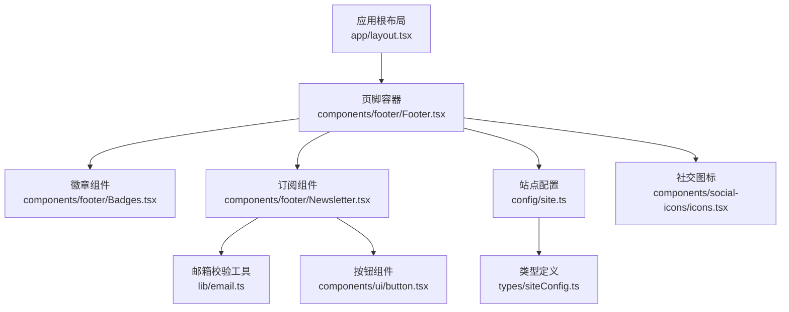
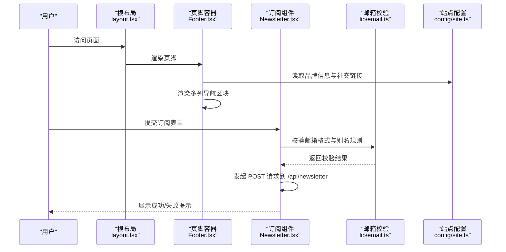
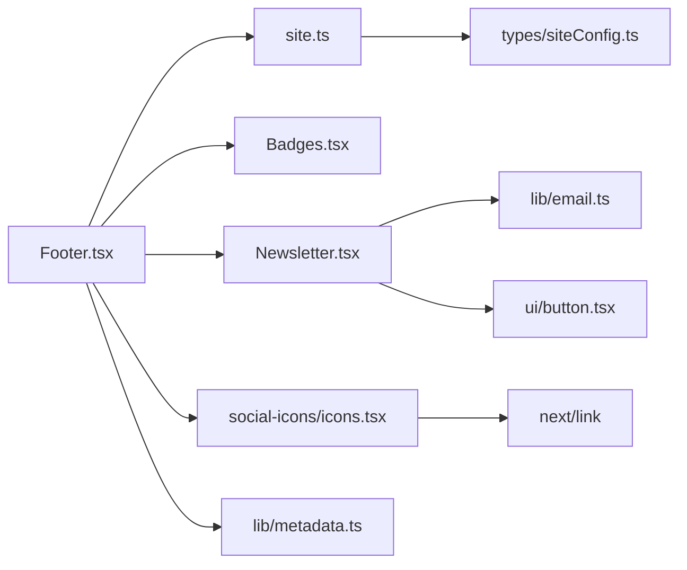

# 页脚系统

<cite>
**本文引用的文件**
- [components/footer/Footer.tsx](file://components/footer/Footer.tsx)
- [components/footer/Badges.tsx](file://components/footer/Badges.tsx)
- [components/footer/Newsletter.tsx](file://components/footer/Newsletter.tsx)
- [app/layout.tsx](file://app/layout.tsx)
- [config/site.ts](file://config/site.ts)
- [types/siteConfig.ts](file://types/siteConfig.ts)
- [lib/email.ts](file://lib/email.ts)
- [components/ui/button.tsx](file://components/ui/button.tsx)
- [emails/newsletter-welcome.tsx](file://emails/newsletter-welcome.tsx)
- [emails/submission-notification.tsx](file://emails/submission-notification.tsx)
- [lib/resend/index.ts](file://lib/resend/index.ts)
- [lib/metadata.ts](file://lib/metadata.ts)
- [components/games/GameNavigation.tsx](file://components/games/GameNavigation.tsx)
</cite>

## 更新摘要
**变更内容**
- 页脚组件从简单布局重构为多列信息枢纽架构
- 新增品牌信息区块、游戏导航链接、资源链接和订阅功能
- 全面采用Next.js Link组件提升SEO和导航性能
- 重新设计网格布局结构，支持响应式多列显示
- 增强社交链接和品牌展示功能

## 目录
1. [简介](#简介)
2. [项目结构](#项目结构)
3. [核心组件](#核心组件)
4. [架构总览](#架构总览)
5. [组件详解](#组件详解)
6. [依赖关系分析](#依赖关系分析)
7. [性能与可访问性](#性能与可访问性)
8. [故障排查指南](#故障排查指南)
9. [结论](#结论)
10. [附录](#附录)

## 简介
本文件系统性梳理页脚系统的整体设计与实现，覆盖以下方面：
- 页脚布局结构、内容组织与视觉设计
- 多列信息枢纽架构的设计理念与实现
- 徽章展示与链接配置
- 邮件订阅表单的实现细节与用户交互流程
- 品牌展示与定制化选项
- 不同设备的响应式适配与 SEO 考量
- 完整实现示例与最佳实践

## 项目结构
页脚系统由四个核心组件构成，并在应用根布局中统一挂载：
- 页脚容器：负责整体布局、品牌信息、导航链接与版权信息
- 徽章组件：用于品牌背书与外部链接展示
- 订阅组件：提供邮件订阅表单与状态反馈
- 社交图标：集成多种社交平台链接

**图表来源**
- [app/layout.tsx:1-88](file://app/layout.tsx#L1-L88)
- [components/footer/Footer.tsx:1-174](file://components/footer/Footer.tsx#L1-L174)
- [components/footer/Badges.tsx:1-15](file://components/footer/Badges.tsx#L1-L15)
- [components/footer/Newsletter.tsx:1-91](file://components/footer/Newsletter.tsx#L1-L91)
- [config/site.ts:1-45](file://config/site.ts#L1-L45)
- [types/siteConfig.ts:1-33](file://types/siteConfig.ts#L1-L33)

**章节来源**
- [app/layout.tsx:44-71](file://app/layout.tsx#L44-L71)
- [components/footer/Footer.tsx:7-173](file://components/footer/Footer.tsx#L7-L173)

## 核心组件
- 页脚容器（Footer）：采用多列网格布局，包含品牌信息、游戏导航、资源链接和订阅功能
- 徽章组件（Badges）：用于放置品牌背书或外部链接徽章区
- 订阅组件（Newsletter）：提供邮箱订阅表单、输入校验、网络请求与状态反馈
- 社交图标组件：集成Twitter、GitHub、Bluesky、邮箱等多种社交平台链接

**章节来源**
- [components/footer/Footer.tsx:7-173](file://components/footer/Footer.tsx#L7-L173)
- [components/footer/Badges.tsx:3-14](file://components/footer/Badges.tsx#L3-L14)
- [components/footer/Newsletter.tsx:8-90](file://components/footer/Newsletter.tsx#L8-L90)

## 架构总览
下图展示了页脚系统在应用中的装配关系与数据流：

**图表来源**
- [app/layout.tsx:67-71](file://app/layout.tsx#L67-L71)
- [components/footer/Footer.tsx:13-159](file://components/footer/Footer.tsx#L13-L159)
- [components/footer/Newsletter.tsx:15-55](file://components/footer/Newsletter.tsx#L15-L55)
- [lib/email.ts:1-91](file://lib/email.ts#L1-L91)
- [config/site.ts:14-44](file://config/site.ts#L14-L44)

## 组件详解

### 页脚容器（Footer）
**重大重构**：从简单布局转变为多列信息枢纽架构

- **布局结构**
  - 采用12列网格系统，移动端单列，平板双列，桌面端六列自适应
  - 左侧区域包含品牌标题、简短描述与社交邮箱入口
  - 中间区域包含游戏导航链接（Pinpoint、归档、玩法说明）
  - 右侧区域包含资源链接（关于、隐私政策、服务条款）
  - 底部区域包含订阅功能和外部链接
  - 底部版权信息与法律链接

- **视觉设计**
  - 使用深色背景（bg-gray-900）与浅色文字，强调对比度
  - 通过边框线分隔内容区块，提升层次感
  - 采用响应式网格布局，确保在不同设备上的最佳显示效果

- **品牌与导航**
  - 通过站点配置读取品牌名称与社交链接
  - 邮箱图标仅在配置存在时渲染，避免空链接
  - 所有导航链接使用Next.js Link组件，提升SEO和导航性能

**章节来源**
- [components/footer/Footer.tsx:13-159](file://components/footer/Footer.tsx#L13-L159)
- [config/site.ts:14-44](file://config/site.ts#L14-L44)

### 徽章组件（Badges）
- **功能定位**
  - 用于放置品牌背书、合作伙伴标识或外部链接徽章
- **展示逻辑**
  - 当前版本仅包含一个外链徽章容器，便于扩展
- **链接配置**
  - 外链地址硬编码于组件内部，建议通过站点配置集中管理以支持多环境

**章节来源**
- [components/footer/Badges.tsx:3-14](file://components/footer/Badges.tsx#L3-L14)

### 订阅组件（Newsletter）
- **表单结构**
  - 输入框：邮箱输入，必填，禁用态随状态切换
  - 按钮：提交按钮，根据状态显示文案与禁用态
  - 反馈：成功/失败提示文本
- **交互流程**
  - 用户提交后先进行本地邮箱格式与别名规范化校验
  - 校验通过后发起 POST 请求至 /api/newsletter
  - 成功/失败均返回对应状态与消息，5 秒后自动恢复到空闲态
- **状态机**
  - idle：初始态
  - loading：提交中
  - success：订阅成功
  - error：校验失败或网络异常

**图表来源**
- [components/footer/Newsletter.tsx:15-55](file://components/footer/Newsletter.tsx#L15-L55)
- [lib/email.ts:15-53](file://lib/email.ts#L15-L53)

**章节来源**
- [components/footer/Newsletter.tsx:8-90](file://components/footer/Newsletter.tsx#L8-L90)
- [lib/email.ts:1-91](file://lib/email.ts#L1-L91)
- [components/ui/button.tsx:1-58](file://components/ui/button.tsx#L1-L58)

### 社交图标组件
- **功能定位**
  - 集成多种社交平台链接，包括Twitter、GitHub、Bluesky、邮箱
- **展示逻辑**
  - 根据站点配置动态渲染可用的社交链接
  - 每个链接都包含aria-label和title属性，提升可访问性
- **链接配置**
  - 通过siteConfig.socialLinks配置社交平台URL
  - 支持Discord、Twitter、GitHub、Bluesky、邮箱等多种平台

**章节来源**
- [components/footer/Footer.tsx:23-72](file://components/footer/Footer.tsx#L23-L72)
- [config/site.ts:27-33](file://config/site.ts#L27-L33)

### 邮件订阅 API 与模板（概念说明）
- **API 路由**
  - 订阅组件通过 /api/newsletter 提交数据，需在服务端实现该路由以完成订阅入库与后续邮件发送
- **邮件模板**
  - 提供欢迎邮件与提交通知邮件的 React 模板，便于集成第三方邮件服务（如 Resend）
- **邮件服务集成**
  - 通过 Resend SDK 初始化客户端，需设置 API Key 与受众 ID 环境变量

**章节来源**
- [components/footer/Newsletter.tsx:32-42](file://components/footer/Newsletter.tsx#L32-L42)
- [emails/newsletter-welcome.tsx:1-99](file://emails/newsletter-welcome.tsx#L1-L99)
- [emails/submission-notification.tsx:1-101](file://emails/submission-notification.tsx#L1-L101)
- [lib/resend/index.ts:1-13](file://lib/resend/index.ts#L1-L13)

## 依赖关系分析
- **组件耦合**
  - Footer 依赖站点配置、徽章组件、社交图标组件；徽章组件当前无外部依赖
  - Newsletter 依赖邮箱校验工具与按钮组件；按钮组件为通用 UI 组件
  - 社交图标组件依赖Next.js Link组件和Lucide React图标库
- **数据流向**
  - Footer 从站点配置读取品牌与社交信息
  - Newsletter 在客户端执行邮箱校验与网络请求
  - 所有导航链接使用Next.js Link组件，提升SEO性能
- **外部依赖**
  - 邮件服务集成（Resend）通过环境变量启用
  - SEO优化通过generateMetadata函数实现

**图表来源**
- [components/footer/Footer.tsx:1-5](file://components/footer/Footer.tsx#L1-L5)
- [config/site.ts:1-45](file://config/site.ts#L1-L45)
- [components/footer/Badges.tsx:1-1](file://components/footer/Badges.tsx#L1-L1)
- [components/footer/Newsletter.tsx:3-6](file://components/footer/Newsletter.tsx#L3-L6)
- [lib/email.ts:1-91](file://lib/email.ts#L1-L91)
- [components/ui/button.tsx:1-58](file://components/ui/button.tsx#L1-L58)
- [lib/resend/index.ts:1-13](file://lib/resend/index.ts#L1-L13)
- [lib/metadata.ts:1-78](file://lib/metadata.ts#L1-L78)

**章节来源**
- [components/footer/Footer.tsx:1-6](file://components/footer/Footer.tsx#L1-L6)
- [components/footer/Newsletter.tsx:3-6](file://components/footer/Newsletter.tsx#L3-L6)

## 性能与可访问性
- **性能优化**
  - 订阅组件使用受控表单与状态机，避免不必要的重渲染
  - 邮箱校验在客户端完成，减少无效网络请求
  - 全面采用Next.js Link组件，提升导航性能和SEO表现
  - 响应式网格布局优化移动端性能
- **可访问性**
  - 表单字段具备占位符与禁用态提示
  - 按钮在加载态禁用，避免重复提交
  - 社交链接提供 aria-label 与 title，增强屏幕阅读器体验
  - 所有链接都包含适当的语义化标签
- **响应式适配**
  - 页脚网格在小屏单列、中屏双列、桌面端六列，确保内容可读性
  - 文字大小与间距按断点调整，保证在不同设备上的一致体验
  - 社交图标和链接在移动设备上优化显示

**章节来源**
- [components/footer/Newsletter.tsx:62-70](file://components/footer/Newsletter.tsx#L62-L70)
- [components/footer/Footer.tsx:13-159](file://components/footer/Footer.tsx#L13-L159)
- [components/footer/Footer.tsx:23-72](file://components/footer/Footer.tsx#L23-L72)

## 故障排查指南
- **订阅失败**
  - 检查邮箱格式是否符合规范，确认本地校验是否通过
  - 查看网络请求是否成功到达 /api/newsletter，关注返回的错误信息
  - 若出现"订阅失败"，组件会在 5 秒后自动恢复空闲态
- **邮件服务不可用**
  - 确认环境变量 RESEND_API_KEY 是否正确配置
  - 检查 Resend 客户端初始化是否成功
- **链接无法打开**
  - 确认站点配置中的社交链接是否填写完整
  - 检查徽章组件的外链地址是否有效
- **导航性能问题**
  - 确认Next.js Link组件是否正确导入
  - 检查SEO元数据配置是否正确
  - 验证响应式布局在不同设备上的表现

**章节来源**
- [components/footer/Newsletter.tsx:48-54](file://components/footer/Newsletter.tsx#L48-L54)
- [lib/resend/index.ts:5-9](file://lib/resend/index.ts#L5-L9)
- [config/site.ts:27-33](file://config/site.ts#L27-L33)

## 结论
页脚系统经过重大重构，从简单的两列布局转变为功能丰富的多列信息枢纽。新架构通过以下改进提升了用户体验和SEO表现：
- **多列信息枢纽**：将品牌信息、游戏导航、资源链接和订阅功能有机整合
- **Next.js Link组件**：全面采用Next.js Link提升SEO和导航性能
- **响应式设计**：支持从移动端到桌面端的完美适配
- **模块化架构**：清晰的组件分离便于维护和扩展

建议后续扩展：
- 将徽章链接迁移至站点配置，便于多环境维护
- 在Footer中增加订阅组件的入口，提升可见性
- 在/api/newsletter中完善速率限制与订阅确认流程
- 考虑添加更多社交平台支持和品牌展示选项

## 附录

### 品牌展示与定制化选项
- **品牌信息**
  - 名称、标语、描述、图标等通过站点配置集中管理
  - 支持多语言内容展示
- **社交链接**
  - 支持多平台链接（如 GitHub、Twitter、Discord、Bluesky、邮箱），按需启用
  - 每个链接都包含aria-label和title属性
- **视觉风格**
  - 通过主题色与暗黑模式配置，适配不同用户偏好
  - 响应式网格布局支持不同屏幕尺寸

**章节来源**
- [config/site.ts:14-44](file://config/site.ts#L14-L44)
- [types/siteConfig.ts:10-32](file://types/siteConfig.ts#L10-L32)

### SEO 优化建议
- **元数据配置**
  - 通过generateMetadata函数生成页面元数据
  - 支持Open Graph和Twitter Card标准
  - 包含robots指令和canonical URL
- **导航优化**
  - 全面采用Next.js Link组件提升SEO表现
  - 所有链接都包含适当的语义化标签
  - 支持预加载和缓存策略
- **结构化数据**
  - 可在页面头部引入结构化数据组件，提升搜索结果丰富度
  - 支持多语言内容的SEO优化

**章节来源**
- [components/footer/Footer.tsx:39-58](file://components/footer/Footer.tsx#L39-L58)
- [lib/metadata.ts:14-78](file://lib/metadata.ts#L14-L78)

### 响应式设计指南
- **网格系统**
  - 12列网格系统，支持1、2、3、6列的灵活组合
  - 移动端单列布局，平板双列，桌面端多列
- **断点配置**
  - sm: 640px以上，双列布局
  - lg: 1024px以上，多列布局
  - 自适应间距和字体大小
- **触摸友好**
  - 点击目标最小44px
  - 合适的间距和留白
  - 触摸友好的导航层级

**章节来源**
- [components/footer/Footer.tsx:13-159](file://components/footer/Footer.tsx#L13-L159)