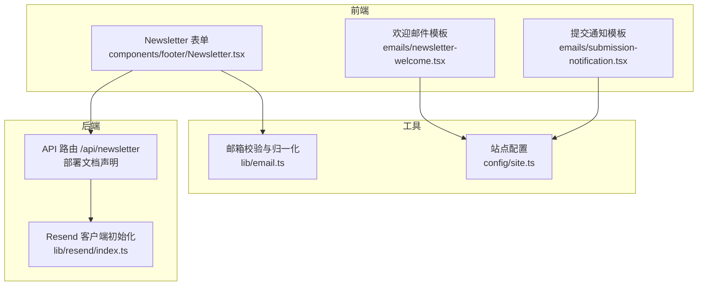
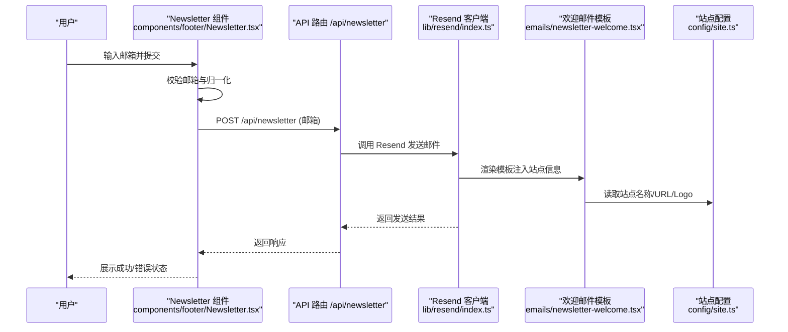
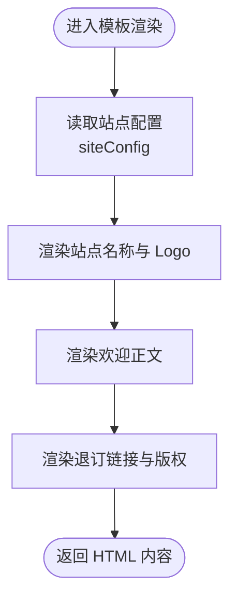
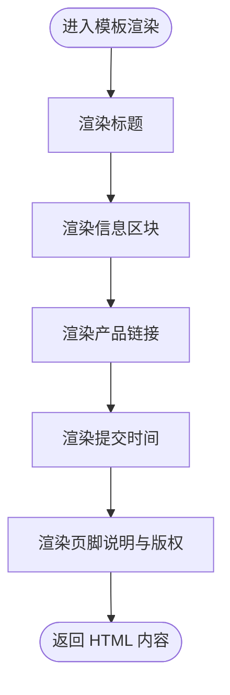
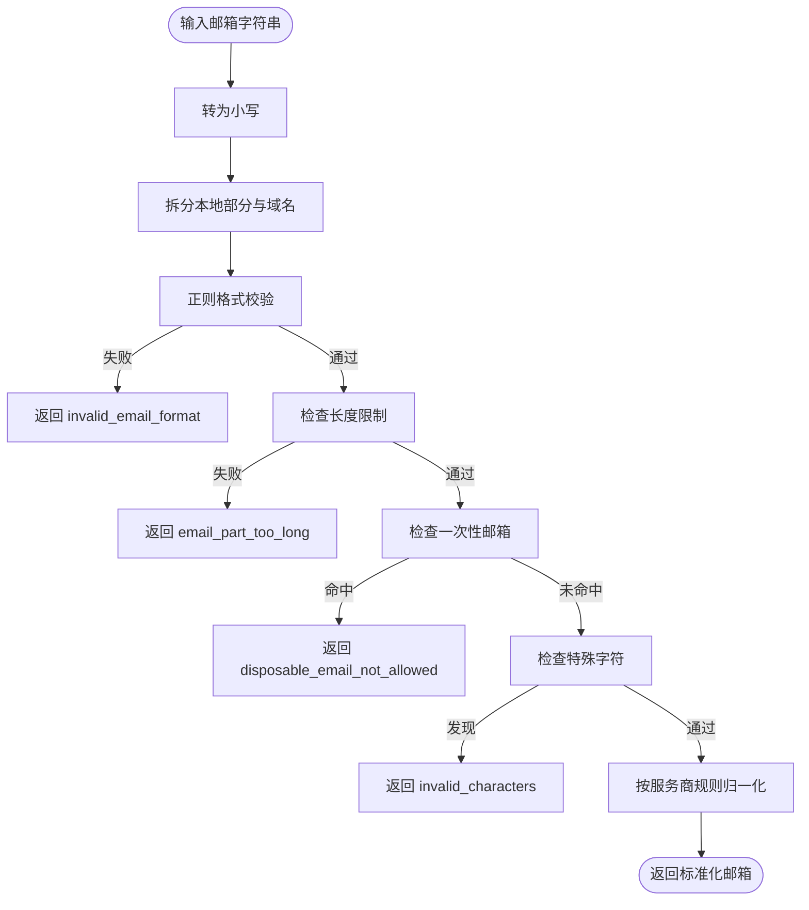
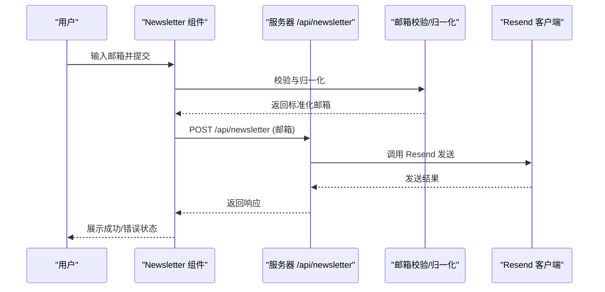
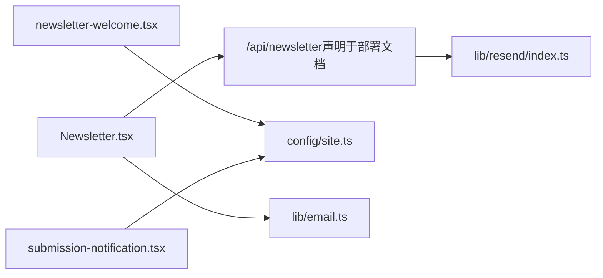

# 邮件系统

<cite>
**本文引用的文件**
- [emails/newsletter-welcome.tsx](file://emails/newsletter-welcome.tsx)
- [emails/submission-notification.tsx](file://emails/submission-notification.tsx)
- [lib/email.ts](file://lib/email.ts)
- [lib/resend/index.ts](file://lib/resend/index.ts)
- [components/footer/Newsletter.tsx](file://components/footer/Newsletter.tsx)
- [config/site.ts](file://config/site.ts)
- [CLOUDFLARE_DEPLOYMENT.md](file://CLOUDFLARE_DEPLOYMENT.md)
- [blogs/zh/2.nextjs-starter-template-guide.mdx](file://blogs/zh/2.nextjs-starter-template-guide.mdx)
- [blogs/en/2.nextjs-starter-template-guide.mdx](file://blogs/en/2.nextjs-starter-template-guide.mdx)
</cite>

## 目录
1. [简介](#简介)
2. [项目结构](#项目结构)
3. [核心组件](#核心组件)
4. [架构总览](#架构总览)
5. [详细组件分析](#详细组件分析)
6. [依赖关系分析](#依赖关系分析)
7. [性能考虑](#性能考虑)
8. [故障排查指南](#故障排查指南)
9. [结论](#结论)
10. [附录](#附录)

## 简介
本邮件系统围绕“邮件订阅 + 欢迎邮件模板 + 提交通知模板”的最小可用能力展开，采用前端表单收集订阅、通过 API 路由完成订阅与发送，使用 Resend 作为邮件服务提供商，并通过 React 组件实现邮件模板渲染。系统同时包含邮箱格式校验与别名归一化逻辑，便于后续扩展速率限制与更复杂的邮件发送流程。

## 项目结构
邮件系统相关文件分布于以下模块：
- 邮件模板：位于 emails/ 目录，分别定义欢迎邮件与提交通知模板
- 邮件发送能力：通过 lib/resend/index.ts 初始化 Resend 客户端；前端 Newsletter 组件通过 /api/newsletter 发送请求
- 邮箱校验与归一化：lib/email.ts 提供邮箱格式校验与别名归一化
- 站点配置：config/site.ts 提供站点名称、URL 等用于模板渲染
- 部署与 API 路由：CLOUDFLARE_DEPLOYMENT.md 指明 /api/newsletter 等 API 路由可用

图表来源
- [components/footer/Newsletter.tsx](file://components/footer/Newsletter.tsx#L15-L55)
- [lib/resend/index.ts](file://lib/resend/index.ts#L1-L13)
- [lib/email.ts](file://lib/email.ts#L1-L91)
- [emails/newsletter-welcome.tsx](file://emails/newsletter-welcome.tsx#L1-L99)
- [emails/submission-notification.tsx](file://emails/submission-notification.tsx#L1-L101)
- [config/site.ts](file://config/site.ts#L14-L44)
- [CLOUDFLARE_DEPLOYMENT.md](file://CLOUDFLARE_DEPLOYMENT.md#L12-L13)

章节来源
- [CLOUDFLARE_DEPLOYMENT.md](file://CLOUDFLARE_DEPLOYMENT.md#L12-L13)
- [components/footer/Newsletter.tsx](file://components/footer/Newsletter.tsx#L1-L91)
- [lib/resend/index.ts](file://lib/resend/index.ts#L1-L13)
- [lib/email.ts](file://lib/email.ts#L1-L91)
- [emails/newsletter-welcome.tsx](file://emails/newsletter-welcome.tsx#L1-L99)
- [emails/submission-notification.tsx](file://emails/submission-notification.tsx#L1-L101)
- [config/site.ts](file://config/site.ts#L14-L44)

## 核心组件
- 邮件模板
  - 欢迎邮件模板：用于新订阅用户的欢迎通知，包含站点名称、Logo、退订链接等
  - 提交通知模板：用于管理员或相关人员接收产品提交的通知，包含产品链接与提交时间
- 邮件发送
  - 前端 Newsletter 组件负责收集邮箱、调用 /api/newsletter、展示结果与错误
  - Resend 客户端初始化：在 lib/resend/index.ts 中按环境变量初始化
- 邮箱校验与归一化
  - 格式校验：长度、字符集、禁用一次性邮箱等
  - 别名归一化：针对不同邮箱服务商的本地部分规则进行归一化
- 站点配置
  - 提供站点名称、URL、图标等，用于模板渲染

章节来源
- [emails/newsletter-welcome.tsx](file://emails/newsletter-welcome.tsx#L1-L99)
- [emails/submission-notification.tsx](file://emails/submission-notification.tsx#L1-L101)
- [components/footer/Newsletter.tsx](file://components/footer/Newsletter.tsx#L15-L55)
- [lib/resend/index.ts](file://lib/resend/index.ts#L1-L13)
- [lib/email.ts](file://lib/email.ts#L1-L91)
- [config/site.ts](file://config/site.ts#L14-L44)

## 架构总览
下图展示了从前端表单到 Resend 的端到端发送流程，以及模板与站点配置的依赖关系：

图表来源
- [components/footer/Newsletter.tsx](file://components/footer/Newsletter.tsx#L15-L55)
- [lib/resend/index.ts](file://lib/resend/index.ts#L1-L13)
- [emails/newsletter-welcome.tsx](file://emails/newsletter-welcome.tsx#L1-L99)
- [config/site.ts](file://config/site.ts#L14-L44)
- [CLOUDFLARE_DEPLOYMENT.md](file://CLOUDFLARE_DEPLOYMENT.md#L12-L13)

## 详细组件分析

### 欢迎邮件模板
- 设计要点
  - 使用内联样式定义容器、卡片、标题、段落、页脚等结构
  - 通过站点配置注入 Logo 与站点名称，保证品牌一致性
  - 提供退订链接占位，便于后续对接订阅管理
- 模板变量
  - 接收参数：退订链接
  - 渲染内容：站点名称、Logo、欢迎语、退订提示、版权信息
- 多语言支持
  - 当前模板文本为英文，若需多语言，可在调用侧传入对应文案或在模板外层做语言切换

图表来源
- [emails/newsletter-welcome.tsx](file://emails/newsletter-welcome.tsx#L1-L99)
- [config/site.ts](file://config/site.ts#L14-L44)

章节来源
- [emails/newsletter-welcome.tsx](file://emails/newsletter-welcome.tsx#L1-L99)
- [config/site.ts](file://config/site.ts#L14-L44)

### 提交通知模板
- 设计要点
  - 信息区块用于展示产品链接与提交时间
  - 使用链接样式突出可点击的产品链接
  - 页脚包含自动化通知说明与版权信息
- 模板变量
  - 接收参数：产品链接、提交时间
  - 渲染内容：标题、信息区块（标签+值）、页脚说明与版权

图表来源
- [emails/submission-notification.tsx](file://emails/submission-notification.tsx#L1-L101)

章节来源
- [emails/submission-notification.tsx](file://emails/submission-notification.tsx#L1-L101)

### 邮箱校验与归一化
- 校验规则
  - 格式校验：符合标准邮箱格式且整体长度与局部长度限制
  - 禁用一次性邮箱：对特定域名进行拦截
  - 字符限制：禁止某些特殊字符出现在本地部分
- 归一化规则
  - 统一小写
  - 针对不同邮箱服务商去除多余字符（例如 Gmail 的点号与加号、Outlook/Hotmail/Live 的加号、Yahoo 的连字符等）
- 错误类型
  - invalid_email_format、email_part_too_long、disposable_email_not_allowed、invalid_characters

图表来源
- [lib/email.ts](file://lib/email.ts#L1-L91)

章节来源
- [lib/email.ts](file://lib/email.ts#L1-L91)

### 前端订阅表单与发送流程
- 表单行为
  - 输入邮箱、点击订阅按钮
  - 前端执行邮箱校验与归一化
  - 调用 /api/newsletter，提交归一化后的邮箱
  - 根据响应更新 UI 状态（成功/错误/加载）
- 错误处理
  - 校验失败：显示错误消息
  - 请求失败：捕获异常并提示
  - 成功后清空输入并提示成功

图表来源
- [components/footer/Newsletter.tsx](file://components/footer/Newsletter.tsx#L15-L55)
- [lib/email.ts](file://lib/email.ts#L1-L91)
- [lib/resend/index.ts](file://lib/resend/index.ts#L1-L13)
- [CLOUDFLARE_DEPLOYMENT.md](file://CLOUDFLARE_DEPLOYMENT.md#L12-L13)

章节来源
- [components/footer/Newsletter.tsx](file://components/footer/Newsletter.tsx#L15-L55)
- [lib/email.ts](file://lib/email.ts#L1-L91)
- [lib/resend/index.ts](file://lib/resend/index.ts#L1-L13)
- [CLOUDFLARE_DEPLOYMENT.md](file://CLOUDFLARE_DEPLOYMENT.md#L12-L13)

### Resend 集成与初始化
- 初始化方式
  - 通过环境变量加载 API Key，实例化 Resend 客户端
  - 若未设置 API Key，控制台输出警告
- 使用场景
  - 在 API 路由中调用 Resend 发送邮件
  - 模板渲染后通过客户端发送 HTML 内容

章节来源
- [lib/resend/index.ts](file://lib/resend/index.ts#L1-L13)

### 站点配置与模板渲染
- 配置项
  - 站点名称、URL、图标等
- 模板渲染
  - 欢迎邮件模板使用站点名称与 Logo
  - 提交通知模板使用站点名称用于页脚说明

章节来源
- [config/site.ts](file://config/site.ts#L14-L44)
- [emails/newsletter-welcome.tsx](file://emails/newsletter-welcome.tsx#L63-L68)
- [emails/newsletter-welcome.tsx](file://emails/newsletter-welcome.tsx#L90-L91)
- [emails/submission-notification.tsx](file://emails/submission-notification.tsx#L90-L94)

## 依赖关系分析
- 组件耦合
  - Newsletter 组件依赖邮箱校验与 API 路由
  - 邮件模板依赖站点配置
  - Resend 客户端被 API 路由使用
- 外部依赖
  - Resend SDK
  - Next.js App Router（API 路由）
- 潜在循环依赖
  - 当前结构清晰，无明显循环依赖

图表来源
- [components/footer/Newsletter.tsx](file://components/footer/Newsletter.tsx#L15-L55)
- [lib/resend/index.ts](file://lib/resend/index.ts#L1-L13)
- [emails/newsletter-welcome.tsx](file://emails/newsletter-welcome.tsx#L1-L99)
- [emails/submission-notification.tsx](file://emails/submission-notification.tsx#L1-L101)
- [config/site.ts](file://config/site.ts#L14-L44)
- [lib/email.ts](file://lib/email.ts#L1-L91)
- [CLOUDFLARE_DEPLOYMENT.md](file://CLOUDFLARE_DEPLOYMENT.md#L12-L13)

章节来源
- [components/footer/Newsletter.tsx](file://components/footer/Newsletter.tsx#L15-L55)
- [lib/resend/index.ts](file://lib/resend/index.ts#L1-L13)
- [emails/newsletter-welcome.tsx](file://emails/newsletter-welcome.tsx#L1-L99)
- [emails/submission-notification.tsx](file://emails/submission-notification.tsx#L1-L101)
- [config/site.ts](file://config/site.ts#L14-L44)
- [lib/email.ts](file://lib/email.ts#L1-L91)
- [CLOUDFLARE_DEPLOYMENT.md](file://CLOUDFLARE_DEPLOYMENT.md#L12-L13)

## 性能考虑
- 模板渲染
  - 使用内联样式与静态资源（Logo）渲染，避免额外网络请求
- 发送路径
  - 前端仅负责提交邮箱，实际发送在后端完成，降低前端复杂度
- 可扩展方向
  - 引入速率限制（如基于 Redis 的限流）防止滥用
  - 对模板进行缓存或预编译，减少重复计算
  - 将发送任务异步化（队列/Worker），提升接口响应速度

## 故障排查指南
- 环境变量未配置
  - 现象：控制台出现警告，Resend 客户端为 null
  - 处理：设置 RESEND_API_KEY
- API 路由不可用
  - 现象：前端调用 /api/newsletter 失败
  - 处理：确认部署文档中声明的 API 路由已在运行环境中可用
- 邮箱格式错误
  - 现象：前端显示校验错误
  - 处理：检查邮箱格式、长度与禁用域名
- 发送失败
  - 现象：后端返回错误或 Resend 返回异常
  - 处理：查看后端日志与 Resend 控制台，确认模板与收件人有效

章节来源
- [lib/resend/index.ts](file://lib/resend/index.ts#L7-L9)
- [components/footer/Newsletter.tsx](file://components/footer/Newsletter.tsx#L40-L54)
- [lib/email.ts](file://lib/email.ts#L15-L53)
- [CLOUDFLARE_DEPLOYMENT.md](file://CLOUDFLARE_DEPLOYMENT.md#L12-L13)

## 结论
本邮件系统以“订阅 + 欢迎邮件 + 提交通知”为核心，结合前端表单、后端 API 路由与 Resend 发送能力，形成简洁可靠的邮件发送链路。模板采用 React 组件形式，便于维护与扩展。当前实现具备邮箱校验与归一化能力，建议后续引入速率限制、异步发送与更完善的错误监控，以满足生产环境的稳定性与可运维性需求。

## 附录

### 邮件模板开发指南
- 模板结构
  - 使用内联样式定义布局与主题
  - 通过 props 注入动态数据（如退订链接、产品链接、提交时间）
  - 读取站点配置以统一品牌元素
- 多语言支持
  - 在调用侧传入对应语言文案，或在外层组件按语言切换
- 测试方法
  - 单元测试：对模板渲染函数进行断言（如标题、链接、版权）
  - 端到端测试：通过 Newsletter 表单提交邮箱，观察 /api/newsletter 响应与 Resend 控制台记录
- 性能优化
  - 缓存模板渲染结果
  - 将发送任务异步化，避免阻塞请求

章节来源
- [emails/newsletter-welcome.tsx](file://emails/newsletter-welcome.tsx#L1-L99)
- [emails/submission-notification.tsx](file://emails/submission-notification.tsx#L1-L101)
- [config/site.ts](file://config/site.ts#L14-L44)

### 邮件发送 API 集成方式
- 前端调用
  - 路由：/api/newsletter
  - 方法：POST
  - 负载：邮箱（已归一化）
- 后端实现要点
  - 校验请求体与邮箱有效性
  - 使用 Resend 客户端发送 HTML 邮件
  - 返回结构化的响应（成功/错误）

章节来源
- [components/footer/Newsletter.tsx](file://components/footer/Newsletter.tsx#L32-L47)
- [CLOUDFLARE_DEPLOYMENT.md](file://CLOUDFLARE_DEPLOYMENT.md#L12-L13)
- [lib/resend/index.ts](file://lib/resend/index.ts#L1-L13)

### 错误处理策略
- 前端
  - 校验失败：显示错误消息并重置状态
  - 请求失败：捕获异常并提示
  - 成功：清空输入并提示成功
- 后端
  - 校验失败：返回明确错误码与原因
  - Resend 失败：记录日志并返回统一错误格式

章节来源
- [components/footer/Newsletter.tsx](file://components/footer/Newsletter.tsx#L22-L54)
- [lib/email.ts](file://lib/email.ts#L15-L53)

### 发送状态监控建议
- 日志记录
  - 记录每次发送的请求体、响应与异常
- 指标采集
  - 发送成功率、失败率、平均耗时
- 告警机制
  - 发送失败阈值告警、API Key 异常告警