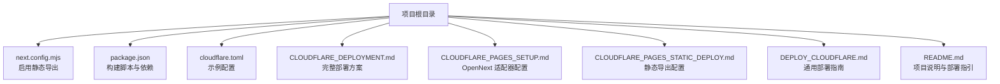
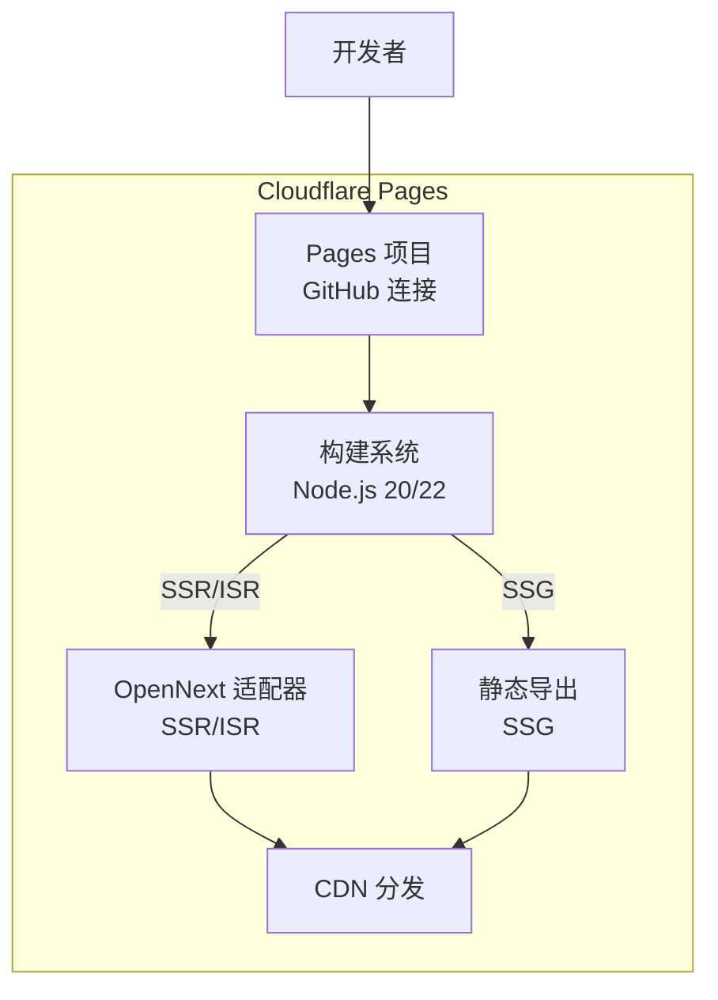
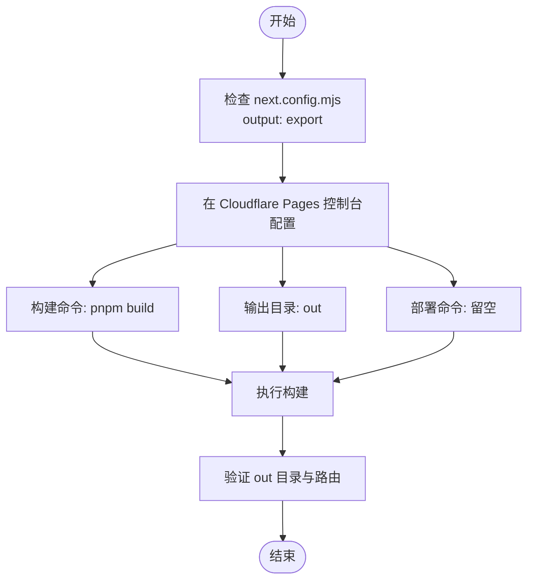
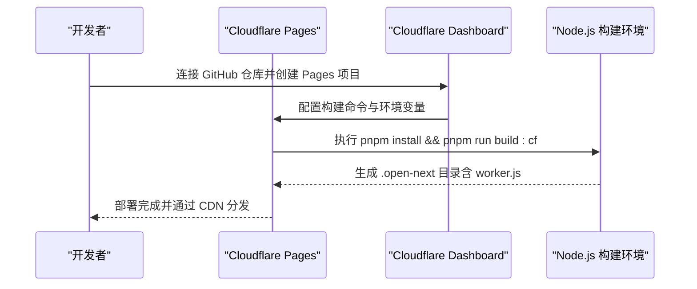
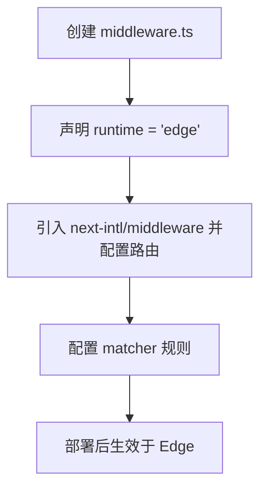
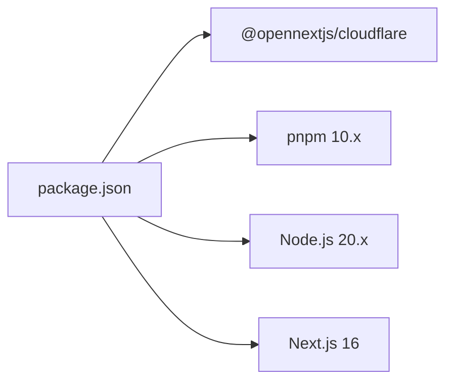
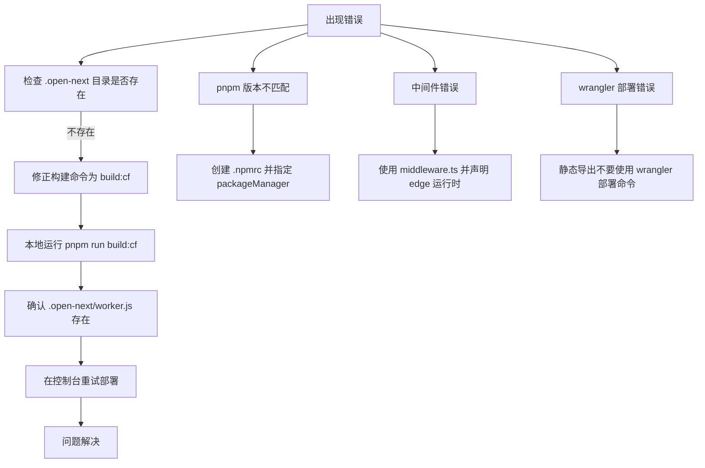

# Cloudflare Pages 部署

<cite>
**本文引用的文件**
- [CLOUDFLARE_DEPLOYMENT.md](file://CLOUDFLARE_DEPLOYMENT.md)
- [CLOUDFLARE_PAGES_SETUP.md](file://CLOUDFLARE_PAGES_SETUP.md)
- [CLOUDFLARE_PAGES_STATIC_DEPLOY.md](file://CLOUDFLARE_PAGES_STATIC_DEPLOY.md)
- [DEPLOY_CLOUDFLARE.md](file://DEPLOY_CLOUDFLARE.md)
- [cloudflare.toml](file://cloudflare.toml)
- [next.config.mjs](file://next.config.mjs)
- [package.json](file://package.json)
- [README.md](file://README.md)
</cite>

## 目录
1. [简介](#简介)
2. [项目结构](#项目结构)
3. [核心组件](#核心组件)
4. [架构总览](#架构总览)
5. [详细组件分析](#详细组件分析)
6. [依赖关系分析](#依赖关系分析)
7. [性能考量](#性能考量)
8. [故障排除指南](#故障排除指南)
9. [结论](#结论)
10. [附录](#附录)

## 简介
本指南面向希望将 Next.js 应用部署至 Cloudflare Pages 的开发者，覆盖 GitHub 连接、构建配置、环境变量设置、静态导出与 SSR 两种部署模式的差异与适用场景，并提供完整的部署步骤、CI/CD 集成与自动化流程、常见错误解决方案与最佳实践。

## 项目结构
该项目采用 Next.js 16 App Router 结构，已内置静态导出配置与 Cloudflare 适配器相关文档与脚本。关键文件如下：
- next.config.mjs：启用静态导出并关闭图片优化以适配静态站点
- package.json：定义构建脚本与依赖，包含 Cloudflare 适配器与 pnpm 引擎约束
- cloudflare.toml：示例配置（控制台中以“构建命令”“输出目录”等为准）
- 多份 Cloudflare 部署文档：涵盖静态导出、OpenNext 适配器、Wrangler 部署与故障排除

图表来源
- [next.config.mjs](file://next.config.mjs#L1-L28)
- [package.json](file://package.json#L1-L65)
- [cloudflare.toml](file://cloudflare.toml#L1-L13)
- [CLOUDFLARE_DEPLOYMENT.md](file://CLOUDFLARE_DEPLOYMENT.md#L1-L303)
- [CLOUDFLARE_PAGES_SETUP.md](file://CLOUDFLARE_PAGES_SETUP.md#L1-L109)
- [CLOUDFLARE_PAGES_STATIC_DEPLOY.md](file://CLOUDFLARE_PAGES_STATIC_DEPLOY.md#L1-L61)
- [DEPLOY_CLOUDFLARE.md](file://DEPLOY_CLOUDFLARE.md#L1-L114)
- [README.md](file://README.md#L181-L202)

章节来源
- [next.config.mjs](file://next.config.mjs#L1-L28)
- [package.json](file://package.json#L1-L65)
- [cloudflare.toml](file://cloudflare.toml#L1-L13)
- [CLOUDFLARE_DEPLOYMENT.md](file://CLOUDFLARE_DEPLOYMENT.md#L1-L303)
- [CLOUDFLARE_PAGES_SETUP.md](file://CLOUDFLARE_PAGES_SETUP.md#L1-L109)
- [CLOUDFLARE_PAGES_STATIC_DEPLOY.md](file://CLOUDFLARE_PAGES_STATIC_DEPLOY.md#L1-L61)
- [DEPLOY_CLOUDFLARE.md](file://DEPLOY_CLOUDFLARE.md#L1-L114)
- [README.md](file://README.md#L181-L202)

## 核心组件
- 静态导出配置：next.config.mjs 启用 output: "export"，并禁用图片优化以适配静态站点
- 构建脚本：package.json 提供 build 与 build:cf 脚本，满足 Cloudflare Pages 构建命令需求
- 适配器与文档：多份 Cloudflare 部署文档分别覆盖静态导出与 OpenNext 适配器方案
- 环境变量：NODE_VERSION、NODE_ENV 等在控制台中配置，确保 Node.js 版本与运行环境一致

章节来源
- [next.config.mjs](file://next.config.mjs#L1-L28)
- [package.json](file://package.json#L8-L15)
- [CLOUDFLARE_DEPLOYMENT.md](file://CLOUDFLARE_DEPLOYMENT.md#L34-L146)
- [CLOUDFLARE_PAGES_SETUP.md](file://CLOUDFLARE_PAGES_SETUP.md#L18-L38)
- [CLOUDFLARE_PAGES_STATIC_DEPLOY.md](file://CLOUDFLARE_PAGES_STATIC_DEPLOY.md#L7-L19)

## 架构总览
下图展示了两种部署模式在 Cloudflare Pages 上的总体流程与差异：

图表来源
- [CLOUDFLARE_DEPLOYMENT.md](file://CLOUDFLARE_DEPLOYMENT.md#L34-L146)
- [CLOUDFLARE_PAGES_SETUP.md](file://CLOUDFLARE_PAGES_SETUP.md#L18-L38)
- [CLOUDFLARE_PAGES_STATIC_DEPLOY.md](file://CLOUDFLARE_PAGES_STATIC_DEPLOY.md#L7-L19)

## 详细组件分析

### 静态导出（SSG）部署模式
- 适用场景：无需 API Routes、追求极致加载速度与零运行时成本的静态站点
- 关键配置：
  - next.config.mjs：启用 output: "export"，禁用图片优化
  - Cloudflare Pages 控制台：构建命令指向 pnpm build；输出目录为 out；部署命令留空
- 优势：构建快、部署简单、成本低
- 局限：不支持 API Routes、动态数据需在构建期完成

图表来源
- [next.config.mjs](file://next.config.mjs#L3-L4)
- [CLOUDFLARE_PAGES_STATIC_DEPLOY.md](file://CLOUDFLARE_PAGES_STATIC_DEPLOY.md#L7-L28)

章节来源
- [next.config.mjs](file://next.config.mjs#L1-L28)
- [CLOUDFLARE_PAGES_STATIC_DEPLOY.md](file://CLOUDFLARE_PAGES_STATIC_DEPLOY.md#L1-L61)

### SSR/ISR 部署模式（OpenNext 适配器）
- 适用场景：需要 API Routes、动态数据、国际化中间件与边缘运行时能力
- 关键配置：
  - 安装 @opennextjs/cloudflare 适配器
  - package.json：新增 build:cf 脚本，串联 next build 与 opennextjs-cloudflare build
  - Cloudflare Pages 控制台：构建命令使用 build:cf；输出目录为 .open-next；设置 NODE_VERSION=20
  - 中间件：使用 Edge Runtime 的 middleware.ts 替代 Node.js 中间件
- 优势：支持 API Routes、SSR/ISR、国际化、边缘计算
- 局限：构建时间较长、需适配中间件与运行时

图表来源
- [CLOUDFLARE_DEPLOYMENT.md](file://CLOUDFLARE_DEPLOYMENT.md#L73-L126)
- [CLOUDFLARE_PAGES_SETUP.md](file://CLOUDFLARE_PAGES_SETUP.md#L11-L38)

章节来源
- [CLOUDFLARE_DEPLOYMENT.md](file://CLOUDFLARE_DEPLOYMENT.md#L34-L146)
- [CLOUDFLARE_PAGES_SETUP.md](file://CLOUDFLARE_PAGES_SETUP.md#L1-L109)
- [package.json](file://package.json#L8-L15)

### 中间件与运行时（Edge）
- Edge Runtime：Cloudflare Workers 需要明确声明 runtime = 'edge'
- next-intl：使用 next-intl/middleware 并配置 matcher
- 禁止 Node.js 中间件：删除 proxy.ts，改用 middleware.ts

图表来源
- [CLOUDFLARE_DEPLOYMENT.md](file://CLOUDFLARE_DEPLOYMENT.md#L40-L59)

章节来源
- [CLOUDFLARE_DEPLOYMENT.md](file://CLOUDFLARE_DEPLOYMENT.md#L38-L59)

### 环境变量与 Node.js 版本
- 必要变量：NODE_VERSION（建议 20）、NODE_ENV（production）
- 在 Cloudflare Pages 项目设置的“环境变量”中配置
- 若使用构建系统 V3，Node.js 默认为 22；如需固定 20，显式设置 NODE_VERSION

章节来源
- [CLOUDFLARE_DEPLOYMENT.md](file://CLOUDFLARE_DEPLOYMENT.md#L105-L114)
- [CLOUDFLARE_PAGES_SETUP.md](file://CLOUDFLARE_PAGES_SETUP.md#L35-L38)
- [CLOUDFLARE_PAGES_STATIC_DEPLOY.md](file://CLOUDFLARE_PAGES_STATIC_DEPLOY.md#L15-L19)

### CI/CD 与自动化部署
- GitHub 连接：在 Cloudflare Dashboard 中连接仓库并选择主分支
- 自动触发：推送代码后自动构建与部署
- 手动重试：若失败可在控制台重试部署
- 构建缓存：Cloudflare Pages 会缓存 node_modules，减少重复安装时间

章节来源
- [CLOUDFLARE_DEPLOYMENT.md](file://CLOUDFLARE_DEPLOYMENT.md#L122-L126)
- [CLOUDFLARE_PAGES_SETUP.md](file://CLOUDFLARE_PAGES_SETUP.md#L11-L11)
- [README.md](file://README.md#L189-L192)

## 依赖关系分析
- 适配器依赖：@opennextjs/cloudflare 用于将 Next.js 构建产物转换为 Cloudflare Workers 格式
- 包管理器：pnpm 10.x（项目已通过 packageManager 字段与 .npmrc 约束）
- Node.js 版本：通过 NODE_VERSION 或构建系统版本控制（V3 默认 22，V2 需设置 20）

图表来源
- [package.json](file://package.json#L16-L63)
- [CLOUDFLARE_DEPLOYMENT.md](file://CLOUDFLARE_DEPLOYMENT.md#L21-L24)

章节来源
- [package.json](file://package.json#L1-L65)
- [CLOUDFLARE_DEPLOYMENT.md](file://CLOUDFLARE_DEPLOYMENT.md#L18-L31)

## 性能考量
- 构建时间：OpenNext 构建可能较长，建议优化依赖与构建步骤
- 构建缓存：利用 Cloudflare Pages 的 node_modules 缓存
- 图片优化：静态导出需禁用 Next.js 图片优化，避免运行时依赖
- CDN 加速：Cloudflare Pages 默认分发至全球 CDN，提升访问速度

章节来源
- [CLOUDFLARE_PAGES_SETUP.md](file://CLOUDFLARE_PAGES_SETUP.md#L82-L82)
- [CLOUDFLARE_DEPLOYMENT.md](file://CLOUDFLARE_DEPLOYMENT.md#L236-L249)
- [next.config.mjs](file://next.config.mjs#L5-L16)

## 故障排除指南
- 未找到 .open-next/worker.js：确保构建命令包含 opennextjs-cloudflare build，并在本地验证 .open-next 目录生成
- pnpm 版本不匹配：在根目录创建 .npmrc 并在 package.json 中指定 packageManager
- 中间件错误（Node.js middleware not supported）：使用 middleware.ts 并声明 runtime = 'edge'
- wrangler 部署错误：静态导出不要使用 wrangler 部署命令；Cloudflare Pages 会自动检测 out 目录
- 构建超时：减少依赖、使用缓存、检查不必要的构建步骤

图表来源
- [CLOUDFLARE_DEPLOYMENT.md](file://CLOUDFLARE_DEPLOYMENT.md#L147-L189)
- [CLOUDFLARE_PAGES_SETUP.md](file://CLOUDFLARE_PAGES_SETUP.md#L84-L102)
- [CLOUDFLARE_PAGES_STATIC_DEPLOY.md](file://CLOUDFLARE_PAGES_STATIC_DEPLOY.md#L55-L61)

章节来源
- [CLOUDFLARE_DEPLOYMENT.md](file://CLOUDFLARE_DEPLOYMENT.md#L147-L189)
- [CLOUDFLARE_PAGES_SETUP.md](file://CLOUDFLARE_PAGES_SETUP.md#L84-L102)
- [CLOUDFLARE_PAGES_STATIC_DEPLOY.md](file://CLOUDFLARE_PAGES_STATIC_DEPLOY.md#L55-L61)

## 结论
- 若项目需要 API Routes、SSR/ISR 与国际化中间件，优先选择 OpenNext 适配器的 SSR/ISR 模式
- 若仅需静态内容与快速部署，选择静态导出（SSG）模式
- 在 Cloudflare Pages 控制台中配置正确的构建命令、输出目录与环境变量，并通过 GitHub 实现自动化部署
- 遇到问题时，优先检查 .open-next 目录生成、中间件运行时声明与 pnpm 版本一致性

## 附录

### 部署步骤清单（SSG）
- 在 next.config.mjs 中启用静态导出
- 在 Cloudflare Pages 控制台设置：
  - 构建命令：pnpm build
  - 输出目录：out
  - 部署命令：留空
  - 环境变量：NODE_VERSION=20
- 推送代码触发自动部署，或在控制台重试

章节来源
- [next.config.mjs](file://next.config.mjs#L3-L4)
- [CLOUDFLARE_PAGES_STATIC_DEPLOY.md](file://CLOUDFLARE_PAGES_STATIC_DEPLOY.md#L7-L28)

### 部署步骤清单（SSR/ISR）
- 安装 @opennextjs/cloudflare 适配器
- 在 package.json 中添加 build:cf 脚本
- 在 Cloudflare Pages 控制台设置：
  - 构建命令：pnpm install && pnpm run build:cf
  - 输出目录：.open-next
  - 环境变量：NODE_VERSION=20
- 创建 middleware.ts 并声明 runtime = 'edge'
- 推送代码触发自动部署

章节来源
- [package.json](file://package.json#L19-L19)
- [CLOUDFLARE_DEPLOYMENT.md](file://CLOUDFLARE_DEPLOYMENT.md#L61-L71)
- [CLOUDFLARE_PAGES_SETUP.md](file://CLOUDFLARE_PAGES_SETUP.md#L11-L38)
- [CLOUDFLARE_DEPLOYMENT.md](file://CLOUDFLARE_DEPLOYMENT.md#L40-L59)

### 最佳实践
- 使用 pnpm 并保持版本一致
- 在控制台启用构建缓存，减少安装时间
- 对敏感信息使用加密环境变量
- 优先使用 Cloudflare Pages 的自动集成，避免手工 wrangler 部署（静态导出除外）

章节来源
- [CLOUDFLARE_DEPLOYMENT.md](file://CLOUDFLARE_DEPLOYMENT.md#L236-L249)
- [CLOUDFLARE_PAGES_SETUP.md](file://CLOUDFLARE_PAGES_SETUP.md#L35-L38)
- [DEPLOY_CLOUDFLARE.md](file://DEPLOY_CLOUDFLARE.md#L98-L100)