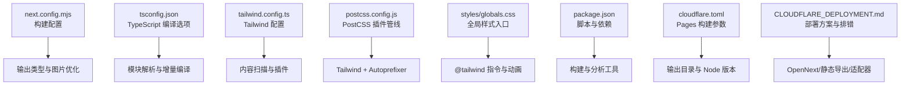
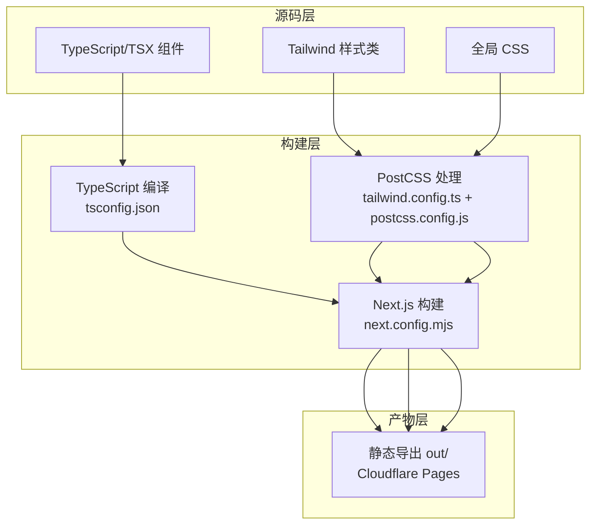
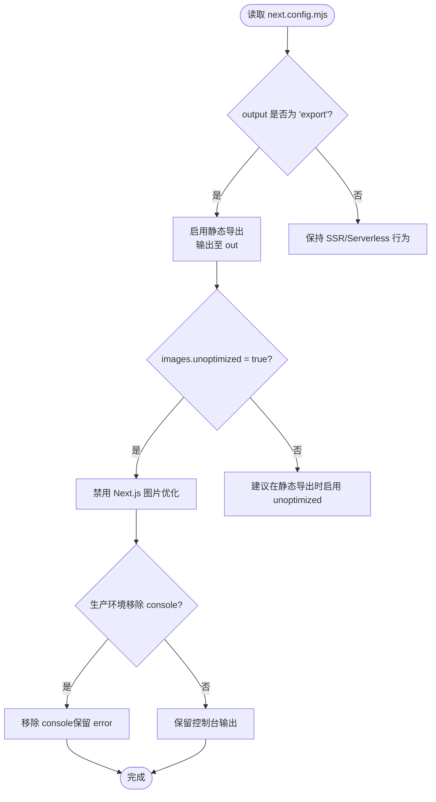
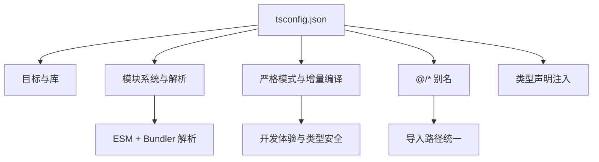
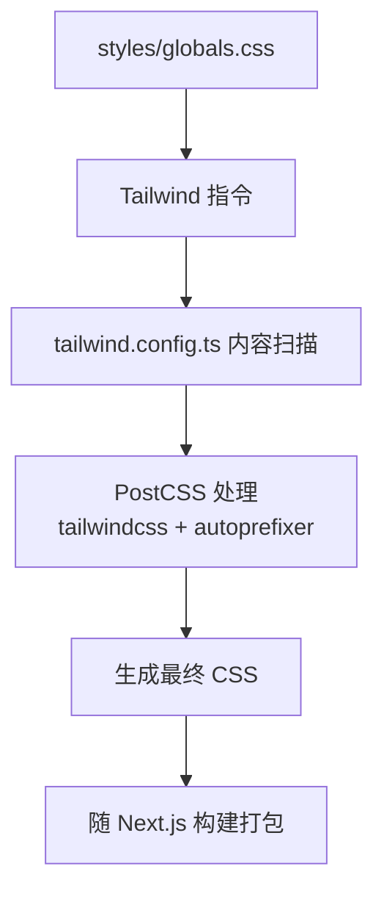
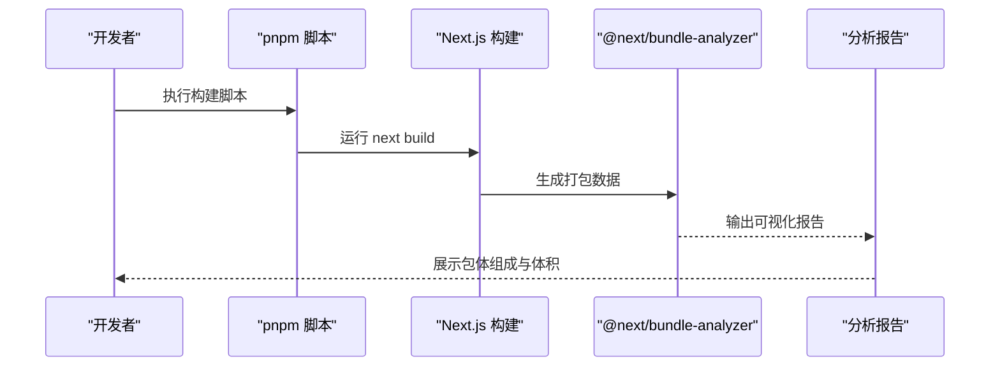
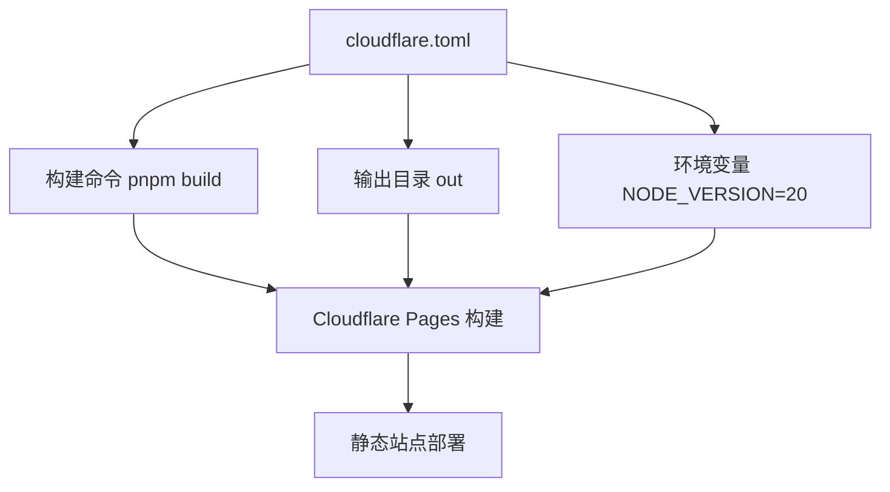
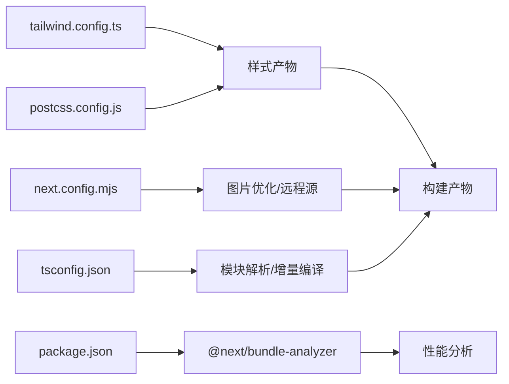

# 构建和优化

<cite>
**本文引用的文件**
- [next.config.mjs](file://next.config.mjs)
- [tsconfig.json](file://tsconfig.json)
- [tailwind.config.ts](file://tailwind.config.ts)
- [postcss.config.js](file://postcss.config.js)
- [styles/globals.css](file://styles/globals.css)
- [package.json](file://package.json)
- [cloudflare.toml](file://cloudflare.toml)
- [CLOUDFLARE_DEPLOYMENT.md](file://CLOUDFLARE_DEPLOYMENT.md)
- [DEPLOY_CLOUDFLARE.md](file://DEPLOY_CLOUDFLARE.md)
- [next-env.d.ts](file://next-env.d.ts)
</cite>

## 目录
1. [简介](#简介)
2. [项目结构](#项目结构)
3. [核心组件](#核心组件)
4. [架构总览](#架构总览)
5. [详细组件分析](#详细组件分析)
6. [依赖关系分析](#依赖关系分析)
7. [性能考量](#性能考量)
8. [故障排查指南](#故障排查指南)
9. [结论](#结论)
10. [附录](#附录)

## 简介
本指南聚焦于 Next.js 项目的构建与优化，涵盖构建配置、TypeScript 编译优化、CSS 处理流程、静态生成与代码分割策略、资源优化、缓存与部署优化、构建工具配置、打包分析与性能监控等主题。结合当前仓库中的配置文件与部署文档，给出可落地的实践建议与最佳实践。

## 项目结构
该项目采用 Next.js App Router 结构，配合 Tailwind CSS 与 PostCSS 进行样式处理，并通过 Cloudflare Pages 进行静态导出部署。关键配置集中在 next.config.mjs、tsconfig.json、tailwind.config.ts、postcss.config.js 与 package.json 中；部署相关配置位于 cloudflare.toml 与部署文档中。

图表来源
- [next.config.mjs](file://next.config.mjs#L1-L28)
- [tsconfig.json](file://tsconfig.json#L1-L43)
- [tailwind.config.ts](file://tailwind.config.ts#L1-L95)
- [postcss.config.js](file://postcss.config.js#L1-L7)
- [styles/globals.css](file://styles/globals.css#L1-L128)
- [package.json](file://package.json#L1-L65)
- [cloudflare.toml](file://cloudflare.toml#L1-L13)

章节来源
- [next.config.mjs](file://next.config.mjs#L1-L28)
- [tsconfig.json](file://tsconfig.json#L1-L43)
- [tailwind.config.ts](file://tailwind.config.ts#L1-L95)
- [postcss.config.js](file://postcss.config.js#L1-L7)
- [styles/globals.css](file://styles/globals.css#L1-L128)
- [package.json](file://package.json#L1-L65)
- [cloudflare.toml](file://cloudflare.toml#L1-L13)

## 核心组件
- 构建配置（Next.js）
  - 输出类型：静态导出（export），输出目录为 out
  - 图片优化：在静态导出模式下禁用 Next.js 图片优化，使用未优化图片
  - 控制台移除：生产环境移除 console（保留 error）
  - 远程图片源：基于环境变量配置 R2 公网域名
- TypeScript 编译
  - 目标与库：ES2017 + dom/dom.iterable/esnext
  - 模块系统：esnext + bundler
  - 严格模式与增量编译：开启严格模式与增量编译
  - 路径别名：@/* -> ./*
- CSS 处理
  - Tailwind 内容扫描：覆盖 pages/components/app/src
  - 主题扩展：颜色、圆角、关键帧与动画
  - PostCSS：Tailwind + Autoprefixer
  - 全局样式：@tailwind 指令 + 动画 + CSS 变量主题
- 构建与分析工具
  - @next/bundle-analyzer：Webpack 打包可视化分析
  - next build/start/lint：标准构建与开发脚本
- 部署配置
  - Cloudflare Pages：构建命令、输出目录、Node 版本
  - 部署方案：OpenNext 适配器（推荐）或静态导出

章节来源
- [next.config.mjs](file://next.config.mjs#L1-L28)
- [tsconfig.json](file://tsconfig.json#L1-L43)
- [tailwind.config.ts](file://tailwind.config.ts#L1-L95)
- [postcss.config.js](file://postcss.config.js#L1-L7)
- [styles/globals.css](file://styles/globals.css#L1-L128)
- [package.json](file://package.json#L1-L65)
- [cloudflare.toml](file://cloudflare.toml#L1-L13)

## 架构总览
下图展示从源码到构建产物的关键路径，包括 TypeScript 编译、CSS 处理、静态导出与部署。

图表来源
- [tsconfig.json](file://tsconfig.json#L1-L43)
- [tailwind.config.ts](file://tailwind.config.ts#L1-L95)
- [postcss.config.js](file://postcss.config.js#L1-L7)
- [next.config.mjs](file://next.config.mjs#L1-L28)
- [styles/globals.css](file://styles/globals.css#L1-L128)

## 详细组件分析

### 构建配置（next.config.mjs）
- 输出类型与静态导出
  - 将 output 设为 export，构建后生成 out 目录，适合静态托管平台（如 Cloudflare Pages）
- 图片优化策略
  - 在静态导出模式下启用 unoptimized，避免运行时图片处理
  - remotePatterns 基于 R2 公网地址动态注入，确保外链图片可被接受
- 控制台移除
  - 生产环境移除 console（保留 error），降低体积与噪音
- 编译器增强
  - 通过 compiler.removeConsole 条件启用，提升生产构建质量

图表来源
- [next.config.mjs](file://next.config.mjs#L1-L28)

章节来源
- [next.config.mjs](file://next.config.mjs#L1-L28)

### TypeScript 编译优化（tsconfig.json）
- 目标与库
  - 目标 ES2017，库包含 DOM、迭代器与 esnext，满足现代浏览器与 Next.js 运行时需求
- 模块系统
  - module 为 esnext，moduleResolution 为 bundler，利于现代打包器进行 Tree Shaking 与 ESM 优化
- 严格性与增量编译
  - strict 严格模式 + incremental 增量编译，提升类型安全与开发体验
- 路径别名
  - @/* -> ./*，统一导入路径，便于维护
- 类型声明
  - 引入 next-env.d.ts，确保 App Router 类型正确注入

图表来源
- [tsconfig.json](file://tsconfig.json#L1-L43)
- [next-env.d.ts](file://next-env.d.ts#L1-L7)

章节来源
- [tsconfig.json](file://tsconfig.json#L1-L43)
- [next-env.d.ts](file://next-env.d.ts#L1-L7)

### CSS 处理流程（Tailwind + PostCSS）
- Tailwind 配置
  - darkMode: class，支持暗色主题切换
  - content 覆盖 pages/components/app/src，确保按需生成样式
  - 主题扩展：颜色、圆角、关键帧与动画，统一设计语言
  - 插件：tailwindcss-animate
- PostCSS 管线
  - tailwindcss + autoprefixer，自动补全前缀并生成最终 CSS
- 全局样式
  - @tailwind base/components/utilities
  - 自定义动画与 CSS 变量主题，支持明暗主题切换

图表来源
- [styles/globals.css](file://styles/globals.css#L1-L128)
- [tailwind.config.ts](file://tailwind.config.ts#L1-L95)
- [postcss.config.js](file://postcss.config.js#L1-L7)

章节来源
- [styles/globals.css](file://styles/globals.css#L1-L128)
- [tailwind.config.ts](file://tailwind.config.ts#L1-L95)
- [postcss.config.js](file://postcss.config.js#L1-L7)

### 静态生成与代码分割
- 静态生成
  - 通过 output: "export" 生成 out 目录，适合纯静态站点与静态托管平台
- 代码分割
  - Next.js 基于路由与组件自动进行代码分割；Tailwind 按需扫描减少无关样式
- 资源优化
  - 静态导出禁用图片优化，建议在构建阶段压缩图片与使用 CDN
  - CSS 通过 PostCSS 与 Tailwind 生成最小化产物

章节来源
- [next.config.mjs](file://next.config.mjs#L1-L28)
- [tailwind.config.ts](file://tailwind.config.ts#L1-L95)

### 构建工具配置与打包分析
- @next/bundle-analyzer
  - 通过 @next/bundle-analyzer 集成 webpack-bundle-analyzer，可视化分析包体构成
- 构建脚本
  - package.json 提供 build、start、lint 等常用脚本，便于本地与 CI 集成

图表来源
- [package.json](file://package.json#L1-L65)

章节来源
- [package.json](file://package.json#L1-L65)

### 部署优化（Cloudflare Pages）
- 构建命令与输出目录
  - cloudflare.toml 指定 build.command 与 output_directory，确保 Pages 正确识别构建产物
- Node 版本与环境变量
  - 通过 build.environment_variables 指定 Node 版本，保证构建一致性
- 部署方案
  - 推荐使用 OpenNext 适配器以支持 API Routes 与 SSR
  - 如仅需静态站点，可使用静态导出（output: "export"）

图表来源
- [cloudflare.toml](file://cloudflare.toml#L1-L13)

章节来源
- [cloudflare.toml](file://cloudflare.toml#L1-L13)
- [CLOUDFLARE_DEPLOYMENT.md](file://CLOUDFLARE_DEPLOYMENT.md#L1-L303)
- [DEPLOY_CLOUDFLARE.md](file://DEPLOY_CLOUDFLARE.md#L1-L114)

## 依赖关系分析
- 组件耦合
  - next.config.mjs 与静态导出强相关，影响图片优化与远程源配置
  - tsconfig.json 影响编译器行为与模块解析，间接影响 Tree Shaking
  - tailwind.config.ts 与 postcss.config.js 共同决定 CSS 产物规模
  - package.json 提供构建与分析工具，支撑性能监控与优化
- 外部依赖
  - @next/bundle-analyzer 用于打包分析
  - Tailwind 与 Autoprefixer 用于样式处理
  - Cloudflare Pages 用于静态部署

图表来源
- [next.config.mjs](file://next.config.mjs#L1-L28)
- [tsconfig.json](file://tsconfig.json#L1-L43)
- [tailwind.config.ts](file://tailwind.config.ts#L1-L95)
- [postcss.config.js](file://postcss.config.js#L1-L7)
- [package.json](file://package.json#L1-L65)

章节来源
- [next.config.mjs](file://next.config.mjs#L1-L28)
- [tsconfig.json](file://tsconfig.json#L1-L43)
- [tailwind.config.ts](file://tailwind.config.ts#L1-L95)
- [postcss.config.js](file://postcss.config.js#L1-L7)
- [package.json](file://package.json#L1-L65)

## 性能考量
- 构建性能
  - 启用 TypeScript 增量编译与严格模式，缩短开发与 CI 时间
  - 使用 ESM + bundler 解析，提升 Tree Shaking 效果
- CSS 体积
  - Tailwind 按需扫描 content，避免无用样式
  - PostCSS 自动前缀与最小化，减少体积与兼容成本
- 静态导出优化
  - 禁用图片优化，建议在构建阶段进行图片压缩与 CDN 加速
  - 将静态资源置于 CDN，结合 Pages 的全球分发能力
- 打包分析
  - 使用 @next/bundle-analyzer 识别大体积模块与重复依赖，针对性优化
- 缓存策略
  - Cloudflare Pages 默认缓存静态资源，合理设置缓存头与版本化资源
  - 对 CSS/JS 使用内容哈希命名，实现长期缓存与更新可控

## 故障排查指南
- 构建找不到入口点（Cloudflare Pages）
  - 若使用 OpenNext 适配器，请确认构建命令包含适配器构建步骤，并检查 .open-next/worker.js 是否生成
  - 若使用静态导出，请确认输出目录为 out，且构建命令正确执行
- Middleware 错误（Node.js middleware 不支持）
  - 使用 Edge Runtime 的 middleware.ts，删除旧的 proxy.ts
- pnpm 版本不匹配
  - 在项目根目录创建 .npmrc 并设置 engine-strict=true，同时在 package.json 指定 packageManager
- 构建超时
  - 优化依赖数量、利用 Pages 的 node_modules 缓存、减少不必要的构建步骤

章节来源
- [CLOUDFLARE_DEPLOYMENT.md](file://CLOUDFLARE_DEPLOYMENT.md#L147-L207)
- [DEPLOY_CLOUDFLARE.md](file://DEPLOY_CLOUDFLARE.md#L1-L114)

## 结论
本项目通过静态导出与 Tailwind + PostCSS 的组合，实现了简洁高效的构建与部署流程。建议在现有基础上进一步完善打包分析与缓存策略，结合 Cloudflare Pages 的全球分发能力，持续优化首屏加载与交互性能。若未来需要 API Routes 或 SSR，可考虑引入 OpenNext 适配器以获得更完整的 Next.js 运行时能力。

## 附录
- 关键配置要点速览
  - next.config.mjs：output=export、images.unoptimized=true、生产环境移除 console
  - tsconfig.json：module=esnext、moduleResolution=bundler、strict+incremental、@/* 别名
  - tailwind.config.ts：content 覆盖 pages/components/app/src、主题扩展、插件启用
  - postcss.config.js：tailwindcss + autoprefixer
  - package.json：构建脚本与 @next/bundle-analyzer
  - cloudflare.toml：构建命令、输出目录、Node 版本