# 环境配置管理

<cite>
**本文档引用的文件**
- [package.json](file://package.json)
- [next.config.mjs](file://next.config.mjs)
- [cloudflare.toml](file://cloudflare.toml)
- [config/site.ts](file://config/site.ts)
- [types/siteConfig.ts](file://types/siteConfig.ts)
- [lib/logger.ts](file://lib/logger.ts)
- [lib/resend/index.ts](file://lib/resend/index.ts)
- [gtag.js](file://gtag.js)
- [CLOUDFLARE_DEPLOYMENT.md](file://CLOUDFLARE_DEPLOYMENT.md)
- [DEPLOY_CLOUDFLARE.md](file://DEPLOY_CLOUDFLARE.md)
- [hooks/use-toast.ts](file://hooks/use-toast.ts)
- [lib/email.ts](file://lib/email.ts)
</cite>

## 目录
1. [简介](#简介)
2. [项目结构](#项目结构)
3. [核心组件](#核心组件)
4. [架构概览](#架构概览)
5. [详细组件分析](#详细组件分析)
6. [依赖关系分析](#依赖关系分析)
7. [性能考虑](#性能考虑)
8. [故障排除指南](#故障排除指南)
9. [结论](#结论)
10. [附录](#附录)

## 简介

本指南专注于该 Next.js 16.1.1 项目的环境配置管理。项目采用多种环境变量来控制构建行为、运行时配置和第三方服务集成。通过分析代码库中的配置文件和使用模式，我们将提供一套完整的环境配置管理策略，涵盖开发、测试、生产等不同环境的配置差异，以及敏感信息保护、配置验证和动态配置加载的最佳实践。

## 项目结构

该项目采用标准的 Next.js App Router 结构，环境配置分布在多个层面：

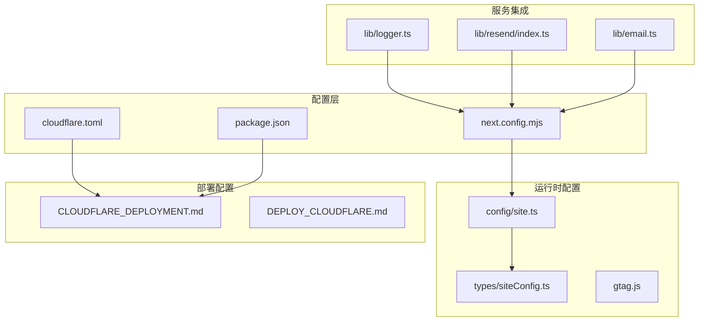

**图表来源**
- [next.config.mjs](file://next.config.mjs#L1-L28)
- [cloudflare.toml](file://cloudflare.toml#L1-L13)
- [config/site.ts](file://config/site.ts#L1-L45)

**章节来源**
- [package.json](file://package.json#L1-L65)
- [next.config.mjs](file://next.config.mjs#L1-L28)
- [cloudflare.toml](file://cloudflare.toml#L1-L13)

## 核心组件

### 环境变量分类

项目中的环境变量主要分为以下几类：

#### 构建时环境变量
- `NODE_VERSION`: 指定 Node.js 版本 (值: 20)
- `NODE_ENV`: 应用环境标识 (值: production)

#### Next.js 运行时环境变量
- `NEXT_PUBLIC_SITE_URL`: 站点基础 URL
- `NEXT_PUBLIC_DISCORD_INVITE_URL`: Discord 邀请链接
- `NEXT_PUBLIC_GOOGLE_ID`: Google Analytics ID
- `NEXT_PUBLIC_PLAUSIBLE_DOMAIN`: Plausible Analytics 域名
- `NEXT_PUBLIC_PLAUSIBLE_SRC`: Plausible Analytics 源地址
- `NEXT_PUBLIC_BAIDU_TONGJI`: 百度统计 ID
- `NEXT_PUBLIC_GOOGLE_ADSENSE_ID`: Google AdSense ID
- `NEXT_PUBLIC_LOCALE_DETECTION`: 语言检测开关

#### 第三方服务密钥
- `RESEND_API_KEY`: Resend 邮件服务 API 密钥
- `UPSTASH_REDIS_URL`: Upstash Redis 服务 URL

#### 日志配置
- `LOG_DIR`: 日志目录路径

**章节来源**
- [cloudflare.toml](file://cloudflare.toml#L8-L12)
- [config/site.ts](file://config/site.ts#L3-L12)
- [gtag.js](file://gtag.js#L1-L15)
- [lib/logger.ts](file://lib/logger.ts#L5-L5)
- [lib/resend/index.ts](file://lib/resend/index.ts#L5-L9)

### 配置文件结构

```mermaid
erDiagram
ENVIRONMENT_VARIABLES {
string NODE_VERSION
string NODE_ENV
string NEXT_PUBLIC_SITE_URL
string NEXT_PUBLIC_DISCORD_INVITE_URL
string NEXT_PUBLIC_GOOGLE_ID
string NEXT_PUBLIC_PLAUSIBLE_DOMAIN
string NEXT_PUBLIC_PLAUSIBLE_SRC
string NEXT_PUBLIC_BAIDU_TONGJI
string NEXT_PUBLIC_GOOGLE_ADSENSE_ID
string NEXT_PUBLIC_LOCALE_DETECTION
string RESEND_API_KEY
string UPSTASH_REDIS_URL
string LOG_DIR
}
CONFIG_FILES {
string next.config.mjs
string cloudflare.toml
string package.json
string config/site.ts
string types/siteConfig.ts
}
SERVICE_INTEGRATIONS {
string lib/logger.ts
string lib/resend/index.ts
string gtag.js
string lib/email.ts
}
ENVIRONMENT_VARIABLES ||--|| CONFIG_FILES : "读取"
CONFIG_FILES ||--|| SERVICE_INTEGRATIONS : "驱动"
```

**图表来源**
- [next.config.mjs](file://next.config.mjs#L7-L24)
- [config/site.ts](file://config/site.ts#L1-L45)
- [lib/logger.ts](file://lib/logger.ts#L1-L41)

## 架构概览

### 环境配置流

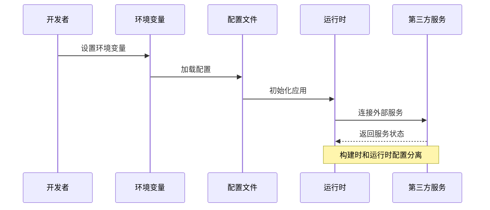

**图表来源**
- [next.config.mjs](file://next.config.mjs#L1-L28)
- [lib/resend/index.ts](file://lib/resend/index.ts#L1-L13)

### 环境隔离策略

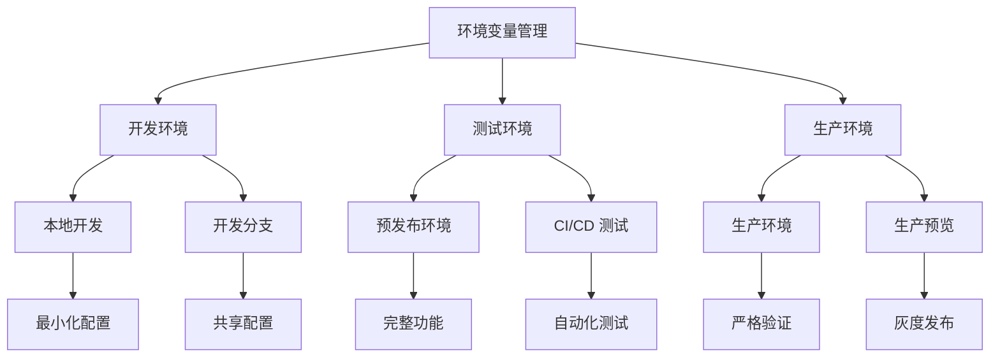

**图表来源**
- [cloudflare.toml](file://cloudflare.toml#L1-L13)
- [CLOUDFLARE_DEPLOYMENT.md](file://CLOUDFLARE_DEPLOYMENT.md#L209-L235)

## 详细组件分析

### Next.js 配置管理

#### 构建配置分析

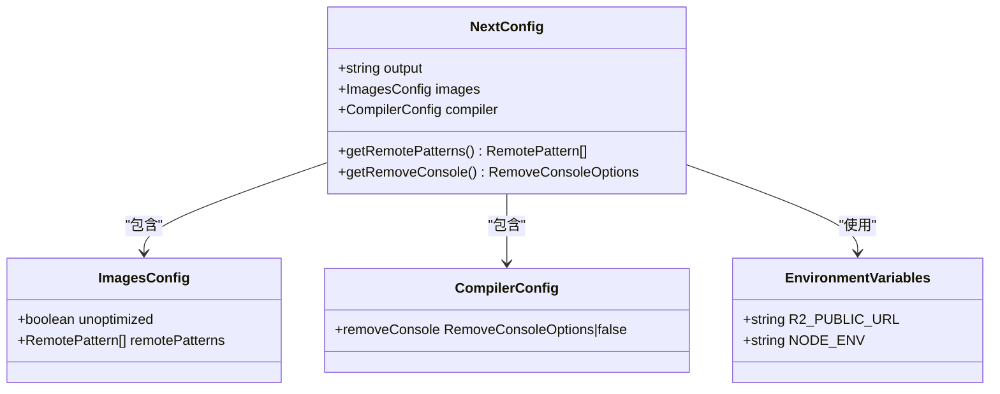

**图表来源**
- [next.config.mjs](file://next.config.mjs#L1-L28)

#### 配置加载流程

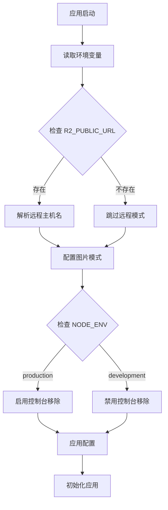

**图表来源**
- [next.config.mjs](file://next.config.mjs#L7-L24)

**章节来源**
- [next.config.mjs](file://next.config.mjs#L1-L28)

### 站点配置管理

#### 配置数据模型

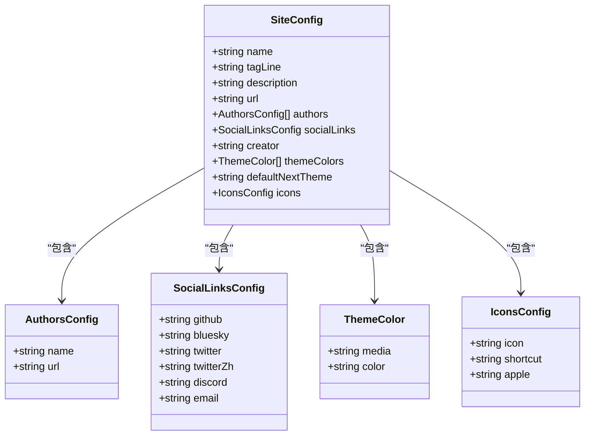

**图表来源**
- [types/siteConfig.ts](file://types/siteConfig.ts#L1-L33)
- [config/site.ts](file://config/site.ts#L14-L44)

#### 动态配置加载

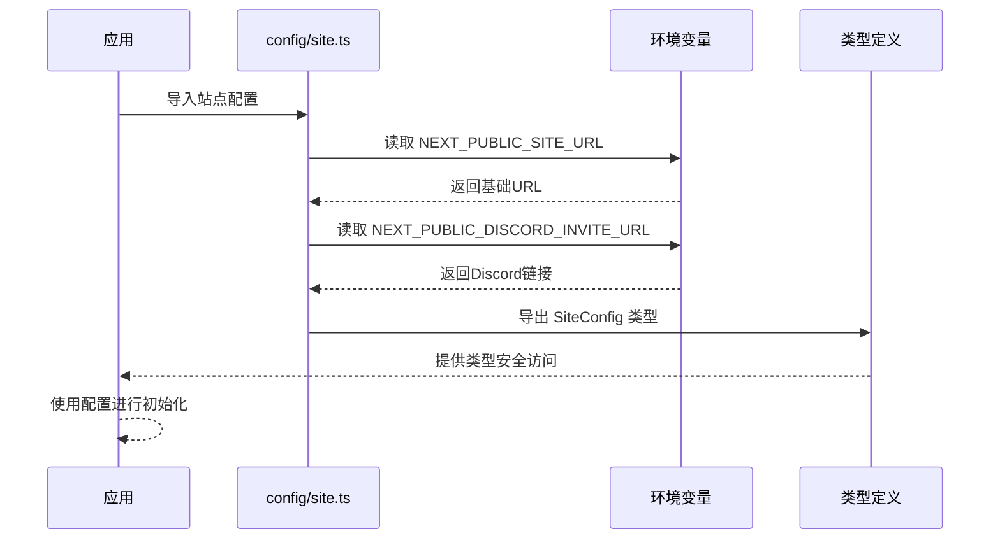

**图表来源**
- [config/site.ts](file://config/site.ts#L1-L45)
- [types/siteConfig.ts](file://types/siteConfig.ts#L1-L33)

**章节来源**
- [config/site.ts](file://config/site.ts#L1-L45)
- [types/siteConfig.ts](file://types/siteConfig.ts#L1-L33)

### 日志配置管理

#### 日志系统架构

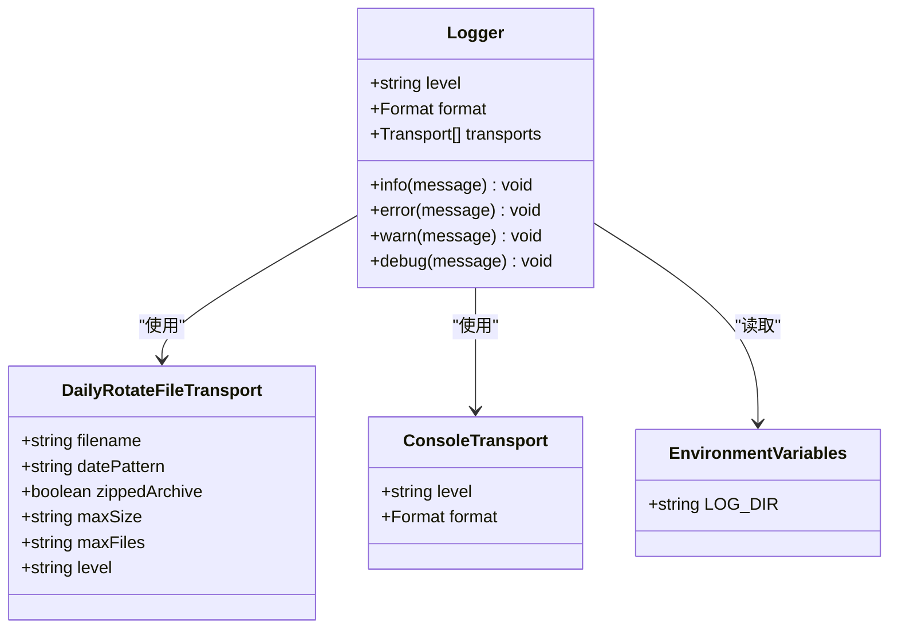

**图表来源**
- [lib/logger.ts](file://lib/logger.ts#L1-L41)

#### 日志配置策略

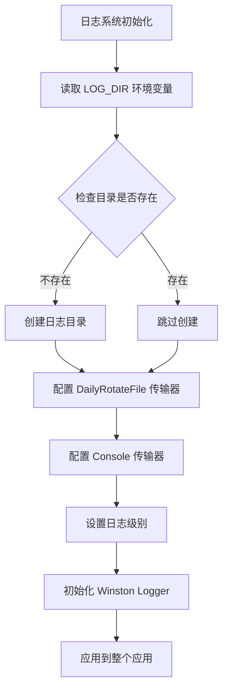

**图表来源**
- [lib/logger.ts](file://lib/logger.ts#L5-L38)

**章节来源**
- [lib/logger.ts](file://lib/logger.ts#L1-L41)

### 邮件服务配置

#### Resend 集成

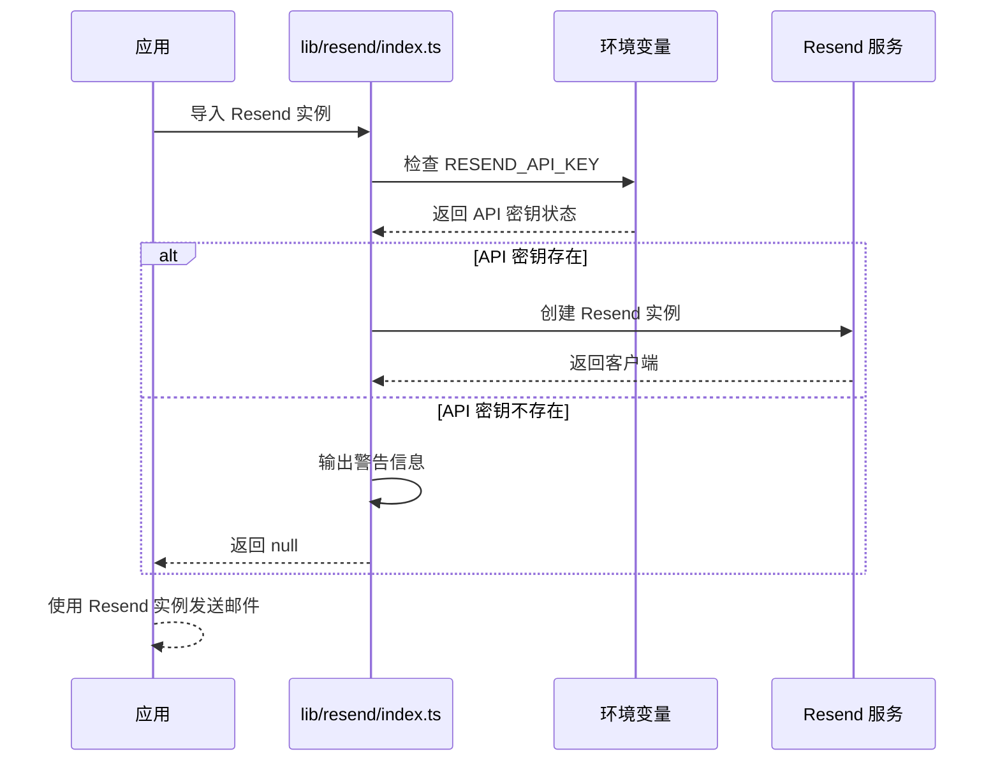

**图表来源**
- [lib/resend/index.ts](file://lib/resend/index.ts#L1-L13)

#### 邮件验证机制

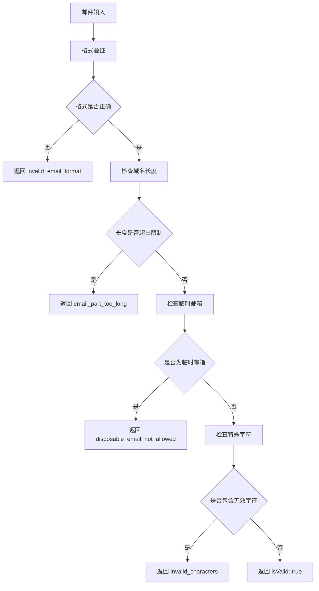

**图表来源**
- [lib/email.ts](file://lib/email.ts#L15-L53)

**章节来源**
- [lib/resend/index.ts](file://lib/resend/index.ts#L1-L13)
- [lib/email.ts](file://lib/email.ts#L1-L91)

### 分析工具配置

#### Google Analytics 集成

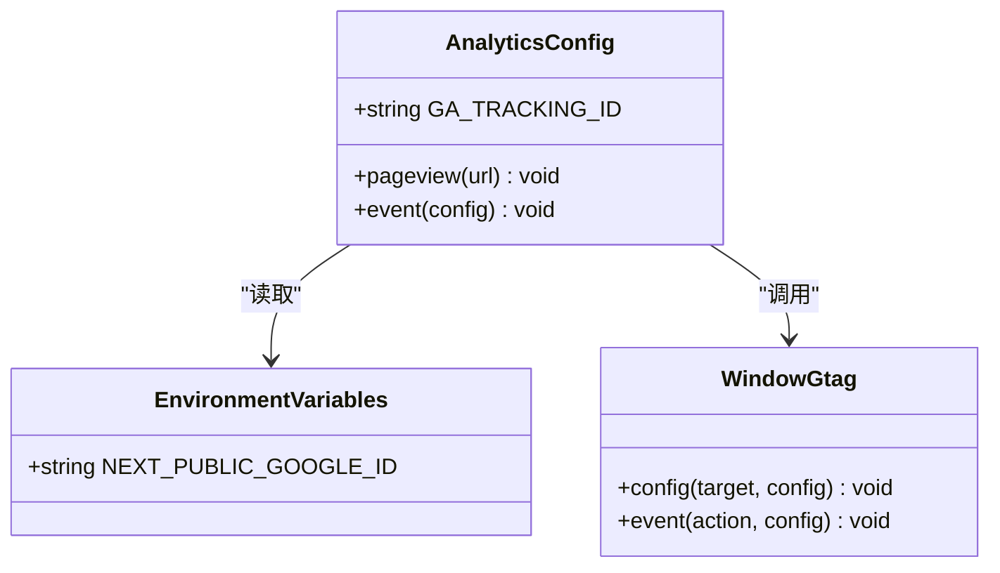

**图表来源**
- [gtag.js](file://gtag.js#L1-L15)

**章节来源**
- [gtag.js](file://gtag.js#L1-L15)

## 依赖关系分析

### 环境变量依赖图

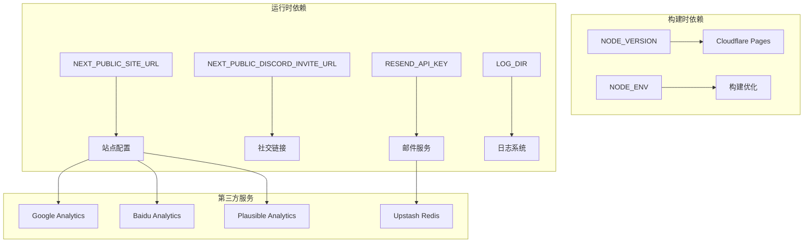

**图表来源**
- [cloudflare.toml](file://cloudflare.toml#L8-L12)
- [config/site.ts](file://config/site.ts#L3-L12)
- [lib/resend/index.ts](file://lib/resend/index.ts#L5-L9)
- [lib/logger.ts](file://lib/logger.ts#L5-L5)

### 配置验证流程

```mermaid
flowchart TD
A[配置加载] --> B[验证必填项]
B --> C{检查 NODE_VERSION }
C --> |缺失| D[抛出配置错误]
C --> |存在| E{检查 NODE_ENV }
E --> |缺失| F[使用默认值 production]
E --> |存在| G{验证 NEXT_PUBLIC_* 变量}
G --> |部分缺失| H[记录警告但继续]
G --> |全部存在| I{验证私密变量}
I --> |RESEND_API_KEY 缺失| J[记录邮件服务降级]
I --> |UPSTASH_REDIS_URL 缺失| K[记录缓存服务降级]
I --> |全部存在| L[配置验证通过]
D --> M[终止应用启动]
H --> N[继续应用启动]
J --> N
K --> N
L --> O[应用正常运行]
```

**图表来源**
- [cloudflare.toml](file://cloudflare.toml#L8-L12)
- [lib/resend/index.ts](file://lib/resend/index.ts#L7-L9)

**章节来源**
- [cloudflare.toml](file://cloudflare.toml#L1-L13)
- [lib/resend/index.ts](file://lib/resend/index.ts#L1-L13)

## 性能考虑

### 环境特定优化

| 环境 | 优化策略 | 配置示例 | 影响范围 |
|------|----------|----------|----------|
| 开发环境 | 启用详细日志 | LOG_LEVEL=debug | 开发体验 |
| 测试环境 | 中等日志级别 | LOG_LEVEL=info | 测试稳定性 |
| 生产环境 | 最小化日志 | LOG_LEVEL=warn | 性能优化 |

### 构建性能优化

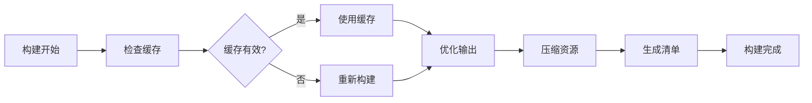

**章节来源**
- [next.config.mjs](file://next.config.mjs#L17-L24)

## 故障排除指南

### 常见环境配置问题

#### 环境变量未生效

**问题症状**:
- 应用无法连接到第三方服务
- 配置显示默认值而非预期值

**排查步骤**:
1. 验证环境变量是否正确设置
2. 检查变量名拼写是否正确
3. 确认变量作用域（NEXT_PUBLIC 前缀）

#### 部署失败

**问题症状**:
- Cloudflare Pages 构建失败
- 找不到 worker.js 文件

**解决方案**:
1. 确保使用正确的构建命令
2. 验证环境变量配置
3. 检查文件权限

#### 服务连接问题

**问题症状**:
- 邮件服务无法发送
- Redis 连接失败

**诊断方法**:
1. 检查 API 密钥格式
2. 验证服务端点可达性
3. 查看服务提供商状态

**章节来源**
- [CLOUDFLARE_DEPLOYMENT.md](file://CLOUDFLARE_DEPLOYMENT.md#L147-L189)
- [DEPLOY_CLOUDFLARE.md](file://DEPLOY_CLOUDFLARE.md#L1-L114)

## 结论

本项目提供了完整的环境配置管理实践，涵盖了从基础的环境变量设置到复杂的第三方服务集成。通过明确的配置层次、严格的验证机制和灵活的环境隔离策略，确保了应用在不同环境下的稳定运行。

关键要点包括：
- 清晰的环境变量命名约定和作用域划分
- 分层的配置管理和类型安全
- 完善的错误处理和降级策略
- 详细的部署和故障排除指南

这些实践为类似项目的环境配置管理提供了良好的参考模板。

## 附录

### 环境变量最佳实践清单

#### 命名约定
- 公共变量使用 `NEXT_PUBLIC_` 前缀
- 私密变量不使用前缀
- 使用描述性变量名

#### 安全考虑
- 永远不要在客户端代码中暴露敏感密钥
- 使用加密存储敏感信息
- 定期轮换 API 密钥

#### 配置验证
- 实施运行时配置验证
- 提供合理的默认值
- 实现优雅的降级机制

#### 监控和日志
- 记录配置加载过程
- 监控环境变量变更
- 实施配置热重载支持