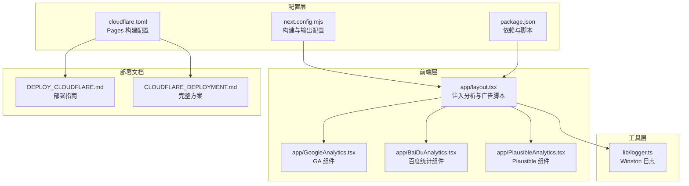
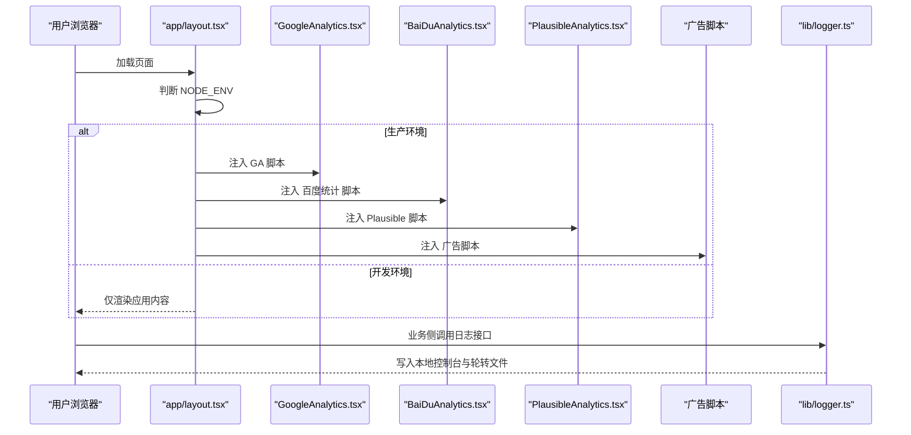
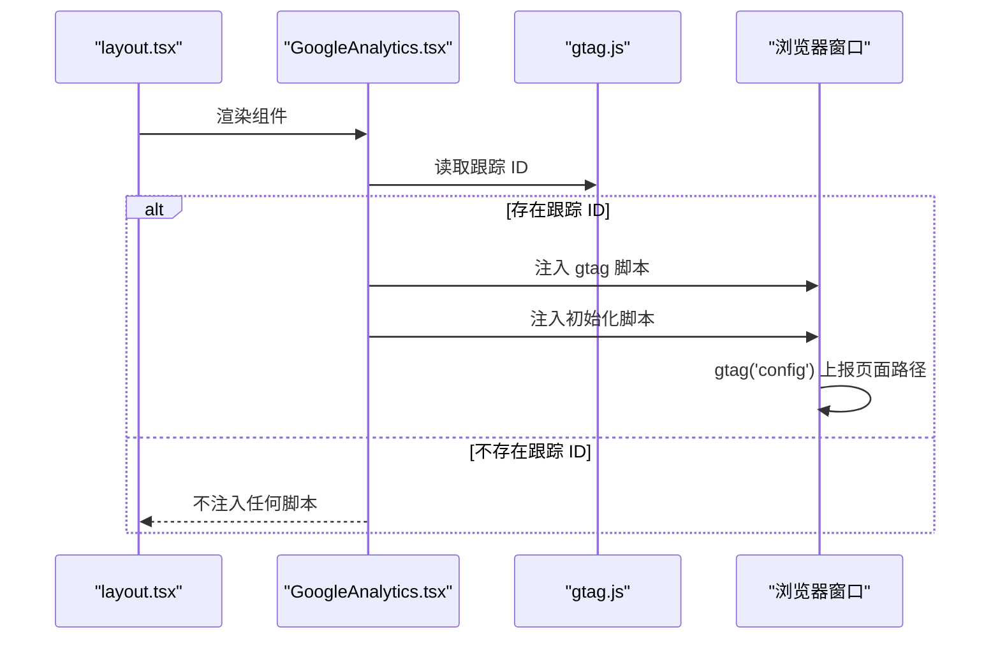
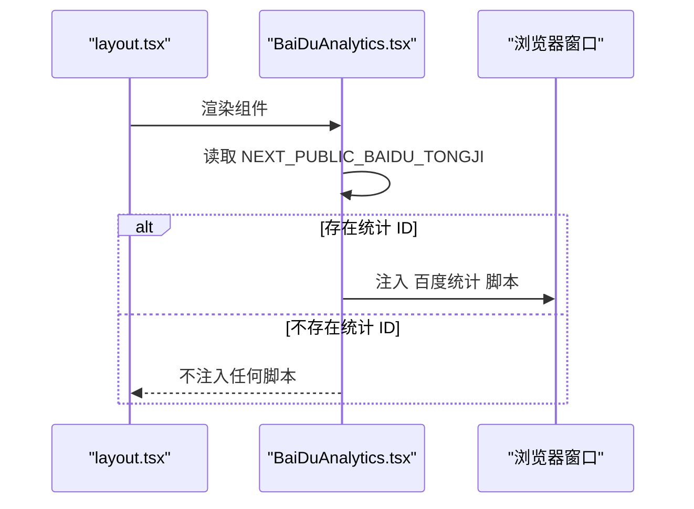
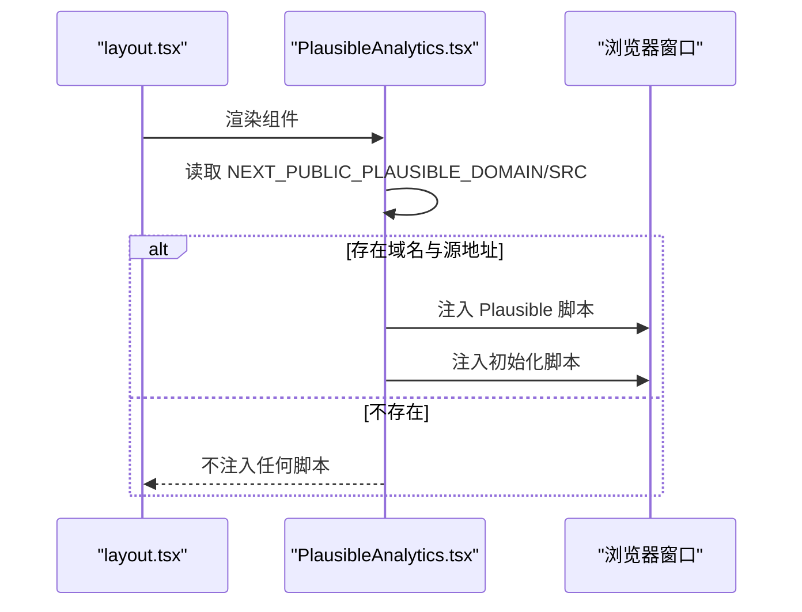
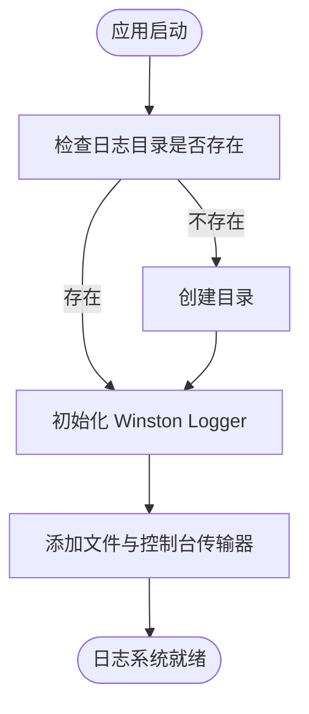
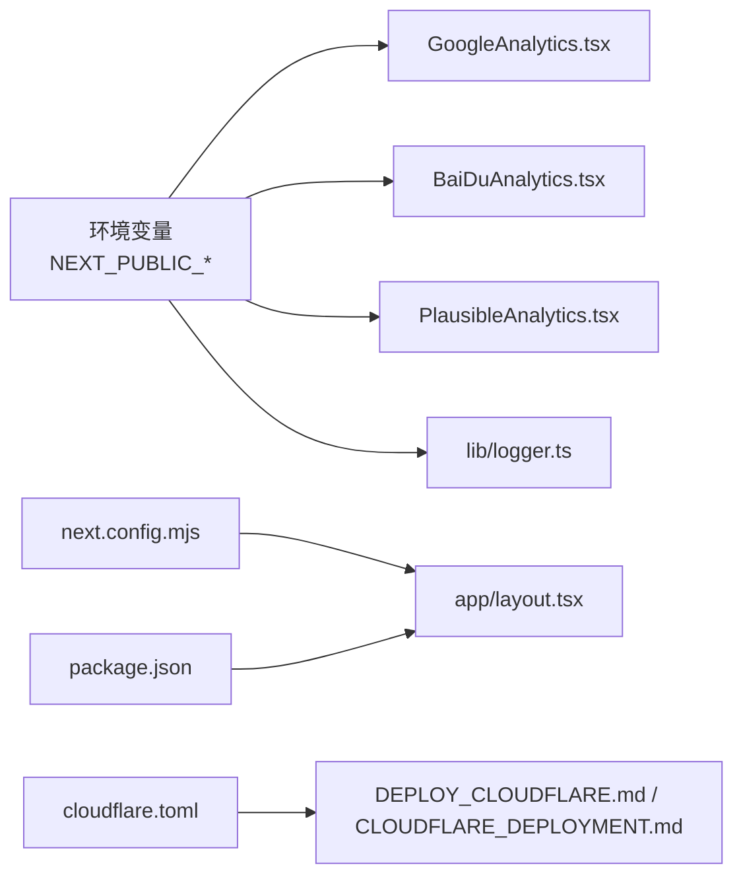

# 监控和运维

<cite>
**本文引用的文件**
- [app/layout.tsx](file://app/layout.tsx)
- [app/GoogleAnalytics.tsx](file://app/GoogleAnalytics.tsx)
- [gtag.js](file://gtag.js)
- [app/BaiDuAnalytics.tsx](file://app/BaiDuAnalytics.tsx)
- [app/PlausibleAnalytics.tsx](file://app/PlausibleAnalytics.tsx)
- [lib/logger.ts](file://lib/logger.ts)
- [next.config.mjs](file://next.config.mjs)
- [package.json](file://package.json)
- [cloudflare.toml](file://cloudflare.toml)
- [DEPLOY_CLOUDFLARE.md](file://DEPLOY_CLOUDFLARE.md)
- [CLOUDFLARE_DEPLOYMENT.md](file://CLOUDFLARE_DEPLOYMENT.md)
- [public/ads.txt](file://public/ads.txt)
- [blogs/zh/2.nextjs-starter-template-guide.mdx](file://blogs/zh/2.nextjs-starter-template-guide.mdx)
</cite>

## 目录
1. [简介](#简介)
2. [项目结构](#项目结构)
3. [核心组件](#核心组件)
4. [架构总览](#架构总览)
5. [组件详解](#组件详解)
6. [依赖关系分析](#依赖关系分析)
7. [性能考量](#性能考量)
8. [故障排查指南](#故障排查指南)
9. [结论](#结论)
10. [附录](#附录)

## 简介
本指南面向监控与运维场景，围绕应用性能监控、用户行为分析与错误追踪，系统讲解如何在当前项目中集成与使用 Google Analytics、百度统计、Plausible Analytics 等分析工具；同时给出日志记录策略、性能指标监控与告警配置思路，并提供运维工具使用、故障排查与系统优化的实用技巧。

## 项目结构
该项目采用 Next.js App Router 结构，监控与运维相关的关键位置包括：
- 布局层注入第三方分析脚本与广告脚本
- 工具层提供日志记录能力
- 配置层控制构建输出与生产环境日志输出策略
- 部署文档提供 Cloudflare Pages 与适配器部署方案

图表来源
- [app/layout.tsx](file://app/layout.tsx#L1-L78)
- [app/GoogleAnalytics.tsx](file://app/GoogleAnalytics.tsx#L1-L38)
- [app/BaiDuAnalytics.tsx](file://app/BaiDuAnalytics.tsx#L1-L34)
- [app/PlausibleAnalytics.tsx](file://app/PlausibleAnalytics.tsx#L1-L40)
- [lib/logger.ts](file://lib/logger.ts#L1-L41)
- [next.config.mjs](file://next.config.mjs#L1-L28)
- [package.json](file://package.json#L1-L65)
- [cloudflare.toml](file://cloudflare.toml#L1-L13)
- [DEPLOY_CLOUDFLARE.md](file://DEPLOY_CLOUDFLARE.md#L1-L114)
- [CLOUDFLARE_DEPLOYMENT.md](file://CLOUDFLARE_DEPLOYMENT.md#L1-L303)

章节来源
- [app/layout.tsx](file://app/layout.tsx#L1-L78)
- [next.config.mjs](file://next.config.mjs#L1-L28)

## 核心组件
- 分析脚本注入：在布局层统一注入 Google Analytics、百度统计、Plausible Analytics 与广告脚本，按环境变量条件加载，避免开发环境干扰。
- 日志记录：基于 Winston 的每日轮转日志，支持本地控制台与文件输出，便于生产问题定位。
- 构建与输出：开启静态导出以适配 Cloudflare Pages，生产环境移除 console 输出，降低体积与噪声。
- 部署与适配：提供 Cloudflare Pages 与 OpenNext 适配器两种部署路径，确保 API Routes 与 SSR 场景可用。

章节来源
- [app/layout.tsx](file://app/layout.tsx#L1-L78)
- [lib/logger.ts](file://lib/logger.ts#L1-L41)
- [next.config.mjs](file://next.config.mjs#L1-L28)
- [package.json](file://package.json#L1-L65)
- [cloudflare.toml](file://cloudflare.toml#L1-L13)

## 架构总览
下图展示前端监控与日志在请求生命周期中的位置与交互：

图表来源
- [app/layout.tsx](file://app/layout.tsx#L63-L73)
- [app/GoogleAnalytics.tsx](file://app/GoogleAnalytics.tsx#L9-L32)
- [app/BaiDuAnalytics.tsx](file://app/BaiDuAnalytics.tsx#L8-L28)
- [app/PlausibleAnalytics.tsx](file://app/PlausibleAnalytics.tsx#L12-L34)
- [lib/logger.ts](file://lib/logger.ts#L20-L38)

## 组件详解

### Google Analytics 集成
- 组件职责：按环境变量条件加载 GA 脚本与初始化配置，支持页面浏览事件上报。
- 关键点：
  - 使用 Next.js 的动态脚本注入，保证客户端执行。
  - 初始化脚本设置页面路径参数，确保准确统计。
  - 提供独立的事件上报工具模块，便于业务侧调用。

图表来源
- [app/GoogleAnalytics.tsx](file://app/GoogleAnalytics.tsx#L1-L38)
- [gtag.js](file://gtag.js#L1-L16)
- [app/layout.tsx](file://app/layout.tsx#L67-L71)

章节来源
- [app/GoogleAnalytics.tsx](file://app/GoogleAnalytics.tsx#L1-L38)
- [gtag.js](file://gtag.js#L1-L16)
- [blogs/zh/2.nextjs-starter-template-guide.mdx](file://blogs/zh/2.nextjs-starter-template-guide.mdx#L96-L116)

### 百度统计集成
- 组件职责：按环境变量条件加载百度统计脚本，实现基础 PV/UV 统计。
- 关键点：
  - 使用 Next.js 的动态脚本注入，延迟到交互后加载。
  - 通过环境变量传入统计 ID，避免硬编码。

图表来源
- [app/BaiDuAnalytics.tsx](file://app/BaiDuAnalytics.tsx#L1-L34)
- [app/layout.tsx](file://app/layout.tsx#L67-L71)

章节来源
- [app/BaiDuAnalytics.tsx](file://app/BaiDuAnalytics.tsx#L1-L34)
- [blogs/zh/2.nextjs-starter-template-guide.mdx](file://blogs/zh/2.nextjs-starter-template-guide.mdx#L96-L116)

### Plausible Analytics 集成
- 组件职责：按环境变量条件加载 Plausible 脚本，支持隐私友好的统计。
- 关键点：
  - 通过 data-domain 属性绑定域名，defer 异步加载。
  - 提供初始化脚本，确保全局方法可用。

图表来源
- [app/PlausibleAnalytics.tsx](file://app/PlausibleAnalytics.tsx#L1-L40)
- [app/layout.tsx](file://app/layout.tsx#L67-L71)

章节来源
- [app/PlausibleAnalytics.tsx](file://app/PlausibleAnalytics.tsx#L1-L40)
- [blogs/zh/2.nextjs-starter-template-guide.mdx](file://blogs/zh/2.nextjs-starter-template-guide.mdx#L96-L116)

### 日志记录策略
- 实现方式：基于 Winston 的每日轮转文件传输器，结合控制台输出，支持 JSON 格式与时间戳。
- 配置要点：
  - 日志目录可通过环境变量自定义，默认为 log。
  - 文件按日期轮转，压缩归档，保留最近 3 天，单文件最大 20MB。
  - 控制台输出带颜色与简单格式，便于本地调试。

图表来源
- [lib/logger.ts](file://lib/logger.ts#L1-L41)

章节来源
- [lib/logger.ts](file://lib/logger.ts#L1-L41)

### 性能指标监控与告警
- 内置监控：Vercel Analytics 已在布局中引入，用于前端性能与访问指标采集。
- 建议实践：
  - 将关键页面的首屏时间、TTI 等指标纳入监控看板。
  - 对异常错误率、响应时间阈值设置告警。
  - 结合日志与分析平台的错误追踪，建立闭环。

章节来源
- [app/layout.tsx](file://app/layout.tsx#L14-L14)

### 错误追踪与用户反馈
- 前端错误：结合分析平台与日志系统，定位页面异常与用户路径。
- 用户反馈：可利用 Toast 组件向用户提示操作结果与错误信息，提升可观测性。

章节来源
- [hooks/use-toast.ts](file://hooks/use-toast.ts#L1-L195)

## 依赖关系分析
- 前端分析脚本依赖环境变量与 Next.js 的动态脚本注入能力。
- 日志系统依赖 Node.js 文件系统与 Winston，适合服务端或边缘运行时。
- 构建配置影响静态导出与生产环境输出，进而影响部署与性能。

图表来源
- [app/layout.tsx](file://app/layout.tsx#L1-L78)
- [app/GoogleAnalytics.tsx](file://app/GoogleAnalytics.tsx#L1-L38)
- [app/BaiDuAnalytics.tsx](file://app/BaiDuAnalytics.tsx#L1-L34)
- [app/PlausibleAnalytics.tsx](file://app/PlausibleAnalytics.tsx#L1-L40)
- [lib/logger.ts](file://lib/logger.ts#L1-L41)
- [next.config.mjs](file://next.config.mjs#L1-L28)
- [package.json](file://package.json#L1-L65)
- [cloudflare.toml](file://cloudflare.toml#L1-L13)
- [DEPLOY_CLOUDFLARE.md](file://DEPLOY_CLOUDFLARE.md#L1-L114)
- [CLOUDFLARE_DEPLOYMENT.md](file://CLOUDFLARE_DEPLOYMENT.md#L1-L303)

章节来源
- [package.json](file://package.json#L1-L65)
- [next.config.mjs](file://next.config.mjs#L1-L28)

## 性能考量
- 构建输出：启用静态导出以适配 Pages，减少服务器端依赖。
- 生产输出：移除 console 输出，降低体积与潜在性能开销。
- 分析脚本：采用“交互后加载”策略，避免阻塞首屏渲染。
- 日志：文件轮转与压缩，避免磁盘占用过大；仅在必要级别输出。

章节来源
- [next.config.mjs](file://next.config.mjs#L17-L24)
- [app/layout.tsx](file://app/layout.tsx#L63-L73)
- [lib/logger.ts](file://lib/logger.ts#L11-L18)

## 故障排查指南
- 分析脚本未生效
  - 检查对应环境变量是否正确配置。
  - 确认组件在生产环境才被注入。
- 构建失败或部署入口缺失
  - 若使用 OpenNext 适配器，确保构建命令包含适配器构建步骤。
  - 检查构建日志中是否生成适配器产物。
- pnpm 版本不匹配
  - 在项目根目录创建引擎严格配置文件，确保与 package.json 中声明一致。
- 构建超时
  - 优化依赖与构建步骤，利用缓存，必要时考虑本地构建预览。

章节来源
- [DEPLOY_CLOUDFLARE.md](file://DEPLOY_CLOUDFLARE.md#L1-L114)
- [CLOUDFLARE_DEPLOYMENT.md](file://CLOUDFLARE_DEPLOYMENT.md#L147-L188)

## 结论
本项目在前端层面实现了多平台分析脚本的条件注入与隐私友好的统计方案，在工具层面提供了可扩展的日志记录能力，并通过构建与部署配置保障了在 Cloudflare Pages 上的稳定运行。建议在生产环境中结合 Vercel Analytics、分析平台与日志系统，形成完整的可观测性闭环，并配合告警策略与故障排查流程，持续优化性能与稳定性。

## 附录

### 环境变量与配置清单
- 分析平台
  - NEXT_PUBLIC_GOOGLE_ID：Google Analytics 跟踪 ID
  - NEXT_PUBLIC_BAIDU_TONGJI：百度统计 ID
  - NEXT_PUBLIC_PLAUSIBLE_DOMAIN：Plausible 域名
  - NEXT_PUBLIC_PLAUSIBLE_SRC：Plausible 脚本地址
- 日志
  - LOG_DIR：日志目录（默认 log）
- 构建与部署
  - NODE_VERSION：Node.js 版本（推荐 20）
  - NODE_ENV：运行环境（生产）

章节来源
- [blogs/zh/2.nextjs-starter-template-guide.mdx](file://blogs/zh/2.nextjs-starter-template-guide.mdx#L96-L116)
- [lib/logger.ts](file://lib/logger.ts#L5-L5)
- [cloudflare.toml](file://cloudflare.toml#L8-L12)