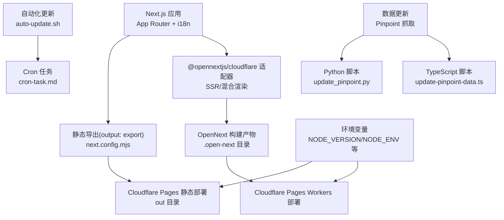
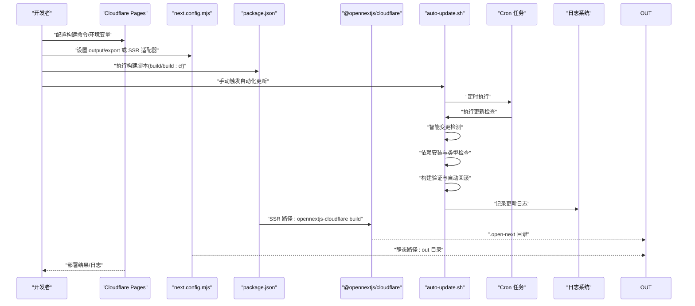
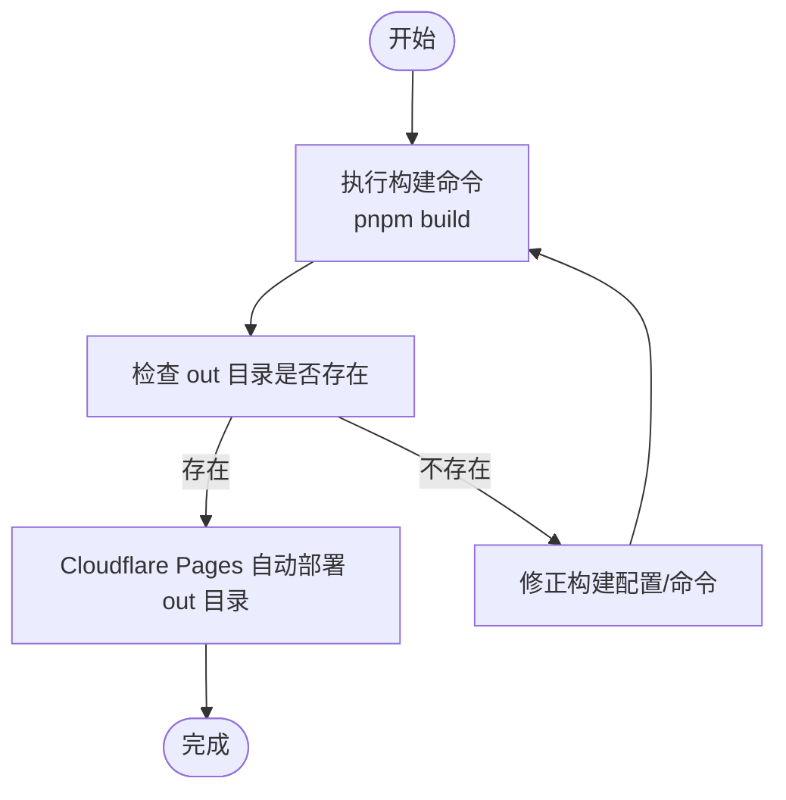
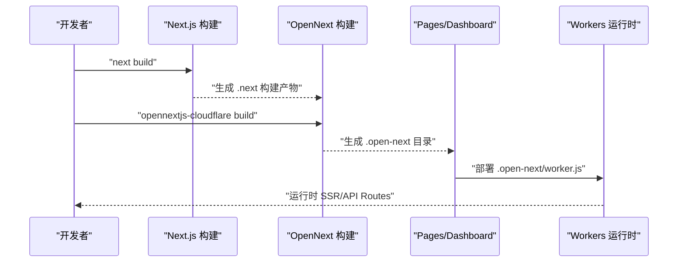
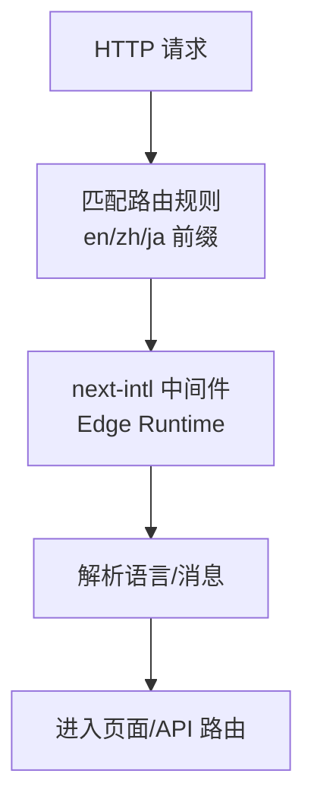
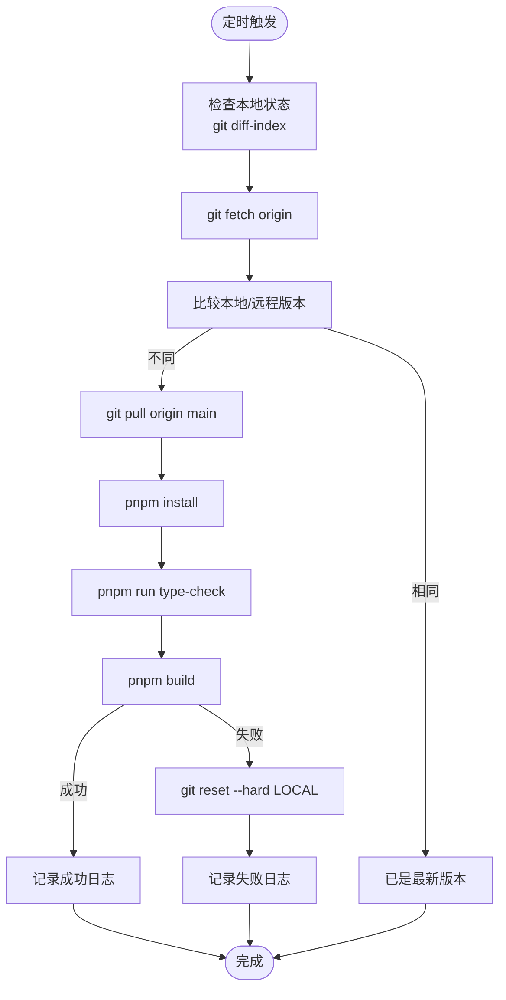
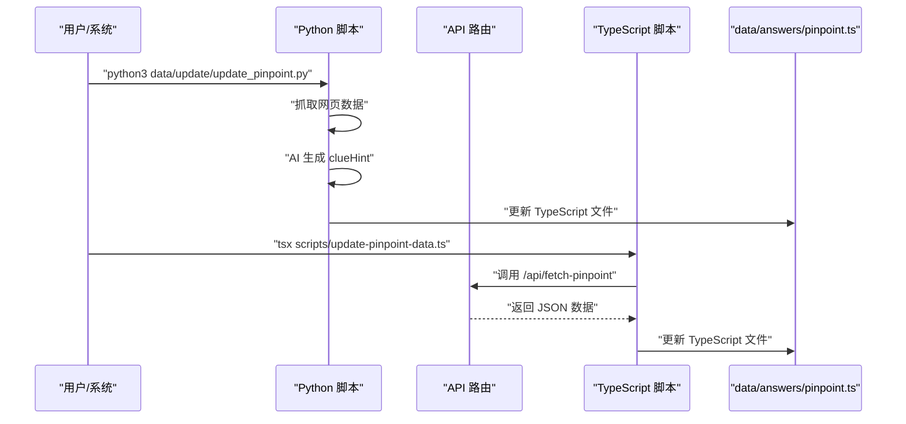
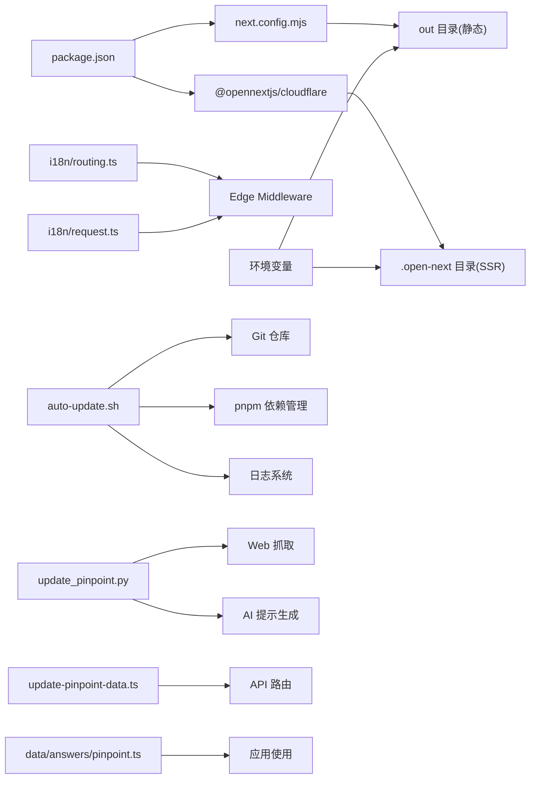

# 部署和运维

<cite>
**本文引用的文件**
- [AUTO_UPDATE.md](file://AUTO_UPDATE.md)
- [scripts/auto-update.sh](file://scripts/auto-update.sh)
- [cron-task.md](file://cron-task.md)
- [scripts/README.md](file://scripts/README.md)
- [scripts/update-pinpoint-data.ts](file://scripts/update-pinpoint-data.ts)
- [data/update/update_pinpoint.py](file://data/update/update_pinpoint.py)
- [CLOUDFLARE_DEPLOYMENT.md](file://CLOUDFLARE_DEPLOYMENT.md)
- [CLOUDFLARE_PAGES_SETUP.md](file://CLOUDFLARE_PAGES_SETUP.md)
- [CLOUDFLARE_PAGES_STATIC_DEPLOY.md](file://CLOUDFLARE_PAGES_STATIC_DEPLOY.md)
- [DEPLOY_CLOUDFLARE.md](file://DEPLOY_CLOUDFLARE.md)
- [cloudflare.toml](file://cloudflare.toml)
- [next.config.mjs](file://next.config.mjs)
- [package.json](file://package.json)
- [README.md](file://README.md)
- [i18n/routing.ts](file://i18n/routing.ts)
- [i18n/request.ts](file://i18n/request.ts)
- [next-env.d.ts](file://next-env.d.ts)
- [tsconfig.json](file://tsconfig.json)
</cite>

## 目录
1. [简介](#简介)
2. [项目结构](#项目结构)
3. [核心组件](#核心组件)
4. [架构总览](#架构总览)
5. [详细组件分析](#详细组件分析)
6. [依赖关系分析](#依赖关系分析)
7. [性能考虑](#性能考虑)
8. [故障排除指南](#故障排除指南)
9. [结论](#结论)
10. [附录](#附录)

## 简介
本指南面向部署与运维团队，提供基于 Cloudflare Pages 的完整部署与运维实践，覆盖一键部署按钮、手动部署步骤、静态导出与 SSR 适配器两种路径、环境变量管理、构建优化、安全与性能调优、监控与回滚、CI/CD 集成与质量保障等。文档同时给出针对本项目的实际配置要点与检查清单，帮助快速落地。

**更新** 新增完整的自动化更新基础设施，包括智能变更检测、依赖安装、类型检查和构建过程的自动化，以及 Pinpoint 游戏数据的自动化抓取和更新机制。

## 项目结构
本项目采用 Next.js App Router 结构，结合国际化（next-intl）、静态导出与 Cloudflare 适配器能力，支持 API Routes 与多语言路由。关键部署相关文件包括：
- 构建配置：next.config.mjs（静态导出）、cloudflare.toml（示例 Pages 配置）
- 包管理与脚本：package.json（构建与部署脚本）
- 国际化：i18n/routing.ts、i18n/request.ts
- 类型与环境：next-env.d.ts、tsconfig.json
- 部署文档：CLOUDFLARE_DEPLOYMENT.md、CLOUDFLARE_PAGES_SETUP.md、CLOUDFLARE_PAGES_STATIC_DEPLOY.md、DEPLOY_CLOUDFLARE.md
- **自动化更新**：scripts/auto-update.sh（78行自动化脚本）、cron-task.md（Cron 配置）、AUTO_UPDATE.md（完整任务说明）
- **数据更新**：data/update/update_pinpoint.py（Python 抓取脚本）、scripts/update-pinpoint-data.ts（TypeScript 更新脚本）

**图表来源**
- [next.config.mjs](file://next.config.mjs#L1-L28)
- [package.json](file://package.json#L1-L65)
- [scripts/auto-update.sh](file://scripts/auto-update.sh#L1-L79)
- [cron-task.md](file://cron-task.md#L1-L67)
- [data/update/update_pinpoint.py](file://data/update/update_pinpoint.py#L1-L450)
- [scripts/update-pinpoint-data.ts](file://scripts/update-pinpoint-data.ts#L1-L82)

**章节来源**
- [next.config.mjs](file://next.config.mjs#L1-L28)
- [package.json](file://package.json#L1-L65)
- [i18n/routing.ts](file://i18n/routing.ts#L1-L37)
- [i18n/request.ts](file://i18n/request.ts#L1-L28)
- [next-env.d.ts](file://next-env.d.ts#L1-L7)
- [tsconfig.json](file://tsconfig.json#L1-L43)

## 核心组件
- 静态导出路径：适用于无需 API Routes 的纯静态站点，构建输出至 out 目录，Cloudflare Pages 直接部署。
- SSR/混合渲染路径：通过 @opennextjs/cloudflare 适配器，将 Next.js 构建产物转换为 Cloudflare Workers 格式，支持 API Routes 与 SSR。
- 国际化中间件：基于 next-intl 的 Edge Middleware，支持 en/zh/ja 多语言路由与自动检测。
- 环境变量：在 Cloudflare Pages 控制台设置 NODE_VERSION、NODE_ENV、i18n 与第三方服务密钥等。
- **自动化更新系统**：基于 Bash 脚本的智能变更检测、依赖安装、类型检查和构建验证，支持自动回滚和通知机制。
- **数据更新管道**：支持 Python 和 TypeScript 两种方式的 Pinpoint 游戏数据抓取与更新。

**章节来源**
- [CLOUDFLARE_DEPLOYMENT.md](file://CLOUDFLARE_DEPLOYMENT.md#L32-L126)
- [CLOUDFLARE_PAGES_STATIC_DEPLOY.md](file://CLOUDFLARE_PAGES_STATIC_DEPLOY.md#L1-L61)
- [i18n/routing.ts](file://i18n/routing.ts#L1-L37)
- [package.json](file://package.json#L1-L65)
- [scripts/auto-update.sh](file://scripts/auto-update.sh#L1-L79)
- [data/update/update_pinpoint.py](file://data/update/update_pinpoint.py#L1-L450)

## 架构总览
下图展示两种部署路径的端到端流程与关键产物，以及新增的自动化更新架构：

**图表来源**
- [CLOUDFLARE_DEPLOYMENT.md](file://CLOUDFLARE_DEPLOYMENT.md#L61-L126)
- [CLOUDFLARE_PAGES_STATIC_DEPLOY.md](file://CLOUDFLARE_PAGES_STATIC_DEPLOY.md#L7-L32)
- [next.config.mjs](file://next.config.mjs#L1-L28)
- [package.json](file://package.json#L8-L15)
- [scripts/auto-update.sh](file://scripts/auto-update.sh#L1-L79)
- [cron-task.md](file://cron-task.md#L1-L67)

## 详细组件分析

### 组件A：静态导出部署（适合纯静态站点）
- 构建命令：使用 pnpm/npx 运行构建脚本，输出目录为 out。
- Pages 控制台配置：构建命令、输出目录、根目录、Node.js 版本。
- 环境变量：可选设置 NODE_VERSION。
- 重要约束：不要使用 wrangler 部署命令；部署命令字段应留空或使用占位符。

**图表来源**
- [CLOUDFLARE_PAGES_STATIC_DEPLOY.md](file://CLOUDFLARE_PAGES_STATIC_DEPLOY.md#L7-L32)
- [next.config.mjs](file://next.config.mjs#L3-L4)

**章节来源**
- [CLOUDFLARE_PAGES_STATIC_DEPLOY.md](file://CLOUDFLARE_PAGES_STATIC_DEPLOY.md#L1-L61)
- [next.config.mjs](file://next.config.mjs#L1-L28)

### 组件B：SSR/混合渲染部署（推荐，支持 API Routes）
- 适配器：@opennextjs/cloudflare，将 Next.js 构建产物转换为 Cloudflare Workers 格式。
- 构建命令：先 next build，再 opennextjs-cloudflare build，输出 .open-next 目录。
- 中间件：Edge Runtime 的 next-intl 中间件，支持多语言路由。
- 环境变量：NODE_VERSION、NODE_ENV、i18n 与业务密钥等。

**图表来源**
- [CLOUDFLARE_DEPLOYMENT.md](file://CLOUDFLARE_DEPLOYMENT.md#L34-L126)
- [CLOUDFLARE_PAGES_SETUP.md](file://CLOUDFLARE_PAGES_SETUP.md#L67-L82)
- [package.json](file://package.json#L19-L19)

**章节来源**
- [CLOUDFLARE_DEPLOYMENT.md](file://CLOUDFLARE_DEPLOYMENT.md#L32-L126)
- [CLOUDFLARE_PAGES_SETUP.md](file://CLOUDFLARE_PAGES_SETUP.md#L1-L109)
- [package.json](file://package.json#L1-L65)

### 组件C：国际化与中间件（Edge Runtime）
- 路由配置：定义支持的语言列表、默认语言、自动检测开关与前缀策略。
- 请求配置：服务端按请求解析语言，确保有效语言与默认语言回退。
- 中间件：Edge Runtime 的 next-intl 中间件，匹配多语言路由与非静态资源路径。

**图表来源**
- [i18n/routing.ts](file://i18n/routing.ts#L12-L23)
- [i18n/request.ts](file://i18n/request.ts#L4-L27)
- [CLOUDFLARE_DEPLOYMENT.md](file://CLOUDFLARE_DEPLOYMENT.md#L40-L59)

**章节来源**
- [i18n/routing.ts](file://i18n/routing.ts#L1-L37)
- [i18n/request.ts](file://i18n/request.ts#L1-L28)
- [CLOUDFLARE_DEPLOYMENT.md](file://CLOUDFLARE_DEPLOYMENT.md#L38-L59)

### 组件D：环境变量与安全
- 必需变量：NODE_VERSION（如 20）、NODE_ENV（production）。
- 可选变量：i18n 检测开关 NEXT_PUBLIC_LOCALE_DETECTION、第三方服务密钥等。
- 安全建议：敏感变量在 Pages 控制台勾选加密；避免在客户端暴露私密密钥。

**章节来源**
- [CLOUDFLARE_DEPLOYMENT.md](file://CLOUDFLARE_DEPLOYMENT.md#L209-L235)
- [CLOUDFLARE_PAGES_STATIC_DEPLOY.md](file://CLOUDFLARE_PAGES_STATIC_DEPLOY.md#L15-L19)
- [cloudflare.toml](file://cloudflare.toml#L8-L12)

### 组件E：构建优化与缓存
- 缓存策略：Cloudflare Pages 会缓存 node_modules，确保 .gitignore 正确。
- 依赖管理：使用 pnpm 并固定版本，减少安装时间。
- 构建时间：OpenNext 构建可能较长，建议在 CI 中开启缓存与并行任务。

**章节来源**
- [CLOUDFLARE_DEPLOYMENT.md](file://CLOUDFLARE_DEPLOYMENT.md#L236-L249)
- [package.json](file://package.json#L4-L6)

### 组件F：自动化更新基础设施（新增）
- **智能变更检测**：自动检查远程仓库更新，避免重复更新。
- **依赖管理**：自动安装 pnpm 依赖，支持增量更新。
- **类型检查**：运行 TypeScript 类型检查，支持警告但继续构建。
- **构建验证**：执行构建测试，失败时自动回滚到上次稳定版本。
- **日志记录**：详细的更新日志记录到 logs/auto-update.log。
- **通知机制**：可选的钉钉通知，支持成功和失败通知配置。

**图表来源**
- [scripts/auto-update.sh](file://scripts/auto-update.sh#L1-L79)
- [AUTO_UPDATE.md](file://AUTO_UPDATE.md#L30-L78)
- [cron-task.md](file://cron-task.md#L1-L67)

**章节来源**
- [scripts/auto-update.sh](file://scripts/auto-update.sh#L1-L79)
- [AUTO_UPDATE.md](file://AUTO_UPDATE.md#L1-L144)
- [cron-task.md](file://cron-task.md#L1-L67)

### 组件G：数据更新管道（新增）
- **Python 抓取脚本**：从 https://pinpointanswer.today/ 抓取 LinkedIn Pinpoint 游戏的当天答案和历史答案数据。
- **AI 提示生成**：支持 DeepSeek 和 OpenAI API，自动生成有意义的 clueHint。
- **TypeScript 更新脚本**：通过 API 路由获取数据并更新 TypeScript 文件。
- **多语言支持**：支持英文、日文、中文三种语言的提示生成。

**图表来源**
- [data/update/update_pinpoint.py](file://data/update/update_pinpoint.py#L1-L450)
- [scripts/update-pinpoint-data.ts](file://scripts/update-pinpoint-data.ts#L1-L82)

**章节来源**
- [data/update/update_pinpoint.py](file://data/update/update_pinpoint.py#L1-L450)
- [scripts/update-pinpoint-data.ts](file://scripts/update-pinpoint-data.ts#L1-L82)
- [scripts/README.md](file://scripts/README.md#L1-L165)

## 依赖关系分析
- next.config.mjs 决定构建输出类型（静态导出或 SSR 适配器）。
- package.json 提供构建脚本与依赖（含 @opennextjs/cloudflare）。
- i18n/routing.ts 与 i18n/request.ts 提供国际化路由与请求解析。
- cloudflare.toml 为 Pages 配置提供参考（实际以控制台为准）。
- **scripts/auto-update.sh** 依赖 Git、pnpm、Node.js 环境。
- **data/update/update_pinpoint.py** 依赖 requests、beautifulsoup4、json5 等 Python 库。
- **scripts/update-pinpoint-data.ts** 依赖 Node.js 环境和 Next.js API 路由。

**图表来源**
- [package.json](file://package.json#L1-L65)
- [next.config.mjs](file://next.config.mjs#L1-L28)
- [i18n/routing.ts](file://i18n/routing.ts#L1-L37)
- [i18n/request.ts](file://i18n/request.ts#L1-L28)
- [cloudflare.toml](file://cloudflare.toml#L1-L13)
- [scripts/auto-update.sh](file://scripts/auto-update.sh#L1-L79)
- [data/update/update_pinpoint.py](file://data/update/update_pinpoint.py#L1-L450)
- [scripts/update-pinpoint-data.ts](file://scripts/update-pinpoint-data.ts#L1-L82)

**章节来源**
- [package.json](file://package.json#L1-L65)
- [next.config.mjs](file://next.config.mjs#L1-L28)
- [i18n/routing.ts](file://i18n/routing.ts#L1-L37)
- [i18n/request.ts](file://i18n/request.ts#L1-L28)
- [cloudflare.toml](file://cloudflare.toml#L1-L13)

## 性能考虑
- 构建时间优化：使用 pnpm、缓存 node_modules、减少依赖体积。
- 输出大小控制：Cloudflare Pages 对构建输出大小有限制，优先静态导出或精简 SSR 产物。
- 图片与静态资源：静态导出需禁用图片优化；合理使用 CDN 与压缩。
- 日志与监控：通过 Pages 构建日志定位问题，必要时开启第三方分析埋点。
- **自动化更新性能**：使用智能变更检测避免不必要的构建；类型检查支持警告但继续构建以提高效率。

**章节来源**
- [CLOUDFLARE_DEPLOYMENT.md](file://CLOUDFLARE_DEPLOYMENT.md#L236-L249)
- [next.config.mjs](file://next.config.mjs#L5-L16)
- [scripts/auto-update.sh](file://scripts/auto-update.sh#L44-L48)

## 故障排除指南
- 中间件错误：确保使用 Edge Runtime 的 middleware.ts，删除旧的 proxy.ts。
- 构建入口缺失：确认构建命令包含 opennextjs-cloudflare build，并验证 .open-next/worker.js 是否生成。
- pnpm 版本不匹配：在根目录创建 .npmrc 并在 package.json 指定 packageManager。
- 构建超时：优化依赖、启用缓存、检查不必要的构建步骤。
- 静态部署误用 wrangler：静态站点不要使用 wrangler 部署命令。
- **自动化更新失败**：检查 Git 状态、pnpm 安装、类型检查和构建日志；确认自动回滚机制正常工作。
- **数据抓取失败**：检查网络连接、目标网站结构变化、AI API 密钥配置。

**章节来源**
- [CLOUDFLARE_DEPLOYMENT.md](file://CLOUDFLARE_DEPLOYMENT.md#L147-L189)
- [CLOUDFLARE_PAGES_SETUP.md](file://CLOUDFLARE_PAGES_SETUP.md#L84-L102)
- [CLOUDFLARE_PAGES_STATIC_DEPLOY.md](file://CLOUDFLARE_PAGES_STATIC_DEPLOY.md#L34-L46)
- [scripts/auto-update.sh](file://scripts/auto-update.sh#L63-L76)
- [data/update/update_pinpoint.py](file://data/update/update_pinpoint.py#L1-L450)

## 结论
- 若项目仅需静态内容，优先采用静态导出路径，配置简单、部署快速。
- 若需 API Routes 与 SSR，采用 @opennextjs/cloudflare 适配器，配合 Edge Middleware 与国际化配置。
- **新增的自动化更新基础设施**提供了完整的变更检测、依赖管理、类型检查和构建验证流程，确保部署质量和稳定性。
- **数据更新管道**支持多种方式的自动化数据抓取和更新，提高了内容维护效率。
- 通过严格的环境变量管理、构建优化与监控日志，可显著提升稳定性与交付效率。
- 建议在 CI/CD 中集成自动化测试与质量门禁，保障每次变更的安全与质量。

## 附录

### 一键部署按钮与手动部署步骤
- 一键部署：可在项目 README 中嵌入平台提供的"Deploy"按钮（如 Vercel），用于演示或替代平台的快速导入。
- 手动部署（Cloudflare Pages）：
  1) 连接 GitHub 仓库并授权。
  2) 在 Pages 项目设置中配置构建命令、输出目录、根目录与 Node.js 版本。
  3) 设置环境变量（NODE_VERSION、NODE_ENV、i18n 与业务密钥）。
  4) 推送代码触发自动构建，或在控制台重试部署。

**章节来源**
- [README.md](file://README.md#L181-L193)
- [CLOUDFLARE_PAGES_SETUP.md](file://CLOUDFLARE_PAGES_SETUP.md#L11-L37)

### 平台迁移指南（从 Vercel/其他平台迁移到 Cloudflare Pages）
- 静态导出：保持 next.config.mjs 的 output: export，构建命令与输出目录不变。
- SSR/混合渲染：移除 Vercel 特定配置，引入 @opennextjs/cloudflare，调整构建命令为先 next build 再 opennextjs-cloudflare build。
- 国际化：保留 i18n/routing.ts 与 Edge Middleware，确保匹配规则与运行时一致。
- 环境变量：在 Pages 控制台重新配置，注意加密敏感变量。

**章节来源**
- [CLOUDFLARE_DEPLOYMENT.md](file://CLOUDFLARE_DEPLOYMENT.md#L32-L126)
- [CLOUDFLARE_PAGES_STATIC_DEPLOY.md](file://CLOUDFLARE_PAGES_STATIC_DEPLOY.md#L1-L61)
- [i18n/routing.ts](file://i18n/routing.ts#L1-L37)

### 生产环境配置与安全
- 生产环境变量：NODE_ENV=production、NODE_VERSION=20、i18n 开关、第三方服务密钥。
- 安全设置：敏感变量加密；限制公开 API；启用 HTTPS 与安全头（由 Pages 默认提供）。
- 性能调优：启用静态导出优先；若使用 SSR，优化 OpenNext 构建与缓存。
- **自动化更新安全**：在 Cron 任务中配置适当的权限和环境变量，确保脚本安全执行。

**章节来源**
- [CLOUDFLARE_DEPLOYMENT.md](file://CLOUDFLARE_DEPLOYMENT.md#L209-L235)
- [next.config.mjs](file://next.config.mjs#L17-L24)
- [cron-task.md](file://cron-task.md#L52-L61)

### 监控、回滚与应急响应
- 监控：通过 Pages 构建日志与第三方分析工具（如 Vercel Analytics、Google Analytics）观察异常。
- 回滚：在 Pages 控制台选择历史部署进行回滚；或在 CI 中保留上一个稳定版本镜像。
- 应急响应：出现构建失败时，先本地复现（pnpm run build），检查 .open-next/worker.js 是否生成，再清理缓存重试。
- **自动化更新应急**：构建失败时自动回滚到上次稳定版本；检查 logs/auto-update.log 获取详细错误信息。

**章节来源**
- [CLOUDFLARE_PAGES_SETUP.md](file://CLOUDFLARE_PAGES_SETUP.md#L95-L102)
- [CLOUDFLARE_DEPLOYMENT.md](file://CLOUDFLARE_DEPLOYMENT.md#L190-L207)
- [scripts/auto-update.sh](file://scripts/auto-update.sh#L63-L76)

### CI/CD 集成、自动化测试与质量保证
- CI/CD：在 GitHub Actions 中配置安装依赖、构建、测试与部署（Pages 自动触发或使用 Wrangler 部署）。
- 自动化测试：在构建前运行类型检查与 ESLint，确保代码质量。
- 质量门禁：对 PR 引入的依赖与构建时间设置阈值，防止回归。
- **自动化更新集成**：将 auto-update.sh 集成到 CI 流程中，定期检查和更新依赖及构建配置。

**章节来源**
- [README.md](file://README.md#L204-L220)
- [package.json](file://package.json#L8-L15)
- [AUTO_UPDATE.md](file://AUTO_UPDATE.md#L128-L144)

### 自动化更新系统详细配置（新增）
- **脚本功能**：智能变更检测、依赖安装、类型检查、构建验证、自动回滚、日志记录。
- **Cron 配置**：支持多种调度选项（每日、每周一、每12小时、工作日）。
- **环境变量**：NOTIFY_CHANNEL、NOTIFY_ON_SUCCESS、NOTIFY_ON_FAILURE。
- **日志位置**：更新日志到 logs/auto-update.log，Cron 日志到 logs/cron.log。
- **通知机制**：可选的钉钉通知，支持成功和失败通知配置。

**章节来源**
- [scripts/auto-update.sh](file://scripts/auto-update.sh#L1-L79)
- [AUTO_UPDATE.md](file://AUTO_UPDATE.md#L1-L144)
- [cron-task.md](file://cron-task.md#L1-L67)

### 数据更新系统详细配置（新增）
- **Python 抓取脚本**：支持 DeepSeek 和 OpenAI API，自动生成有意义的 clueHint。
- **TypeScript 更新脚本**：通过 API 路由获取数据并更新 TypeScript 文件。
- **AI 提示生成**：支持英文、日文、中文三种语言的提示生成。
- **数据结构**：标准化的 GameAnswer 格式，包含日期、答案、线索和提示信息。
- **错误处理**：完善的异常处理和调试信息输出。

**章节来源**
- [data/update/update_pinpoint.py](file://data/update/update_pinpoint.py#L1-L450)
- [scripts/update-pinpoint-data.ts](file://scripts/update-pinpoint-data.ts#L1-L82)
- [scripts/README.md](file://scripts/README.md#L1-L165)