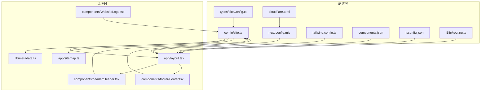
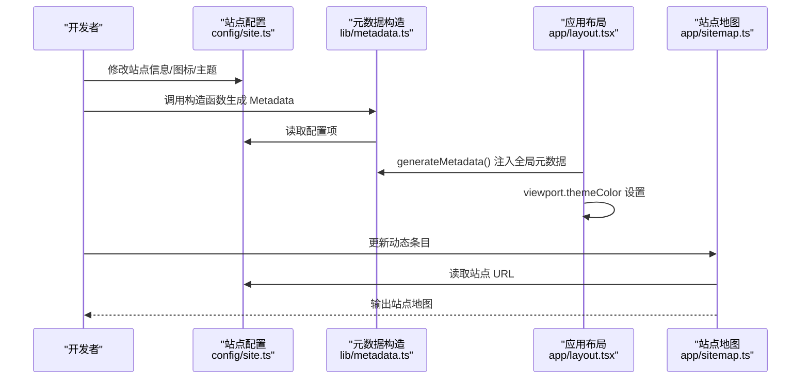
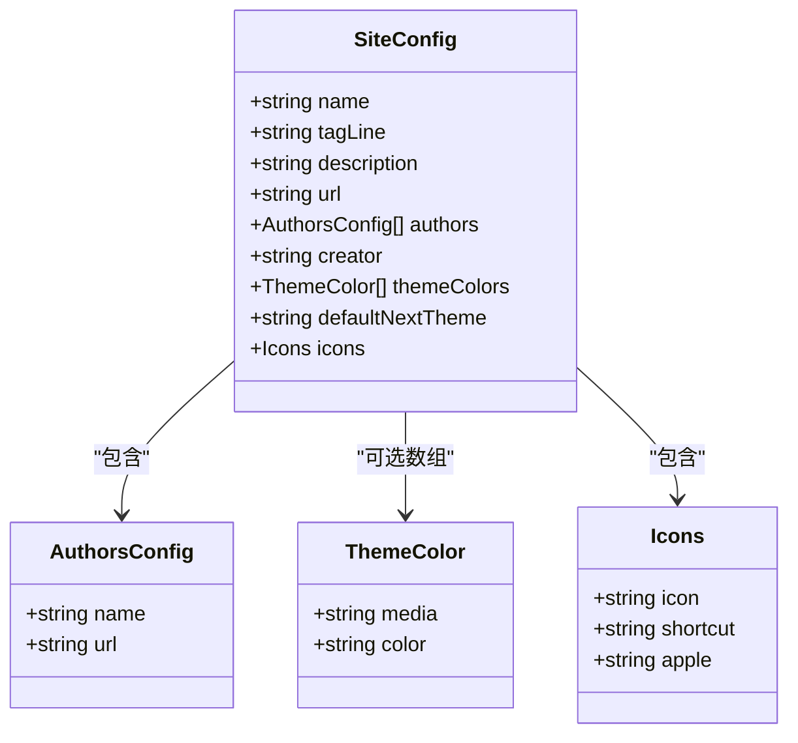
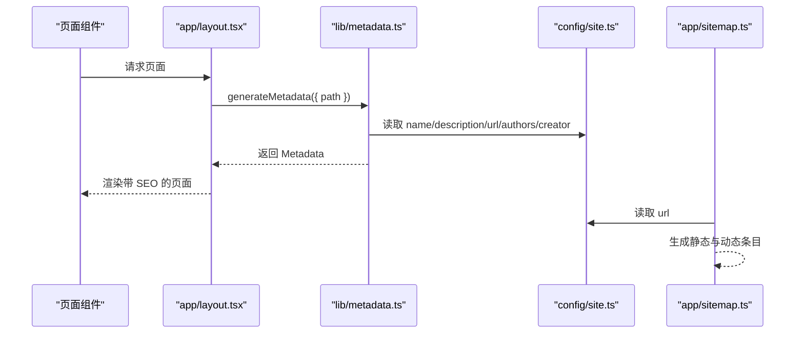
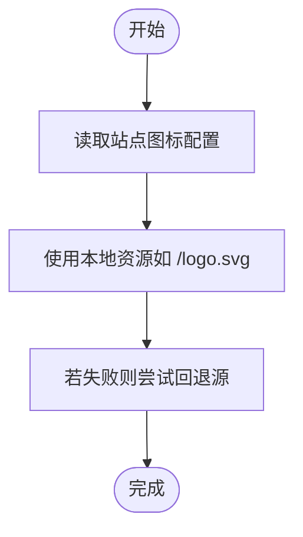
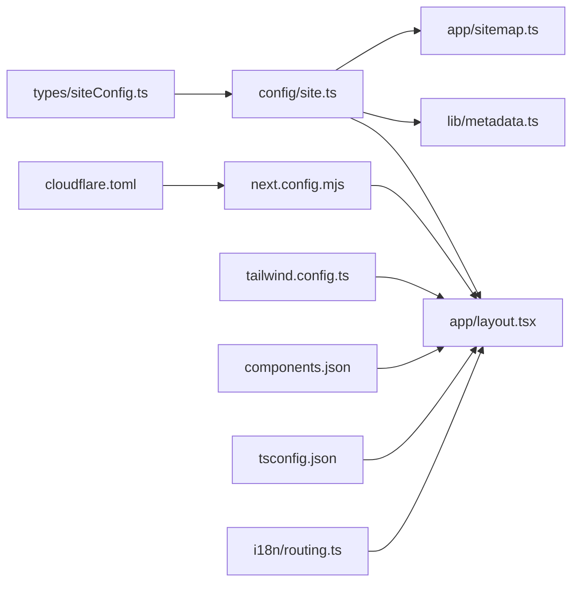

# 配置和定制

<cite>
**本文引用的文件**
- [config/site.ts](file://config/site.ts)
- [types/siteConfig.ts](file://types/siteConfig.ts)
- [next.config.mjs](file://next.config.mjs)
- [tailwind.config.ts](file://tailwind.config.ts)
- [package.json](file://package.json)
- [cloudflare.toml](file://cloudflare.toml)
- [components.json](file://components.json)
- [tsconfig.json](file://tsconfig.json)
- [i18n/routing.ts](file://i18n/routing.ts)
- [lib/metadata.ts](file://lib/metadata.ts)
- [app/layout.tsx](file://app/layout.tsx)
- [components/WebsiteLogo.tsx](file://components/WebsiteLogo.tsx)
- [components/header/Header.tsx](file://components/header/Header.tsx)
- [components/footer/Footer.tsx](file://components/footer/Footer.tsx)
- [app/sitemap.ts](file://app/sitemap.ts)
</cite>

## 目录
1. [简介](#简介)
2. [项目结构](#项目结构)
3. [核心组件](#核心组件)
4. [架构总览](#架构总览)
5. [详细组件分析](#详细组件分析)
6. [依赖关系分析](#依赖关系分析)
7. [性能考量](#性能考量)
8. [故障排查指南](#故障排查指南)
9. [结论](#结论)
10. [附录](#附录)

## 简介
本指南面向希望对本项目进行“配置与定制”的读者，覆盖以下方面：
- 站点配置文件与类型定义的结构与职责
- 自定义网站信息（名称、标语、描述）、图标与徽标
- 站点地图与机器人文件的生成机制
- 环境变量配置、域名设置与第三方服务集成
- 品牌定制、功能开关与主题配置
- 配置验证、常见问题排查与最佳实践

## 项目结构
本项目采用 Next.js 应用结构，配置与定制相关的关键位置如下：
- 站点配置与类型：config/site.ts、types/siteConfig.ts
- 构建与运行时配置：next.config.mjs、cloudflare.toml
- 主题与样式：tailwind.config.ts、components.json、styles/globals.css
- 元数据与 SEO：lib/metadata.ts、app/layout.tsx、app/sitemap.ts
- 多语言路由：i18n/routing.ts
- TypeScript 路径别名与编译配置：tsconfig.json
- 第三方统计与广告：app/layout.tsx 中按需引入的组件

图表来源
- [config/site.ts](file://config/site.ts#L1-L45)
- [types/siteConfig.ts](file://types/siteConfig.ts#L1-L33)
- [next.config.mjs](file://next.config.mjs#L1-L28)
- [cloudflare.toml](file://cloudflare.toml#L1-L13)
- [tailwind.config.ts](file://tailwind.config.ts#L1-L95)
- [components.json](file://components.json#L1-L21)
- [tsconfig.json](file://tsconfig.json#L1-L43)
- [i18n/routing.ts](file://i18n/routing.ts#L1-L37)
- [lib/metadata.ts](file://lib/metadata.ts#L1-L78)
- [app/layout.tsx](file://app/layout.tsx#L1-L78)
- [components/header/Header.tsx](file://components/header/Header.tsx#L1-L45)
- [components/footer/Footer.tsx](file://components/footer/Footer.tsx#L1-L67)
- [components/WebsiteLogo.tsx](file://components/WebsiteLogo.tsx#L1-L109)
- [app/sitemap.ts](file://app/sitemap.ts#L1-L64)

章节来源
- [config/site.ts](file://config/site.ts#L1-L45)
- [types/siteConfig.ts](file://types/siteConfig.ts#L1-L33)
- [next.config.mjs](file://next.config.mjs#L1-L28)
- [cloudflare.toml](file://cloudflare.toml#L1-L13)
- [tailwind.config.ts](file://tailwind.config.ts#L1-L95)
- [components.json](file://components.json#L1-L21)
- [tsconfig.json](file://tsconfig.json#L1-L43)
- [i18n/routing.ts](file://i18n/routing.ts#L1-L37)
- [lib/metadata.ts](file://lib/metadata.ts#L1-L78)
- [app/layout.tsx](file://app/layout.tsx#L1-L78)
- [components/header/Header.tsx](file://components/header/Header.tsx#L1-L45)
- [components/footer/Footer.tsx](file://components/footer/Footer.tsx#L1-L67)
- [components/WebsiteLogo.tsx](file://components/WebsiteLogo.tsx#L1-L109)
- [app/sitemap.ts](file://app/sitemap.ts#L1-L64)

## 核心组件
- 站点配置与类型
  - 站点配置对象集中于 config/site.ts，包含名称、标语、描述、作者、社交链接、主题色、默认主题、图标等字段；类型定义位于 types/siteConfig.ts。
  - 关键字段路径参考：[站点配置对象](file://config/site.ts#L14-L44)、[类型定义](file://types/siteConfig.ts#L10-L32)。

- 构建与运行时配置
  - next.config.mjs 控制输出模式为静态导出、禁用图片优化、移除生产控制台日志、远程图片域名白名单等。
  - cloudflare.toml 定义构建命令、输出目录与环境变量，用于 Cloudflare Pages 部署。
  - 参考：[构建配置](file://next.config.mjs#L1-L28)、[部署配置](file://cloudflare.toml#L1-L13)。

- 主题与样式
  - tailwind.config.ts 定义暗色模式、内容扫描范围、颜色与动画扩展、插件等。
  - components.json 指定 UI 组件库风格、Tailwind 配置、CSS 变量、别名等。
  - 参考：[Tailwind 配置](file://tailwind.config.ts#L1-L95)、[UI 配置](file://components.json#L1-L21)。

- 元数据与 SEO
  - lib/metadata.ts 提供统一的元数据构造函数，读取站点配置生成标题、描述、Open Graph、Twitter 卡片与 robots 设置。
  - app/layout.tsx 使用 generateMetadata 注入全局元数据，并设置 viewport 的主题色。
  - 参考：[元数据构造](file://lib/metadata.ts#L14-L78)、[布局注入](file://app/layout.tsx#L18-L30)。

- 站点地图
  - app/sitemap.ts 动态生成站点地图，包含静态页面、游戏页面与博客文章条目。
  - 参考：[站点地图生成](file://app/sitemap.ts#L13-L64)。

- 多语言路由
  - i18n/routing.ts 定义支持的语言列表、默认语言、自动检测开关与导航封装。
  - 参考：[路由配置](file://i18n/routing.ts#L12-L23)。

章节来源
- [config/site.ts](file://config/site.ts#L14-L44)
- [types/siteConfig.ts](file://types/siteConfig.ts#L10-L32)
- [next.config.mjs](file://next.config.mjs#L1-L28)
- [cloudflare.toml](file://cloudflare.toml#L1-L13)
- [tailwind.config.ts](file://tailwind.config.ts#L1-L95)
- [components.json](file://components.json#L1-L21)
- [lib/metadata.ts](file://lib/metadata.ts#L14-L78)
- [app/layout.tsx](file://app/layout.tsx#L18-L30)
- [app/sitemap.ts](file://app/sitemap.ts#L13-L64)
- [i18n/routing.ts](file://i18n/routing.ts#L12-L23)

## 架构总览
下图展示“配置—渲染—SEO—地图”的端到端流程：

图表来源
- [config/site.ts](file://config/site.ts#L3-L44)
- [lib/metadata.ts](file://lib/metadata.ts#L14-L78)
- [app/layout.tsx](file://app/layout.tsx#L18-L30)
- [app/sitemap.ts](file://app/sitemap.ts#L9-L64)

## 详细组件分析

### 站点配置与类型定义
- 配置对象字段与用途
  - 名称、标语、描述：用于标题、OG 标签与页面描述。
  - URL：用于元数据与站点地图中的绝对链接。
  - 作者与创作者：用于作者信息与 Twitter 创作者标签。
  - 社交链接：用于页脚邮箱等社交入口。
  - 主题色与默认主题：用于 viewport 主题色与 next-themes 默认主题。
  - 图标：用于 favicon、shortcut、apple-touch-icon。
  - 参考：[站点配置对象](file://config/site.ts#L14-L44)、[类型定义](file://types/siteConfig.ts#L10-L32)。

- 类型安全与可选字段
  - 社交链接与图标均为可选，便于按需启用。
  - 参考：[类型定义](file://types/siteConfig.ts#L16-L31)。

图表来源
- [types/siteConfig.ts](file://types/siteConfig.ts#L2-L32)

章节来源
- [config/site.ts](file://config/site.ts#L14-L44)
- [types/siteConfig.ts](file://types/siteConfig.ts#L2-L32)

### 元数据与 SEO（含站点地图）
- 元数据构造逻辑
  - 根据页面类型拼接标题，设置描述、图像、Open Graph、Twitter 卡片与 robots。
  - 图像 URL 优先使用传入的图片数组，否则回退到站点配置中的默认图。
  - canonical 与 metadataBase 基于站点 URL。
  - 参考：[元数据构造函数](file://lib/metadata.ts#L14-L78)。

- 布局注入与 viewport
  - 在 generateMetadata 中注入全局元数据；viewport.themeColor 来自站点配置的主题色数组。
  - 参考：[布局注入](file://app/layout.tsx#L18-L30)。

- 站点地图生成
  - 包含首页、博客、关于、隐私政策、服务条款等静态页面。
  - 动态生成游戏页面与其归档、玩法页面，以及博客文章页面。
  - 参考：[站点地图生成](file://app/sitemap.ts#L13-L64)。

图表来源
- [lib/metadata.ts](file://lib/metadata.ts#L14-L78)
- [app/layout.tsx](file://app/layout.tsx#L18-L30)
- [config/site.ts](file://config/site.ts#L14-L44)
- [app/sitemap.ts](file://app/sitemap.ts#L13-L64)

章节来源
- [lib/metadata.ts](file://lib/metadata.ts#L14-L78)
- [app/layout.tsx](file://app/layout.tsx#L18-L30)
- [app/sitemap.ts](file://app/sitemap.ts#L13-L64)
- [config/site.ts](file://config/site.ts#L14-L44)

### 图标与徽标定制
- 站点图标
  - 在站点配置中设置 icon、shortcut、apple 字段，分别对应不同浏览器与设备的图标需求。
  - 参考：[图标配置](file://config/site.ts#L39-L43)、[类型定义](file://types/siteConfig.ts#L27-L31)。

- 徽标与网站图标显示
  - Header 中使用本地资源作为品牌徽标；WebsiteLogo 支持从外部域名加载 SVG/PNG/ICO 并提供多级回退。
  - 参考：[Header 徽标](file://components/header/Header.tsx#L16-L22)、[WebsiteLogo 回退策略](file://components/WebsiteLogo.tsx#L24-L32)。

图表来源
- [config/site.ts](file://config/site.ts#L39-L43)
- [components/WebsiteLogo.tsx](file://components/WebsiteLogo.tsx#L24-L32)

章节来源
- [config/site.ts](file://config/site.ts#L39-L43)
- [types/siteConfig.ts](file://types/siteConfig.ts#L27-L31)
- [components/header/Header.tsx](file://components/header/Header.tsx#L16-L22)
- [components/WebsiteLogo.tsx](file://components/WebsiteLogo.tsx#L24-L32)

### 主题与品牌定制
- 主题配置
  - 默认主题来自站点配置的 defaultNextTheme；viewport.themeColor 来自 themeColors 数组。
  - 参考：[默认主题](file://config/site.ts#L38-L38)、[viewport 主题色](file://app/layout.tsx#L28-L30)。

- 品牌定制
  - 名称、标语、描述、作者、社交链接均可在站点配置中调整。
  - 参考：[站点配置对象](file://config/site.ts#L14-L33)。

章节来源
- [config/site.ts](file://config/site.ts#L38-L38)
- [app/layout.tsx](file://app/layout.tsx#L28-L30)
- [config/site.ts](file://config/site.ts#L14-L33)

### 环境变量与域名设置
- 环境变量
  - NEXT_PUBLIC_SITE_URL：用于确定站点基础 URL。
  - NEXT_PUBLIC_DISCORD_INVITE_URL：用于社交链接。
  - R2_PUBLIC_URL：用于允许访问的远程图片域名。
  - NODE_ENV：影响控制台日志移除与开发/生产行为。
  - 参考：[环境变量使用](file://config/site.ts#L3-L3)、[Discord 链接](file://config/site.ts#L12-L12)、[远程图片域名](file://next.config.mjs#L7-L15)、[移除控制台日志](file://next.config.mjs#L17-L24)。

- 域名设置
  - BASE_URL 由环境变量决定，未设置时回退到默认值。
  - 参考：[BASE_URL](file://config/site.ts#L3-L3)。

章节来源
- [config/site.ts](file://config/site.ts#L3-L3)
- [config/site.ts](file://config/site.ts#L12-L12)
- [next.config.mjs](file://next.config.mjs#L7-L15)
- [next.config.mjs](file://next.config.mjs#L17-L24)

### 第三方服务集成
- 分析与广告
  - Vercel Analytics、百度统计、Google Analytics、Google Adsense、Plausible Analytics 在布局中按环境条件加载。
  - 参考：[第三方组件加载](file://app/layout.tsx#L63-L73)。

- 多语言与国际化
  - i18n/routing.ts 支持语言检测、前缀与导航封装。
  - 参考：[路由配置](file://i18n/routing.ts#L12-L23)。

章节来源
- [app/layout.tsx](file://app/layout.tsx#L63-L73)
- [i18n/routing.ts](file://i18n/routing.ts#L12-L23)

## 依赖关系分析
- 配置到渲染的依赖链
  - config/site.ts → app/layout.tsx（viewport/theme）、lib/metadata.ts（SEO）、app/sitemap.ts（URL）。
  - types/siteConfig.ts 为 config/site.ts 的类型约束。
  - next.config.mjs 影响构建产物与运行时行为。
  - cloudflare.toml 决定部署命令与输出目录。
  - tailwind.config.ts 与 components.json 影响样式与组件库配置。
  - i18n/routing.ts 影响路由与语言行为。

图表来源
- [types/siteConfig.ts](file://types/siteConfig.ts#L1-L33)
- [config/site.ts](file://config/site.ts#L1-L45)
- [app/layout.tsx](file://app/layout.tsx#L1-L78)
- [lib/metadata.ts](file://lib/metadata.ts#L1-L78)
- [app/sitemap.ts](file://app/sitemap.ts#L1-L64)
- [next.config.mjs](file://next.config.mjs#L1-L28)
- [cloudflare.toml](file://cloudflare.toml#L1-L13)
- [tailwind.config.ts](file://tailwind.config.ts#L1-L95)
- [components.json](file://components.json#L1-L21)
- [tsconfig.json](file://tsconfig.json#L1-L43)
- [i18n/routing.ts](file://i18n/routing.ts#L1-L37)

章节来源
- [config/site.ts](file://config/site.ts#L1-L45)
- [types/siteConfig.ts](file://types/siteConfig.ts#L1-L33)
- [next.config.mjs](file://next.config.mjs#L1-L28)
- [cloudflare.toml](file://cloudflare.toml#L1-L13)
- [tailwind.config.ts](file://tailwind.config.ts#L1-L95)
- [components.json](file://components.json#L1-L21)
- [tsconfig.json](file://tsconfig.json#L1-L43)
- [i18n/routing.ts](file://i18n/routing.ts#L1-L37)
- [lib/metadata.ts](file://lib/metadata.ts#L1-L78)
- [app/layout.tsx](file://app/layout.tsx#L1-L78)
- [app/sitemap.ts](file://app/sitemap.ts#L1-L64)

## 性能考量
- 构建与运行时优化
  - 静态导出与禁用图片优化以适配静态托管。
  - 生产环境移除控制台日志，减少包体积与运行时开销。
  - 参考：[构建配置](file://next.config.mjs#L4-L24)。

- 样式与主题
  - Tailwind 扩展颜色与动画，配合 CSS 变量提升主题切换性能。
  - 参考：[Tailwind 配置](file://tailwind.config.ts#L20-L90)。

- 图标加载回退
  - WebsiteLogo 提供多级回退与超时处理，避免阻塞首屏。
  - 参考：[回退策略](file://components/WebsiteLogo.tsx#L24-L60)。

章节来源
- [next.config.mjs](file://next.config.mjs#L4-L24)
- [tailwind.config.ts](file://tailwind.config.ts#L20-L90)
- [components/WebsiteLogo.tsx](file://components/WebsiteLogo.tsx#L24-L60)

## 故障排查指南
- 站点地图为空或不完整
  - 检查站点 URL 是否正确（NEXT_PUBLIC_SITE_URL），确认 getGameSlugs 与 getPosts 返回有效数据。
  - 参考：[站点 URL](file://config/site.ts#L3-L3)、[sitemap 生成](file://app/sitemap.ts#L13-L64)。

- SEO 标题/描述异常
  - 检查 constructMetadata 的参数是否传入正确的 page/title/description/path/canonicalUrl。
  - 参考：[元数据构造](file://lib/metadata.ts#L14-L78)。

- 图标未显示或加载失败
  - 确认图标路径存在且可公开访问；检查回退源顺序与域名白名单。
  - 参考：[图标配置](file://config/site.ts#L39-L43)、[回退策略](file://components/WebsiteLogo.tsx#L24-L32)。

- 主题色不生效
  - 确认 themeColors 数组格式正确，viewport 读取到该配置。
  - 参考：[viewport 主题色](file://app/layout.tsx#L28-L30)、[主题配置](file://config/site.ts#L34-L37)。

- 部署后域名不匹配
  - 确保 NEXT_PUBLIC_SITE_URL 与实际域名一致，避免 canonical 与 OG 链接错误。
  - 参考：[BASE_URL](file://config/site.ts#L3-L3)。

章节来源
- [config/site.ts](file://config/site.ts#L3-L3)
- [config/site.ts](file://config/site.ts#L39-L43)
- [config/site.ts](file://config/site.ts#L34-L37)
- [lib/metadata.ts](file://lib/metadata.ts#L14-L78)
- [app/layout.tsx](file://app/layout.tsx#L28-L30)
- [app/sitemap.ts](file://app/sitemap.ts#L13-L64)
- [components/WebsiteLogo.tsx](file://components/WebsiteLogo.tsx#L24-L32)

## 结论
通过集中管理站点配置、统一元数据构造与动态站点地图生成，本项目实现了“一处配置、全站生效”的定制能力。结合环境变量、静态导出与第三方服务集成，可在不同平台快速部署并保持一致的品牌体验。建议在定制过程中遵循类型约束、保持配置一致性，并利用回退策略与性能优化确保用户体验。

## 附录
- 快速操作清单
  - 修改站点信息：编辑 [站点配置对象](file://config/site.ts#L14-L33)
  - 设置图标：编辑 [图标配置](file://config/site.ts#L39-L43)
  - 配置主题色与默认主题：编辑 [主题配置](file://config/site.ts#L34-L38)
  - 设置域名与环境变量：编辑 [BASE_URL](file://config/site.ts#L3-L3) 与构建配置
  - 生成站点地图：编辑 [站点地图生成](file://app/sitemap.ts#L13-L64)
  - 配置 SEO：编辑 [元数据构造](file://lib/metadata.ts#L14-L78)
  - 集成第三方服务：编辑 [布局中的第三方组件](file://app/layout.tsx#L63-L73)