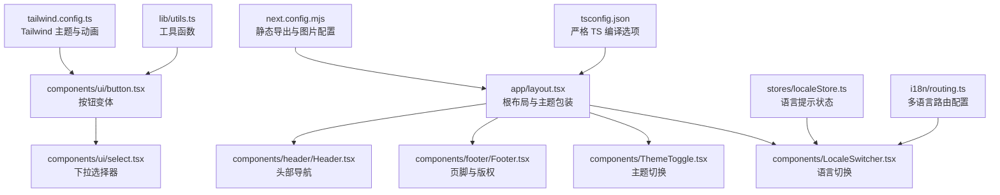
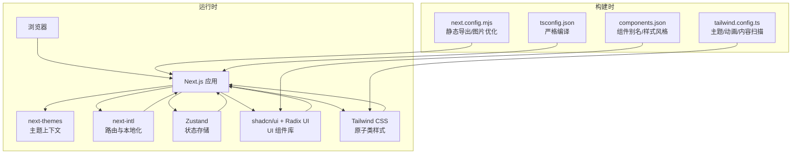
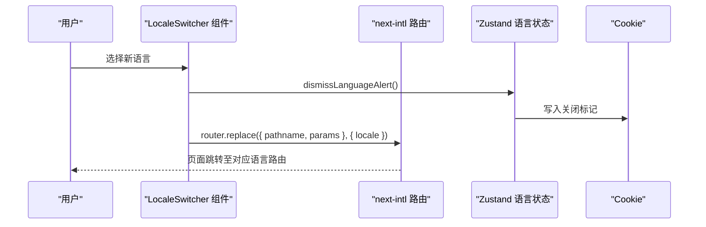
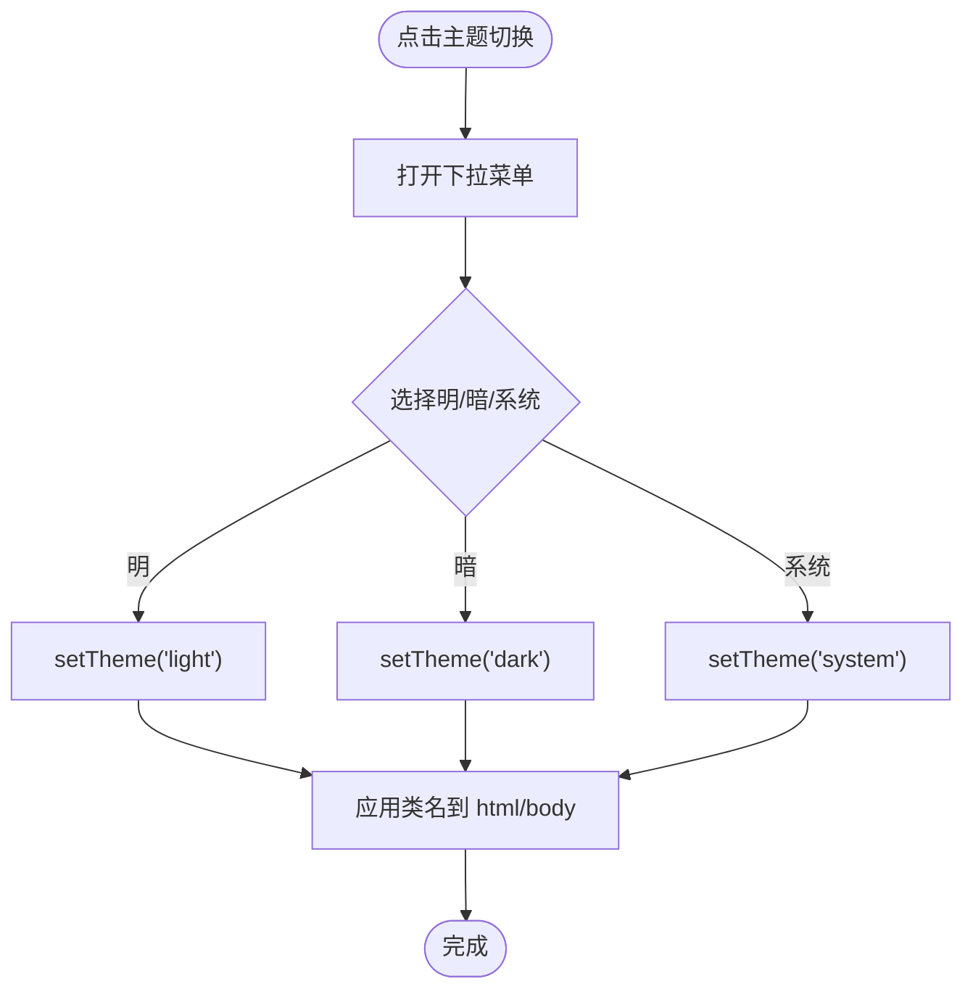
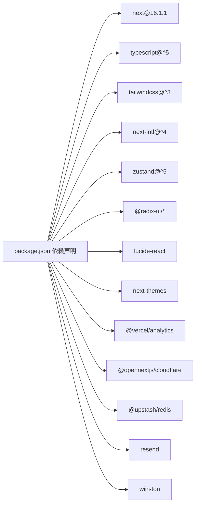

# 技术栈介绍

<cite>
**本文引用的文件**
- [package.json](file://package.json)
- [next.config.mjs](file://next.config.mjs)
- [tsconfig.json](file://tsconfig.json)
- [tailwind.config.ts](file://tailwind.config.ts)
- [components.json](file://components.json)
- [i18n/routing.ts](file://i18n/routing.ts)
- [stores/localeStore.ts](file://stores/localeStore.ts)
- [components/LocaleSwitcher.tsx](file://components/LocaleSwitcher.tsx)
- [components/ThemeToggle.tsx](file://components/ThemeToggle.tsx)
- [lib/utils.ts](file://lib/utils.ts)
- [app/layout.tsx](file://app/layout.tsx)
- [components/header/Header.tsx](file://components/header/Header.tsx)
- [components/footer/Footer.tsx](file://components/footer/Footer.tsx)
- [components/ui/button.tsx](file://components/ui/button.tsx)
- [components/ui/select.tsx](file://components/ui/select.tsx)
</cite>

## 目录
1. [引言](#引言)
2. [项目结构](#项目结构)
3. [核心组件](#核心组件)
4. [架构总览](#架构总览)
5. [详细组件分析](#详细组件分析)
6. [依赖关系分析](#依赖关系分析)
7. [性能考量](#性能考量)
8. [故障排查指南](#故障排查指南)
9. [结论](#结论)
10. [附录：学习路径与最佳实践](#附录学习路径与最佳实践)

## 引言
本技术栈介绍面向 LinkedIn Answer Today 项目，系统阐述其技术选型与架构设计，重点覆盖以下方面：
- 核心框架：Next.js 16.1.1（静态生成、服务端渲染、客户端水合）
- 开发语言：TypeScript（类型安全、工程化保障）
- 样式框架：Tailwind CSS（原子类、主题系统、可组合性）
- 国际化：next-intl（路由级多语言、自动语言检测、链接导航）
- 状态管理：Zustand（轻量、函数式、易上手）
- 组件库：Radix UI + shadcn/ui（语义化、无障碍、可定制）
- 图标库：Lucide React（简洁一致的图标体系）
- 其他：next-themes（明暗主题）、@vercel/analytics（站点分析）、@opennextjs/cloudflare（边缘部署）

这些技术共同构建了高性能、可维护、可扩展且具备现代化开发体验的前端应用。

## 项目结构
项目采用 Next.js App Router 的目录组织方式，结合 TypeScript 类型约束与 Tailwind CSS 原子类样式，形成清晰的分层结构：
- app：页面与布局根目录，支持静态导出与多语言路由
- components：可复用 UI 组件与业务组件
- i18n：国际化路由与消息定义
- stores：Zustand 状态存储
- lib：工具函数与通用逻辑
- styles：全局样式与加载动画
- types：共享类型定义
- 配置文件：next.config.mjs、tsconfig.json、tailwind.config.ts、components.json 等



图表来源
- [app/layout.tsx](file://app/layout.tsx#L1-L78)
- [components/header/Header.tsx](file://components/header/Header.tsx#L1-L45)
- [components/footer/Footer.tsx](file://components/footer/Footer.tsx#L1-L67)
- [components/ThemeToggle.tsx](file://components/ThemeToggle.tsx#L1-L40)
- [components/LocaleSwitcher.tsx](file://components/LocaleSwitcher.tsx#L1-L72)
- [components/ui/button.tsx](file://components/ui/button.tsx#L1-L58)
- [components/ui/select.tsx](file://components/ui/select.tsx#L1-L160)
- [stores/localeStore.ts](file://stores/localeStore.ts#L1-L22)
- [i18n/routing.ts](file://i18n/routing.ts#L1-L37)
- [tailwind.config.ts](file://tailwind.config.ts#L1-L95)
- [lib/utils.ts](file://lib/utils.ts#L1-L19)
- [next.config.mjs](file://next.config.mjs#L1-L28)
- [tsconfig.json](file://tsconfig.json#L1-L43)

章节来源
- [package.json](file://package.json#L1-L65)
- [next.config.mjs](file://next.config.mjs#L1-L28)
- [tsconfig.json](file://tsconfig.json#L1-L43)
- [tailwind.config.ts](file://tailwind.config.ts#L1-L95)
- [components.json](file://components.json#L1-L21)

## 核心组件
- 根布局与主题包装：在根布局中使用 next-themes 提供的主题上下文，统一注入全局样式与分析脚本，确保明暗主题与 SEO 元数据一致。
- 头部与页脚：头部包含品牌标识、主导航与移动端菜单；页脚包含社交链接与法律文档入口。
- 主题切换：基于 Radix UI 下拉菜单与 Lucide 图标，支持切换明/暗/系统主题。
- 语言切换：通过 next-intl 的路由配置与 Zustand 状态管理，实现语言切换与用户偏好持久化。

章节来源
- [app/layout.tsx](file://app/layout.tsx#L1-L78)
- [components/header/Header.tsx](file://components/header/Header.tsx#L1-L45)
- [components/footer/Footer.tsx](file://components/footer/Footer.tsx#L1-L67)
- [components/ThemeToggle.tsx](file://components/ThemeToggle.tsx#L1-L40)
- [components/LocaleSwitcher.tsx](file://components/LocaleSwitcher.tsx#L1-L72)

## 架构总览
整体架构围绕 Next.js App Router 展开，结合 TypeScript 类型系统、Tailwind 原子类与 shadcn/ui 组件库，形成“约定式路由 + 可组合 UI + 轻量状态”的开发范式。国际化通过 next-intl 在路由层面实现，静态导出用于 Cloudflare Pages 部署。



图表来源
- [next.config.mjs](file://next.config.mjs#L1-L28)
- [tsconfig.json](file://tsconfig.json#L1-L43)
- [tailwind.config.ts](file://tailwind.config.ts#L1-L95)
- [components.json](file://components.json#L1-L21)
- [app/layout.tsx](file://app/layout.tsx#L1-L78)

## 详细组件分析

### 国际化与语言切换（next-intl + Zustand）
- 路由配置：通过 defineRouting 定义支持的语言列表、默认语言与自动语言检测开关，并导出 Link、redirect、usePathname 等导航工具。
- 语言切换组件：使用 Radix UI Select 组件与 Lucide Globe 图标，结合 next-intl 的 useRouter/usePathname 实现平滑跳转；通过 Zustand 存储语言提示状态并持久化到 Cookie。
- 状态持久化：dismissLanguageAlert 将用户关闭提示的状态写入 Cookie 并在后续会话中生效。



图表来源
- [components/LocaleSwitcher.tsx](file://components/LocaleSwitcher.tsx#L1-L72)
- [i18n/routing.ts](file://i18n/routing.ts#L1-L37)
- [stores/localeStore.ts](file://stores/localeStore.ts#L1-L22)

章节来源
- [i18n/routing.ts](file://i18n/routing.ts#L1-L37)
- [components/LocaleSwitcher.tsx](file://components/LocaleSwitcher.tsx#L1-L72)
- [stores/localeStore.ts](file://stores/localeStore.ts#L1-L22)

### 主题切换（next-themes + Radix UI）
- 使用 next-themes 提供的 ThemeProvider 包裹整个应用，支持 light/dark/system 三种模式。
- 通过 Radix UI DropdownMenu 与 Lucide Sun/Moon 图标，实现主题切换交互。
- Tailwind CSS 的 darkMode: ["class"] 与组件内过渡类配合，实现平滑的主题切换动画。



图表来源
- [components/ThemeToggle.tsx](file://components/ThemeToggle.tsx#L1-L40)
- [tailwind.config.ts](file://tailwind.config.ts#L1-L95)
- [app/layout.tsx](file://app/layout.tsx#L1-L78)

章节来源
- [components/ThemeToggle.tsx](file://components/ThemeToggle.tsx#L1-L40)
- [tailwind.config.ts](file://tailwind.config.ts#L1-L95)
- [app/layout.tsx](file://app/layout.tsx#L1-L78)

### UI 组件与样式系统（shadcn/ui + Radix UI + Tailwind）
- 按钮组件：基于 class-variance-authority 定义多种变体与尺寸，结合 Radix UI Slot 支持透传元素类型，实现高可组合性。
- 下拉选择器：封装 @radix-ui/react-select，提供触发器、内容区、滚动按钮、选项项与分隔符，适配不同布局场景。
- 工具函数：cn 函数整合 clsx 与 tailwind-merge，避免冲突类名叠加导致的样式覆盖问题。

```mermaid
classDiagram
class Button {
+variant : "default|destructive|outline|secondary|ghost|link"
+size : "default|sm|lg|icon"
+asChild : boolean
}
class SelectRoot {
+value
+onValueChange
}
class SelectTrigger {
+className
}
class SelectContent {
+position
}
class SelectItem {
+children
}
Button --> "使用" Utils["lib/utils.ts 中的 cn(...)"]
SelectRoot --> SelectTrigger
SelectRoot --> SelectContent
SelectContent --> SelectItem
```

图表来源
- [components/ui/button.tsx](file://components/ui/button.tsx#L1-L58)
- [components/ui/select.tsx](file://components/ui/select.tsx#L1-L160)
- [lib/utils.ts](file://lib/utils.ts#L1-L19)

章节来源
- [components/ui/button.tsx](file://components/ui/button.tsx#L1-L58)
- [components/ui/select.tsx](file://components/ui/select.tsx#L1-L160)
- [lib/utils.ts](file://lib/utils.ts#L1-L19)

### 根布局与元数据（Next.js App Router）
- 根布局负责注入全局样式、主题上下文、分析脚本与页脚组件。
- generateMetadata 动态生成 SEO 元数据，确保不同页面的标题、描述与 canonical 地址正确。
- viewport 设置主题色，提升移动端用户体验。

章节来源
- [app/layout.tsx](file://app/layout.tsx#L1-L78)

## 依赖关系分析
- 核心依赖：Next.js 16.1.1、React 19、TypeScript 5、Tailwind CSS 3、next-intl、Zustand、Radix UI、Lucide React、next-themes。
- 构建与工具：@next/bundle-analyzer、@next/env、eslint、postcss、autoprefixer、wrangler。
- 运行时集成：@vercel/analytics、@opennextjs/cloudflare（边缘部署）、@upstash/redis（速率限制/缓存）、resend（邮件）、winston（日志）。



图表来源
- [package.json](file://package.json#L1-L65)

章节来源
- [package.json](file://package.json#L1-L65)

## 性能考量
- 静态导出：next.config.mjs 启用 output: "export"，便于 Cloudflare Pages 部署与零服务器成本运行。
- 图片优化：静态导出需禁用 next/image 的内置优化，通过 unoptimized 与 remotePatterns 控制远程图片源。
- 构建优化：生产环境移除控制台日志，减少包体积与运行时开销。
- 样式优化：Tailwind CSS 仅扫描实际使用的组件与页面，避免无用样式进入产物。
- 状态与网络：Zustand 以最小状态切片管理语言提示等轻量状态，减少不必要的重渲染；Upstash Redis 用于限流与缓存，降低后端压力。

章节来源
- [next.config.mjs](file://next.config.mjs#L1-L28)
- [tailwind.config.ts](file://tailwind.config.ts#L1-L95)
- [stores/localeStore.ts](file://stores/localeStore.ts#L1-L22)

## 故障排查指南
- 语言切换无效
  - 检查 i18n/routing.ts 中 locales、defaultLocale 与 localeDetection 配置是否正确。
  - 确认 LocaleSwitcher 是否调用 router.replace 并传入正确的 pathname 与 params。
  - 验证 Zustand dismissLanguageAlert 是否成功写入 Cookie。
- 主题切换不生效
  - 确认 next-themes 的 ThemeProvider 是否包裹根布局。
  - 检查 Tailwind CSS 的 darkMode: ["class"] 与组件内过渡类是否一致。
- 样式冲突或类名覆盖
  - 使用 lib/utils.ts 中的 cn 函数合并类名，避免重复与冲突。
- 静态导出图片异常
  - 确保 next.config.mjs 中 images.unoptimized 为 true，并正确配置 remotePatterns。
- 构建报错（TypeScript）
  - 检查 tsconfig.json 的 strict、noEmit、jsx 等选项，确保与 Next.js 版本兼容。

章节来源
- [i18n/routing.ts](file://i18n/routing.ts#L1-L37)
- [components/LocaleSwitcher.tsx](file://components/LocaleSwitcher.tsx#L1-L72)
- [stores/localeStore.ts](file://stores/localeStore.ts#L1-L22)
- [components/ThemeToggle.tsx](file://components/ThemeToggle.tsx#L1-L40)
- [tailwind.config.ts](file://tailwind.config.ts#L1-L95)
- [lib/utils.ts](file://lib/utils.ts#L1-L19)
- [next.config.mjs](file://next.config.mjs#L1-L28)
- [tsconfig.json](file://tsconfig.json#L1-L43)

## 结论
本项目以 Next.js 16.1.1 为核心，结合 TypeScript、Tailwind CSS、next-intl、Zustand、Radix UI 与 Lucide React，构建了高性能、可维护、可扩展的现代前端应用。通过静态导出与边缘部署，进一步降低了运维复杂度；通过严格的类型系统与组件化设计，提升了开发效率与代码质量。建议在后续迭代中持续关注依赖更新与性能指标，保持技术栈的先进性与稳定性。

## 附录：学习路径与最佳实践
- 学习路径
  - Next.js App Router 与静态生成：从官方文档入手，理解路由、布局与构建流程。
  - TypeScript：掌握严格模式、类型推断与模块解析，提升代码健壮性。
  - Tailwind CSS：学习原子类、主题变量与插件机制，结合内容扫描优化产物。
  - next-intl：理解路由级国际化、自动语言检测与链接导航 API。
  - Zustand：掌握状态切片、中间件与持久化策略。
  - Radix UI + shadcn/ui：学习语义化组件与无障碍设计，按需定制主题。
- 最佳实践
  - 使用 next.config.mjs 的静态导出与图片优化策略，适配 Cloudflare Pages。
  - 在组件中统一使用 lib/utils.ts 的 cn 合并类名，避免样式冲突。
  - 通过 Zustand 管理轻量状态，避免过度使用全局状态库。
  - 利用 Tailwind CSS 的 darkMode 与过渡类，提供一致的明暗主题体验。
  - 在生产环境启用控制台日志移除与 Tree Shaking，优化包体积与运行时性能。