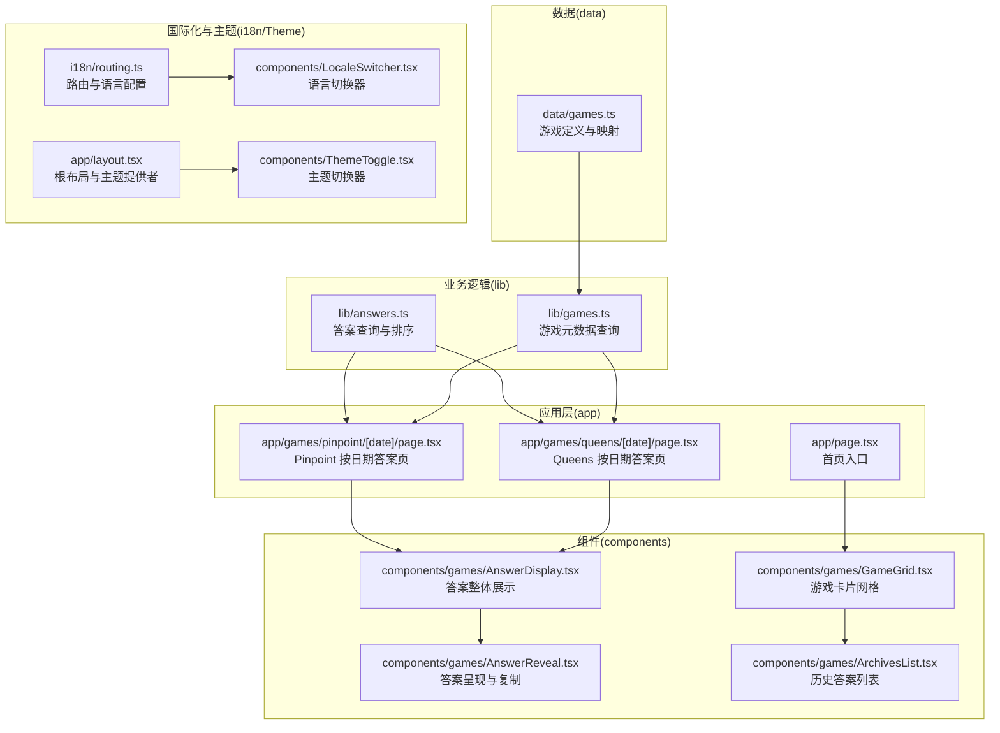
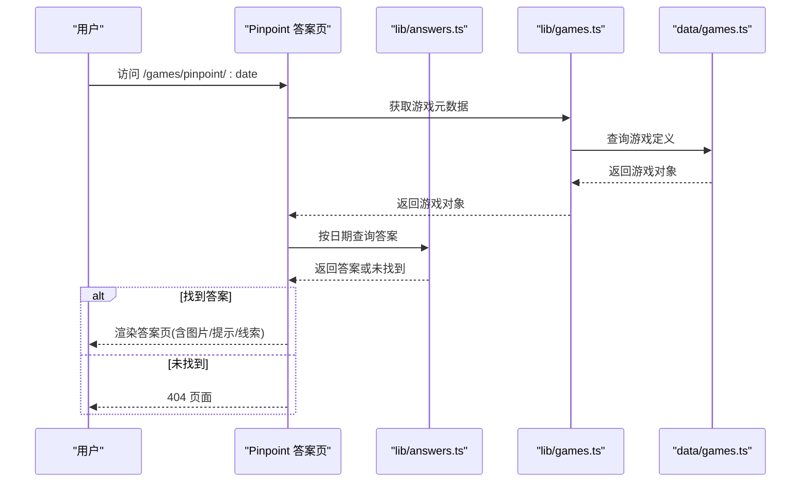
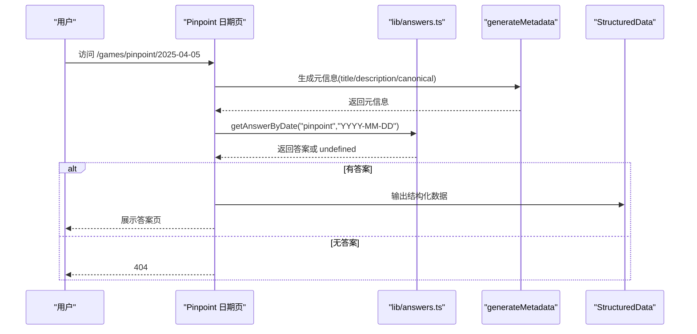
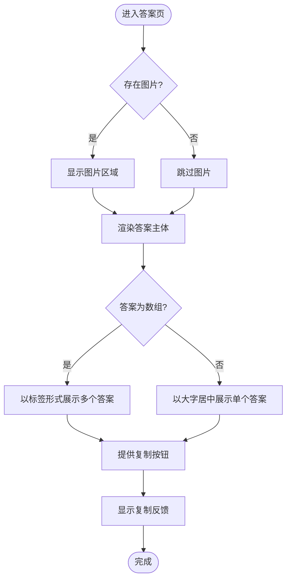
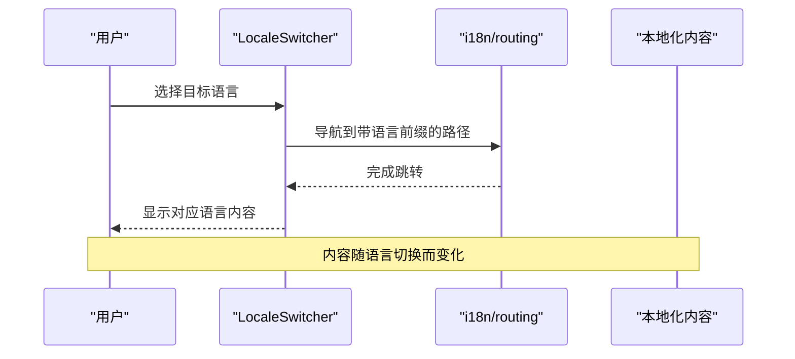
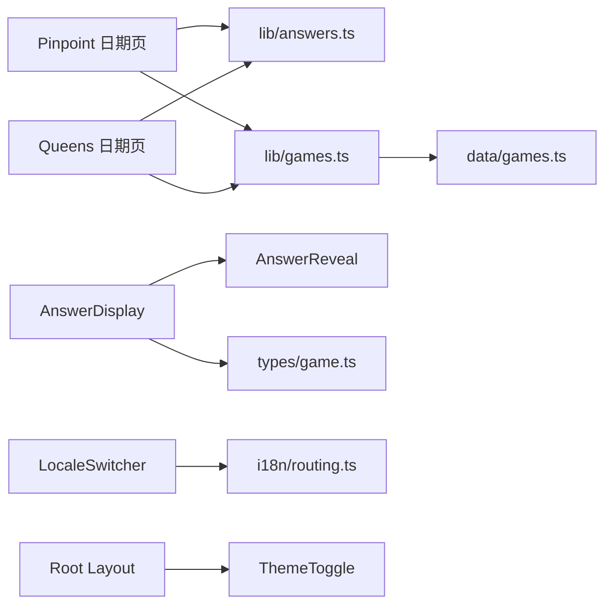

# 核心功能特性

<cite>
**本文引用的文件**
- [app/page.tsx](file://app/page.tsx)
- [app/games/pinpoint/[date]/page.tsx](file://app/games/pinpoint/[date]/page.tsx)
- [app/games/queens/[date]/page.tsx](file://app/games/queens/[date]/page.tsx)
- [components/games/AnswerDisplay.tsx](file://components/games/AnswerDisplay.tsx)
- [components/games/AnswerReveal.tsx](file://components/games/AnswerReveal.tsx)
- [components/games/ArchivesList.tsx](file://components/games/ArchivesList.tsx)
- [components/games/GameGrid.tsx](file://components/games/GameGrid.tsx)
- [lib/answers.ts](file://lib/answers.ts)
- [lib/games.ts](file://lib/games.ts)
- [data/games.ts](file://data/games.ts)
- [types/game.ts](file://types/game.ts)
- [i18n/routing.ts](file://i18n/routing.ts)
- [components/LocaleSwitcher.tsx](file://components/LocaleSwitcher.tsx)
- [components/ThemeToggle.tsx](file://components/ThemeToggle.tsx)
- [app/layout.tsx](file://app/layout.tsx)
</cite>

## 目录
1. [简介](#简介)
2. [项目结构](#项目结构)
3. [核心组件](#核心组件)
4. [架构总览](#架构总览)
5. [详细组件分析](#详细组件分析)
6. [依赖关系分析](#依赖关系分析)
7. [性能考量](#性能考量)
8. [故障排查指南](#故障排查指南)
9. [结论](#结论)
10. [附录](#附录)

## 简介
本文件面向“LinkedIn Answer Today”项目，系统化梳理其核心功能与实现方式，重点覆盖以下能力：
- Pinpoint 游戏答案查询：按日期精确查询、历史答案浏览、答案展示与复制
- Queens 游戏答案查询：按日期精确查询、历史答案浏览、答案展示与复制
- 多语言支持：英语、中文、日语三语切换与自动检测
- 主题切换：浅色/深色/系统跟随
- 响应式设计与 SEO 优化：移动端适配、结构化数据、元信息生成
- 使用场景与价值：帮助用户快速定位答案、提升阅读体验与可访问性

## 项目结构
项目采用 Next.js 应用程序路由组织，页面级组件位于 app/ 下，业务逻辑封装在 lib/，游戏与答案数据位于 data/，UI 组件位于 components/，国际化与主题控制通过 i18n 与 next-themes 集成。

图表来源
- [app/page.tsx](file://app/page.tsx#L1-L6)
- [app/games/pinpoint/[date]/page.tsx](file://app/games/pinpoint/[date]/page.tsx#L1-L90)
- [app/games/queens/[date]/page.tsx](file://app/games/queens/[date]/page.tsx#L1-L90)
- [lib/answers.ts](file://lib/answers.ts#L1-L42)
- [lib/games.ts](file://lib/games.ts#L1-L15)
- [data/games.ts](file://data/games.ts#L1-L29)
- [components/games/AnswerDisplay.tsx](file://components/games/AnswerDisplay.tsx#L1-L65)
- [components/games/AnswerReveal.tsx](file://components/games/AnswerReveal.tsx#L1-L83)
- [components/games/ArchivesList.tsx](file://components/games/ArchivesList.tsx#L1-L67)
- [components/games/GameGrid.tsx](file://components/games/GameGrid.tsx#L1-L15)
- [i18n/routing.ts](file://i18n/routing.ts#L1-L37)
- [components/LocaleSwitcher.tsx](file://components/LocaleSwitcher.tsx#L1-L72)
- [components/ThemeToggle.tsx](file://components/ThemeToggle.tsx#L1-L40)
- [app/layout.tsx](file://app/layout.tsx#L1-L78)

章节来源
- [app/page.tsx](file://app/page.tsx#L1-L6)
- [app/games/pinpoint/[date]/page.tsx](file://app/games/pinpoint/[date]/page.tsx#L1-L90)
- [app/games/queens/[date]/page.tsx](file://app/games/queens/[date]/page.tsx#L1-L90)
- [lib/answers.ts](file://lib/answers.ts#L1-L42)
- [lib/games.ts](file://lib/games.ts#L1-L15)
- [data/games.ts](file://data/games.ts#L1-L29)
- [components/games/AnswerDisplay.tsx](file://components/games/AnswerDisplay.tsx#L1-L65)
- [components/games/AnswerReveal.tsx](file://components/games/AnswerReveal.tsx#L1-L83)
- [components/games/ArchivesList.tsx](file://components/games/ArchivesList.tsx#L1-L67)
- [components/games/GameGrid.tsx](file://components/games/GameGrid.tsx#L1-L15)
- [i18n/routing.ts](file://i18n/routing.ts#L1-L37)
- [components/LocaleSwitcher.tsx](file://components/LocaleSwitcher.tsx#L1-L72)
- [components/ThemeToggle.tsx](file://components/ThemeToggle.tsx#L1-L40)
- [app/layout.tsx](file://app/layout.tsx#L1-L78)

## 核心组件
- 答案查询与排序：提供按日期精确查询、今日答案回退、全部答案排序等能力
- 游戏元数据：统一管理游戏名称、描述、链接、颜色等信息
- 答案展示：图片、答案主体、提示与线索的组合展示
- 历史归档：按日期倒序的历史答案列表，支持跳转到具体答案页
- 国际化与主题：支持三语切换与系统语言检测；支持浅色/深色/系统主题

章节来源
- [lib/answers.ts](file://lib/answers.ts#L1-L42)
- [lib/games.ts](file://lib/games.ts#L1-L15)
- [data/games.ts](file://data/games.ts#L1-L29)
- [components/games/AnswerDisplay.tsx](file://components/games/AnswerDisplay.tsx#L1-L65)
- [components/games/ArchivesList.tsx](file://components/games/ArchivesList.tsx#L1-L67)
- [i18n/routing.ts](file://i18n/routing.ts#L1-L37)
- [components/LocaleSwitcher.tsx](file://components/LocaleSwitcher.tsx#L1-L72)
- [components/ThemeToggle.tsx](file://components/ThemeToggle.tsx#L1-L40)

## 架构总览
系统遵循“页面层 → 业务逻辑层 → 数据层”的分层设计，页面通过参数解析日期，调用答案查询函数获取数据，再由展示组件渲染。国际化与主题通过独立模块注入到根布局中，确保全局可用。

图表来源
- [app/games/pinpoint/[date]/page.tsx](file://app/games/pinpoint/[date]/page.tsx#L1-L90)
- [lib/answers.ts](file://lib/answers.ts#L1-L42)
- [lib/games.ts](file://lib/games.ts#L1-L15)
- [data/games.ts](file://data/games.ts#L1-L29)

## 详细组件分析

### Pinpoint 答案查询（按日期）
- 功能概述：根据日期参数加载对应答案，若无该日期答案则返回 404；生成页面元信息以优化 SEO；支持结构化数据输出。
- 关键流程：
  - 解析路径参数日期
  - 调用答案查询函数获取答案
  - 若未找到则触发 404
  - 渲染标题、日期、答案展示组件
- 用户价值：用户可直接通过日期直达答案，便于回顾与分享。

图表来源
- [app/games/pinpoint/[date]/page.tsx](file://app/games/pinpoint/[date]/page.tsx#L1-L90)
- [lib/answers.ts](file://lib/answers.ts#L28-L34)

章节来源
- [app/games/pinpoint/[date]/page.tsx](file://app/games/pinpoint/[date]/page.tsx#L1-L90)
- [lib/answers.ts](file://lib/answers.ts#L1-L42)

### Queens 答案查询（按日期）
- 功能概述：与 Pinpoint 类似，支持按日期查询答案、生成元信息、结构化数据与 404 处理。
- 关键流程：同 Pinpoint，仅游戏 slug 不同。

章节来源
- [app/games/queens/[date]/page.tsx](file://app/games/queens/[date]/page.tsx#L1-L90)
- [lib/answers.ts](file://lib/answers.ts#L1-L42)

### 答案展示与交互
- AnswerDisplay：整合图片、答案主体、提示与线索，统一布局与样式。
- AnswerReveal：支持单值与数组型答案的展示；提供一键复制到剪贴板与 Toast 提示。
- 用户价值：清晰的答案呈现、便捷复制、可读性强。

图表来源
- [components/games/AnswerDisplay.tsx](file://components/games/AnswerDisplay.tsx#L1-L65)
- [components/games/AnswerReveal.tsx](file://components/games/AnswerReveal.tsx#L1-L83)

章节来源
- [components/games/AnswerDisplay.tsx](file://components/games/AnswerDisplay.tsx#L1-L65)
- [components/games/AnswerReveal.tsx](file://components/games/AnswerReveal.tsx#L1-L83)

### 历史答案浏览
- ArchivesList：按日期倒序列出历史答案，支持跳转到具体答案页；对数组型答案以标签形式预览。
- 用户价值：快速检索过往答案，便于对比与回顾。

章节来源
- [components/games/ArchivesList.tsx](file://components/games/ArchivesList.tsx#L1-L67)
- [lib/answers.ts](file://lib/answers.ts#L36-L41)

### 游戏列表与导航
- GameGrid：遍历所有游戏并渲染卡片，作为入口导航。
- 用户价值：集中查看所有可查询的游戏，快速跳转。

章节来源
- [components/games/GameGrid.tsx](file://components/games/GameGrid.tsx#L1-L15)
- [lib/games.ts](file://lib/games.ts#L1-L15)
- [data/games.ts](file://data/games.ts#L1-L29)

### 多语言支持与自动检测
- 路由配置：支持 en、zh、ja 三语，可自动检测浏览器语言。
- 语言切换器：下拉选择语言，保持当前路径并更新语言。
- 用户价值：满足不同地区用户的语言偏好，提升易用性。

图表来源
- [components/LocaleSwitcher.tsx](file://components/LocaleSwitcher.tsx#L1-L72)
- [i18n/routing.ts](file://i18n/routing.ts#L1-L37)

章节来源
- [i18n/routing.ts](file://i18n/routing.ts#L1-L37)
- [components/LocaleSwitcher.tsx](file://components/LocaleSwitcher.tsx#L1-L72)

### 主题切换与系统跟随
- 主题切换器：提供 light/dark/system 三种模式，点击即刻生效。
- 根布局：通过 ThemeProvider 注入主题上下文，配合 Tailwind 的暗色类名实现样式切换。
- 用户价值：依据个人偏好与环境光线自由切换主题，降低视觉疲劳。

章节来源
- [components/ThemeToggle.tsx](file://components/ThemeToggle.tsx#L1-L40)
- [app/layout.tsx](file://app/layout.tsx#L1-L78)

### 响应式设计与 SEO 优化
- 响应式：组件广泛使用断点类名，确保在移动端与桌面端均具良好可读性。
- SEO：页面动态生成标题、描述、canonical，支持结构化数据输出，提升搜索引擎可见性。
- 用户价值：跨设备一致体验，提高搜索排名与曝光度。

章节来源
- [app/games/pinpoint/[date]/page.tsx](file://app/games/pinpoint/[date]/page.tsx#L19-L50)
- [app/games/queens/[date]/page.tsx](file://app/games/queens/[date]/page.tsx#L19-L50)
- [components/games/AnswerDisplay.tsx](file://components/games/AnswerDisplay.tsx#L24-L36)

## 依赖关系分析
- 页面依赖业务逻辑：Pinpoint/Queens 页面依赖 lib/answers.ts 进行答案查询，依赖 lib/games.ts 获取游戏元数据。
- 组件依赖类型：AnswerDisplay/AnswerReveal 依赖 types/game.ts 中的 GameAnswer 类型定义。
- 国际化与主题：i18n/routing.ts 与 components/LocaleSwitcher.tsx 协作；app/layout.tsx 与 components/ThemeToggle.tsx 协作。
- 数据耦合：data/games.ts 提供游戏常量，lib/games.ts 封装查询；lib/answers.ts 封装答案集合与查询。

图表来源
- [app/games/pinpoint/[date]/page.tsx](file://app/games/pinpoint/[date]/page.tsx#L1-L90)
- [app/games/queens/[date]/page.tsx](file://app/games/queens/[date]/page.tsx#L1-L90)
- [lib/answers.ts](file://lib/answers.ts#L1-L42)
- [lib/games.ts](file://lib/games.ts#L1-L15)
- [data/games.ts](file://data/games.ts#L1-L29)
- [components/games/AnswerDisplay.tsx](file://components/games/AnswerDisplay.tsx#L1-L65)
- [components/games/AnswerReveal.tsx](file://components/games/AnswerReveal.tsx#L1-L83)
- [types/game.ts](file://types/game.ts#L1-L27)
- [components/LocaleSwitcher.tsx](file://components/LocaleSwitcher.tsx#L1-L72)
- [i18n/routing.ts](file://i18n/routing.ts#L1-L37)
- [app/layout.tsx](file://app/layout.tsx#L1-L78)
- [components/ThemeToggle.tsx](file://components/ThemeToggle.tsx#L1-L40)

章节来源
- [lib/answers.ts](file://lib/answers.ts#L1-L42)
- [lib/games.ts](file://lib/games.ts#L1-L15)
- [data/games.ts](file://data/games.ts#L1-L29)
- [types/game.ts](file://types/game.ts#L1-L27)
- [components/LocaleSwitcher.tsx](file://components/LocaleSwitcher.tsx#L1-L72)
- [components/ThemeToggle.tsx](file://components/ThemeToggle.tsx#L1-L40)
- [app/layout.tsx](file://app/layout.tsx#L1-L78)

## 性能考量
- 静态生成参数：Pinpoint/Queens 页面通过 generateStaticParams 预渲染历史答案页，减少运行时计算与数据库访问。
- 本地化与主题：切换语言与主题均为客户端操作，避免服务端往返。
- 图片懒加载：答案图片使用 Next.js Image 的懒加载与尺寸适配，降低首屏压力。
- 建议：未来可考虑对历史列表进行分页或虚拟滚动，以优化长列表渲染性能。

章节来源
- [app/games/pinpoint/[date]/page.tsx](file://app/games/pinpoint/[date]/page.tsx#L14-L17)
- [app/games/queens/[date]/page.tsx](file://app/games/queens/[date]/page.tsx#L14-L17)
- [components/games/AnswerDisplay.tsx](file://components/games/AnswerDisplay.tsx#L24-L36)

## 故障排查指南
- 答案未找到（404）：当指定日期无答案时，页面会返回 404。检查日期格式是否为 YYYY-MM-DD，以及数据源是否存在该日期记录。
- 复制失败：AnswerReveal 在复制失败时会通过 Toast 提示错误，请确认浏览器允许剪贴板权限。
- 语言切换无效：LocaleSwitcher 依赖路由配置，确认当前路径与语言前缀匹配，且 i18n/routing.ts 中 locales 包含目标语言。
- 主题不生效：确保 ThemeProvider 已包裹应用根节点，且 Tailwind 暗色类名正确启用。

章节来源
- [app/games/pinpoint/[date]/page.tsx](file://app/games/pinpoint/[date]/page.tsx#L57-L59)
- [components/games/AnswerReveal.tsx](file://components/games/AnswerReveal.tsx#L20-L37)
- [components/LocaleSwitcher.tsx](file://components/LocaleSwitcher.tsx#L36-L50)
- [app/layout.tsx](file://app/layout.tsx#L48-L60)

## 结论
本项目围绕“答案查询”这一核心目标，构建了从数据到展示的一体化能力，并通过国际化、主题切换、响应式设计与 SEO 优化提升了用户体验。Pinpoint 与 Queens 的按日期查询、历史归档、答案复制等特性，使用户能够高效获取与回顾答案，适合日常查阅与分享场景。

## 附录
- 使用场景建议
  - 快速回顾：通过历史归档列表快速定位某日答案
  - 对比学习：在同一页面内对比不同日期的答案差异
  - 分享传播：利用复制功能将答案一键粘贴至社交平台
  - 多语言协作：团队成员可按语言偏好切换界面语言
  - 视觉舒适：根据环境选择浅色/深色/系统主题，降低长时间阅读的视觉负担