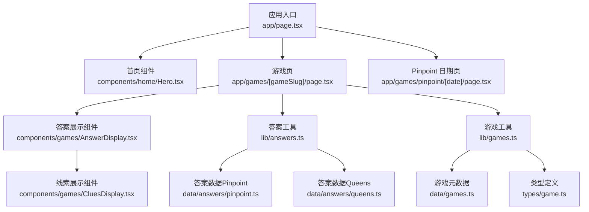
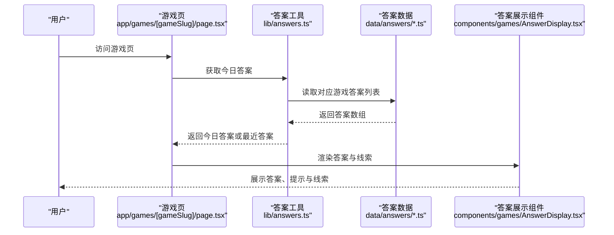
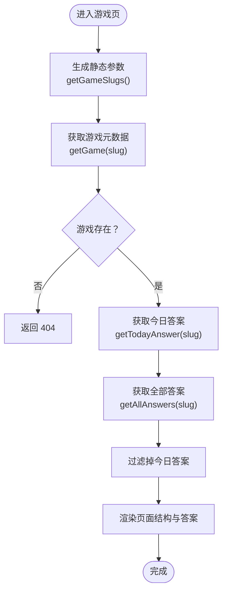
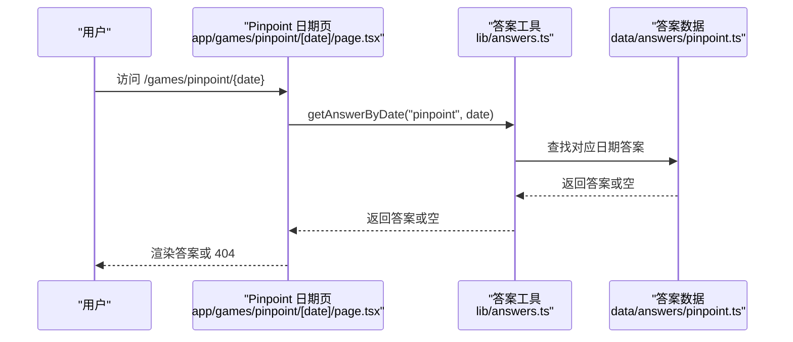
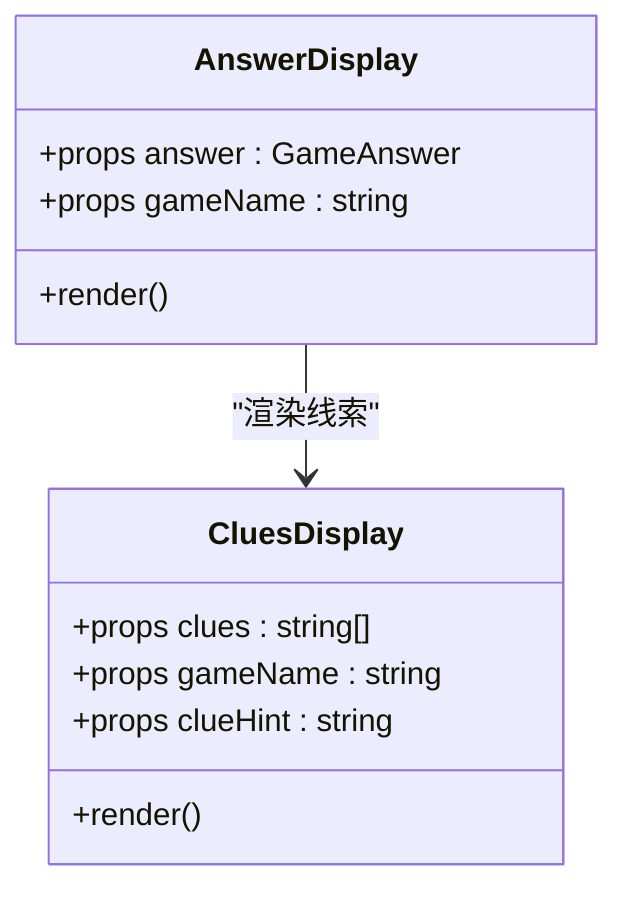
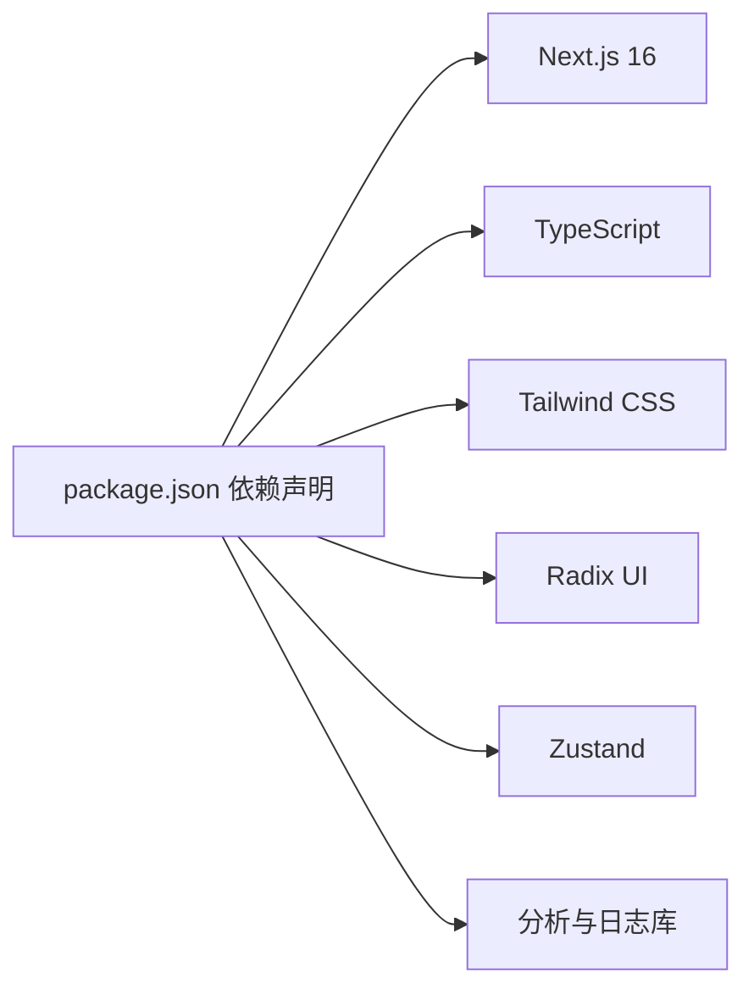

# 项目介绍

<cite>
**本文引用的文件**
- [README.md](file://README.md)
- [package.json](file://package.json)
- [app/page.tsx](file://app/page.tsx)
- [components/home/Hero.tsx](file://components/home/Hero.tsx)
- [components/games/GameCard.tsx](file://components/games/GameCard.tsx)
- [data/games.ts](file://data/games.ts)
- [data/answers/pinpoint.ts](file://data/answers/pinpoint.ts)
- [data/answers/queens.ts](file://data/answers/queens.ts)
- [types/game.ts](file://types/game.ts)
- [lib/games.ts](file://lib/games.ts)
- [lib/answers.ts](file://lib/answers.ts)
- [app/games/[gameSlug]/page.tsx](file://app/games/[gameSlug]/page.tsx)
- [app/games/pinpoint/[date]/page.tsx](file://app/games/pinpoint/[date]/page.tsx)
- [components/games/AnswerDisplay.tsx](file://components/games/AnswerDisplay.tsx)
- [components/games/CluesDisplay.tsx](file://components/games/CluesDisplay.tsx)
</cite>

## 目录
1. [引言](#引言)
2. [项目结构](#项目结构)
3. [核心组件](#核心组件)
4. [架构总览](#架构总览)
5. [详细组件分析](#详细组件分析)
6. [依赖关系分析](#依赖关系分析)
7. [性能考虑](#性能考虑)
8. [故障排查指南](#故障排查指南)
9. [结论](#结论)
10. [附录](#附录)

## 引言
LinkedIn Answer Today 是一个面向 LinkedIn 游戏用户的“答案查询与学习”平台，专注于帮助用户快速、便捷地查找 Pinpoint（线索词归类）与 Queens（逻辑填放）等每日游戏的答案与解析。项目以“即时可用、结构清晰、体验友好”为核心目标，通过静态生成与客户端交互相结合的方式，为用户提供稳定可靠的信息检索入口。

- 核心使命：让用户在最短时间内找到当日或历史答案，并获得清晰的线索提示与解题思路。
- 价值主张：降低信息搜索成本，提升用户的游戏体验与成就感；同时为内容创作者提供可扩展的多语言与多游戏支持基础。
- 社会价值：通过提供准确、及时的答案与提示，减少用户在游戏中的挫败感，增强社交互动中的参与度与乐趣。
- 用户体验改善：统一的视觉风格、清晰的导航、按日排序的历史记录、移动端友好的交互设计，使不同技术背景的用户都能轻松上手。

## 项目结构
本项目采用 Next.js App Router 的目录化组织方式，围绕“页面路由 + 数据层 + 组件层”的分层设计展开，确保可维护性与可扩展性。

- 应用入口与首页：应用根路由指向首页组件，首页展示项目名称与简要说明。
- 游戏页面：按游戏 slug 动态路由，支持“今日答案”和“历史归档”两类视图；Pinpoint 还支持按日期直接访问。
- 数据与类型：游戏元数据与答案数据分别存放于 data 目录，类型定义集中于 types 目录，便于跨组件复用。
- 工具与逻辑：lib 目录封装游戏与答案的查询逻辑，提供按日期、按最新等策略的读取能力。
- 组件层：可复用的 UI 组件（如答案展示、线索显示、游戏卡片等），负责渲染与交互。



图表来源
- [app/page.tsx](file://app/page.tsx#L1-L6)
- [components/home/Hero.tsx](file://components/home/Hero.tsx#L1-L13)
- [app/games/[gameSlug]/page.tsx](file://app/games/[gameSlug]/page.tsx#L1-L115)
- [app/games/pinpoint/[date]/page.tsx](file://app/games/pinpoint/[date]/page.tsx#L1-L90)
- [components/games/AnswerDisplay.tsx](file://components/games/AnswerDisplay.tsx#L1-L65)
- [components/games/CluesDisplay.tsx](file://components/games/CluesDisplay.tsx#L1-L74)
- [lib/answers.ts](file://lib/answers.ts#L1-L42)
- [lib/games.ts](file://lib/games.ts#L1-L15)
- [data/answers/pinpoint.ts](file://data/answers/pinpoint.ts#L1-L139)
- [data/answers/queens.ts](file://data/answers/queens.ts#L1-L59)
- [data/games.ts](file://data/games.ts#L1-L29)
- [types/game.ts](file://types/game.ts#L1-L27)

章节来源
- [README.md](file://README.md#L139-L168)
- [package.json](file://package.json#L1-L65)

## 核心组件
- 首页与标题：首页组件集中展示项目名称与简要说明，帮助新用户快速理解项目定位。
- 游戏卡片：用于展示各游戏的基本信息、跳转到“今日答案”、“归档”和“玩法说明”的入口。
- 答案展示：统一渲染答案、图片、提示与线索，支持 Pinpoint 的 5 个线索与解释性提示。
- 线索展示：以卡片形式呈现每个线索，并提供交互提示，帮助用户理解线索与答案之间的关联。

章节来源
- [components/home/Hero.tsx](file://components/home/Hero.tsx#L1-L13)
- [components/games/GameCard.tsx](file://components/games/GameCard.tsx#L1-L91)
- [components/games/AnswerDisplay.tsx](file://components/games/AnswerDisplay.tsx#L1-L65)
- [components/games/CluesDisplay.tsx](file://components/games/CluesDisplay.tsx#L1-L74)

## 架构总览
系统采用“静态生成 + 客户端交互”的混合模式：
- 页面生成：通过 App Router 的动态路由与静态参数生成，确保页面可被搜索引擎收录且加载迅速。
- 数据访问：lib 层封装答案与游戏元数据的读取逻辑，支持按日期、按最新、按归档等策略。
- 组件渲染：答案展示组件根据数据结构自动渲染文本、图片与提示；线索组件负责 Pinpoint 的线索可视化与交互提示。



图表来源
- [app/games/[gameSlug]/page.tsx](file://app/games/[gameSlug]/page.tsx#L45-L114)
- [lib/answers.ts](file://lib/answers.ts#L10-L26)
- [data/answers/pinpoint.ts](file://data/answers/pinpoint.ts#L1-L139)
- [data/answers/queens.ts](file://data/answers/queens.ts#L1-L59)
- [components/games/AnswerDisplay.tsx](file://components/games/AnswerDisplay.tsx#L1-L65)

## 详细组件分析

### 游戏页面（按游戏 slug）
- 职责：根据游戏 slug 生成页面，展示“今日答案”与“历史归档”，并提供 SEO 元数据优化。
- 关键流程：
  - 参数生成：通过静态参数生成所有已支持游戏的页面，保证可发现性。
  - 数据获取：调用答案工具获取今日答案与全部答案，排除当前答案后生成归档列表。
  - 渲染：先渲染结构化数据，再输出标题、日期、答案与归档区域。



图表来源
- [app/games/[gameSlug]/page.tsx](file://app/games/[gameSlug]/page.tsx#L14-L61)
- [lib/games.ts](file://lib/games.ts#L8-L10)
- [lib/answers.ts](file://lib/answers.ts#L14-L41)

章节来源
- [app/games/[gameSlug]/page.tsx](file://app/games/[gameSlug]/page.tsx#L1-L115)
- [lib/answers.ts](file://lib/answers.ts#L1-L42)
- [lib/games.ts](file://lib/games.ts#L1-L15)

### Pinpoint 日期页面（按日期）
- 职责：允许用户通过日期直接访问某一天的 Pinpoint 答案，增强可发现性与回溯能力。
- 关键流程：
  - 参数生成：基于答案列表生成所有有效日期的静态参数。
  - 数据获取：按日期精确匹配答案，不存在时返回 404。
  - 渲染：输出标题、日期、答案与导航。



图表来源
- [app/games/pinpoint/[date]/page.tsx](file://app/games/pinpoint/[date]/page.tsx#L14-L59)
- [lib/answers.ts](file://lib/answers.ts#L28-L34)
- [data/answers/pinpoint.ts](file://data/answers/pinpoint.ts#L1-L139)

章节来源
- [app/games/pinpoint/[date]/page.tsx](file://app/games/pinpoint/[date]/page.tsx#L1-L90)
- [lib/answers.ts](file://lib/answers.ts#L28-L34)

### 答案展示组件
- 职责：统一渲染答案主体、可选图片、提示与线索，支持多游戏通用结构。
- 关键点：
  - 图片渲染：当答案包含图片时，以响应式容器展示。
  - 提示渲染：当存在 hints 时，以列表形式展示。
  - 线索渲染：委托给线索展示组件处理。



图表来源
- [components/games/AnswerDisplay.tsx](file://components/games/AnswerDisplay.tsx#L1-L65)
- [components/games/CluesDisplay.tsx](file://components/games/CluesDisplay.tsx#L1-L74)

章节来源
- [components/games/AnswerDisplay.tsx](file://components/games/AnswerDisplay.tsx#L1-L65)
- [components/games/CluesDisplay.tsx](file://components/games/CluesDisplay.tsx#L1-L74)

### 游戏卡片组件
- 职责：展示游戏名称、描述与操作入口（今日答案、归档、玩法说明），并提供外部链接直达游戏。
- 关键点：
  - 彩色主题：通过颜色映射为不同游戏提供视觉区分。
  - 操作入口：一键跳转至游戏页、归档页与玩法说明页。

章节来源
- [components/games/GameCard.tsx](file://components/games/GameCard.tsx#L1-L91)

### 类型与数据模型
- 游戏类型：定义 slug、名称、描述、链接与颜色等字段，支持扩展更多游戏。
- 答案类型：支持单答案或多答案、可选线索、提示与图片等字段，满足不同游戏的数据需求。
- 数据文件：分别存放 Pinpoint 与 Queens 的答案数据，便于维护与扩展。

```mermaid
erDiagram
GAME {
string slug
string name
string description
string playUrl
string icon
string color
}
GAMEANSWER {
string sequence
string date
string|[] answer
string[] clues
string clueHint
string[] hints
string image
}
GAME ||--o{ GAMEANSWER : "拥有"
```

图表来源
- [types/game.ts](file://types/game.ts#L1-L27)
- [data/answers/pinpoint.ts](file://data/answers/pinpoint.ts#L1-L139)
- [data/answers/queens.ts](file://data/answers/queens.ts#L1-L59)

章节来源
- [types/game.ts](file://types/game.ts#L1-L27)
- [data/games.ts](file://data/games.ts#L1-L29)
- [data/answers/pinpoint.ts](file://data/answers/pinpoint.ts#L1-L139)
- [data/answers/queens.ts](file://data/answers/queens.ts#L1-L59)

## 依赖关系分析
- 技术栈：Next.js 16（App Router）、TypeScript、Tailwind CSS、Radix UI、Zustand 状态管理等。
- 国际化与部署：项目内置国际化与部署相关配置，便于多语言与多平台发布。
- 外部依赖：包含分析、邮件、日志、限流等实用库，支撑生产级运行。



图表来源
- [package.json](file://package.json#L16-L51)

章节来源
- [package.json](file://package.json#L1-L65)
- [README.md](file://README.md#L170-L179)

## 性能考虑
- 静态生成：通过静态参数生成与页面预渲染，显著降低首屏加载时间与服务器压力。
- 响应式图片：答案图片采用响应式尺寸与容器，兼顾加载速度与显示质量。
- 组件拆分：答案展示与线索展示分离，便于按需渲染与缓存优化。
- 数据排序：按日期降序排列历史答案，提升用户浏览效率。

## 故障排查指南
- 页面 404：当游戏 slug 或日期无效时，页面将返回 404。请检查路径与参数是否正确。
- 无答案数据：若某日无答案，页面会提示“暂无答案”。可切换到历史归档查看其他日期。
- 线索提示异常：线索提示支持 HTML 内容，若出现格式问题，请检查 clueHint 字段的 HTML 结构与包裹标签。
- 本地开发：确保环境变量与依赖安装正确，参考项目提供的开发与部署指引。

章节来源
- [app/games/[gameSlug]/page.tsx](file://app/games/[gameSlug]/page.tsx#L49-L51)
- [app/games/pinpoint/[date]/page.tsx](file://app/games/pinpoint/[date]/page.tsx#L57-L59)
- [components/games/CluesDisplay.tsx](file://components/games/CluesDisplay.tsx#L20-L30)

## 结论
LinkedIn Answer Today 以简洁明确的定位服务于 LinkedIn 游戏爱好者：快速获取 Pinpoint 与 Queens 的答案与线索，享受一致、直观的阅读体验。项目通过清晰的分层架构、可扩展的数据模型与组件化设计，既满足初学者的快速上手，也为后续扩展更多游戏与功能提供了坚实基础。

## 附录
- 开发者入门建议：从首页与游戏卡片开始，逐步理解页面路由与数据流；通过答案展示与线索组件掌握渲染逻辑；最后结合类型定义与数据文件进行扩展。
- 扩展方向：新增游戏只需在数据层添加答案文件与在类型中声明 slug，即可无缝接入现有页面与工具层。