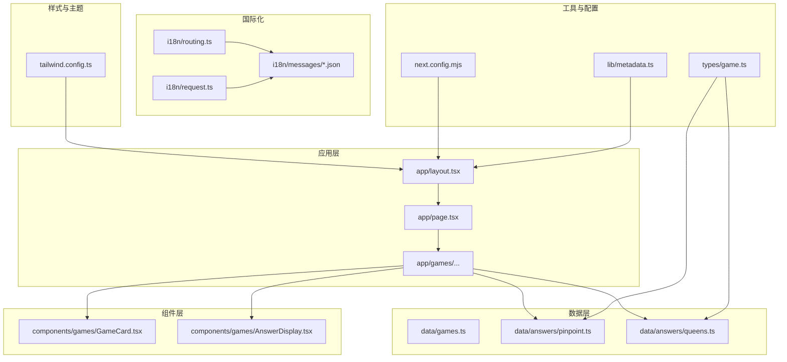
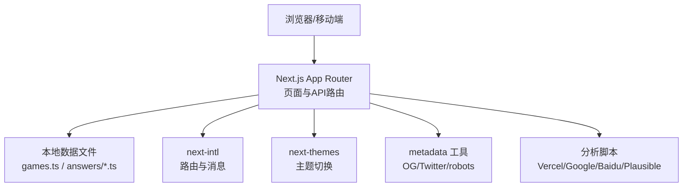
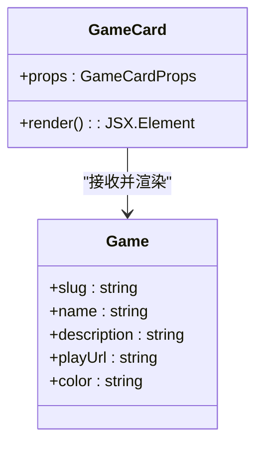
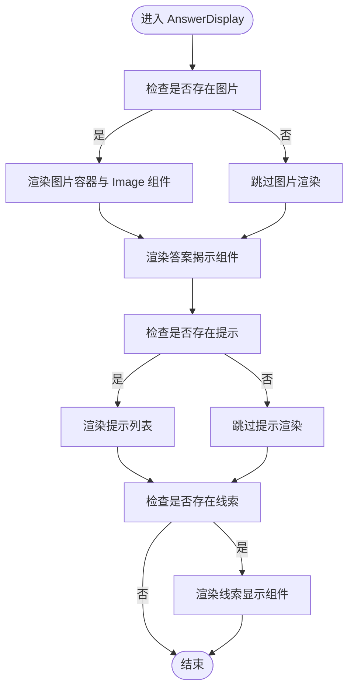
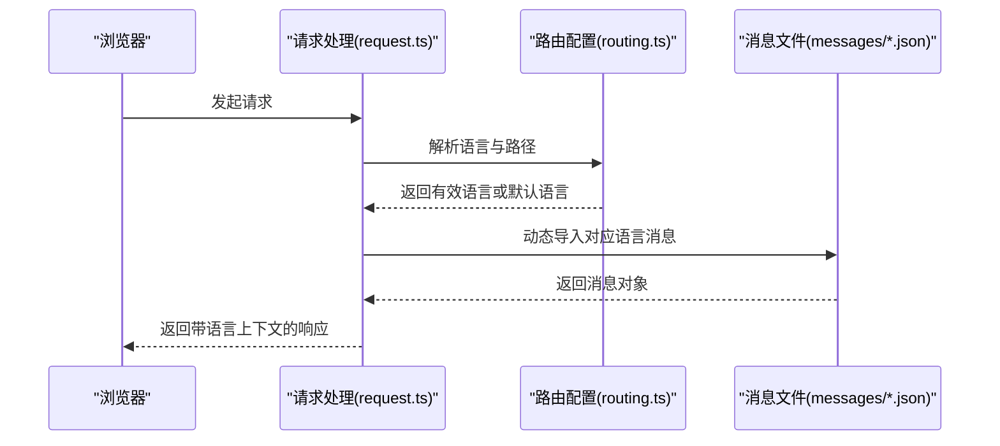
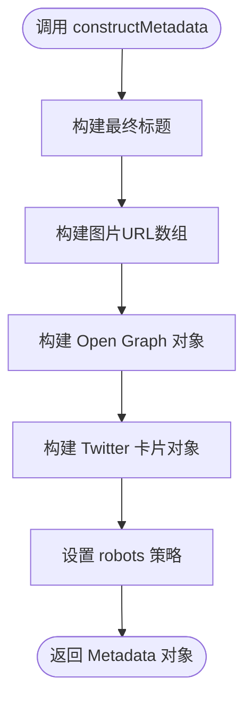
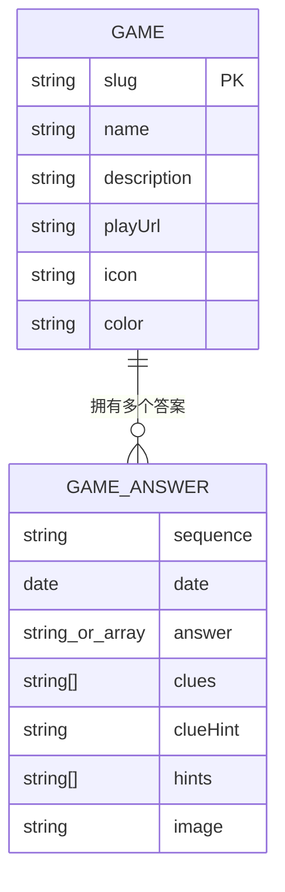
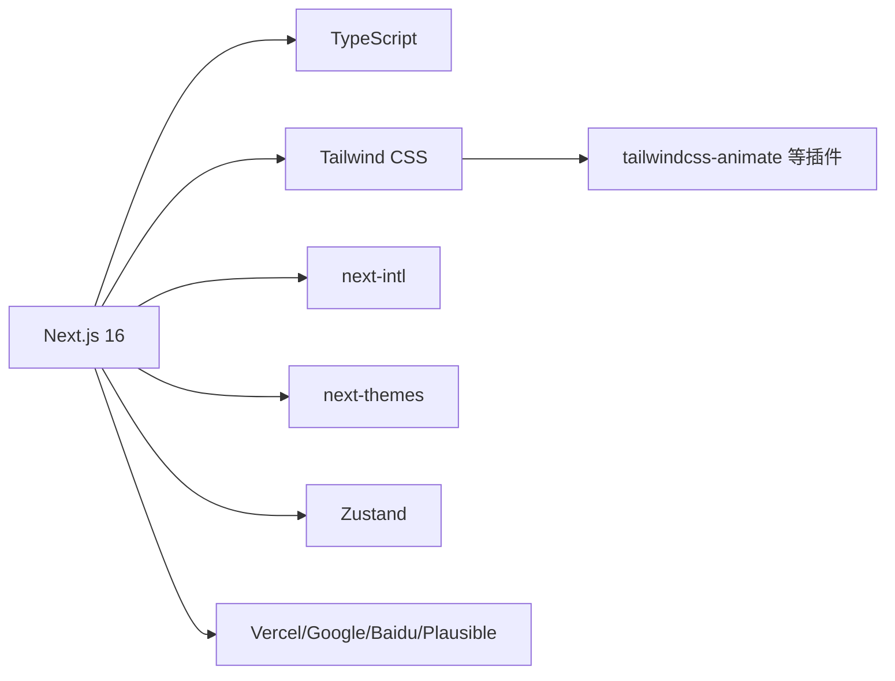

# 项目概述

<cite>
**本文档引用的文件**
- [README.md](file://README.md)
- [package.json](file://package.json)
- [next.config.mjs](file://next.config.mjs)
- [tailwind.config.ts](file://tailwind.config.ts)
- [app/layout.tsx](file://app/layout.tsx)
- [data/games.ts](file://data/games.ts)
- [data/answers/pinpoint.ts](file://data/answers/pinpoint.ts)
- [data/answers/queens.ts](file://data/answers/queens.ts)
- [components/games/GameCard.tsx](file://components/games/GameCard.tsx)
- [components/games/AnswerDisplay.tsx](file://components/games/AnswerDisplay.tsx)
- [i18n/routing.ts](file://i18n/routing.ts)
- [i18n/request.ts](file://i18n/request.ts)
- [i18n/messages/en.json](file://i18n/messages/en.json)
- [lib/metadata.ts](file://lib/metadata.ts)
- [types/game.ts](file://types/game.ts)
</cite>

## 目录
1. [引言](#引言)
2. [项目结构](#项目结构)
3. [核心组件](#核心组件)
4. [架构总览](#架构总览)
5. [详细组件分析](#详细组件分析)
6. [依赖关系分析](#依赖关系分析)
7. [性能考虑](#性能考虑)
8. [故障排除指南](#故障排除指南)
9. [结论](#结论)
10. [附录](#附录)

## 引言
LinkedIn Answer Today 是一个面向 LinkedIn 游戏（如 Pinpoint、Queens 等）的“今日答案”查询与展示平台。项目以 Next.js 16 App Router 构建，采用 TypeScript、Tailwind CSS、next-intl 国际化方案，提供多语言支持、SEO 优化、暗黑主题切换、响应式布局，并内置多种分析工具集成。该平台旨在帮助用户快速查找每日游戏答案、查看历史归档、了解玩法说明，并通过清晰的 UI 提升阅读与交互体验。

本项目既适合初学者快速上手，也为有经验的开发者提供了可扩展的架构与最佳实践参考。

## 项目结构
项目采用基于 App Router 的目录组织方式，关键模块包括：
- 应用层：页面路由、全局布局、元数据生成
- 数据层：游戏与答案数据定义与存储
- 组件层：可复用 UI 组件与游戏专用组件
- 国际化：多语言消息、路由与请求处理
- 样式与主题：Tailwind CSS 主题系统与暗黑模式
- 工具与配置：构建配置、元数据工具、类型定义

图表来源
- [app/layout.tsx](file://app/layout.tsx#L1-L78)
- [data/games.ts](file://data/games.ts#L1-L29)
- [data/answers/pinpoint.ts](file://data/answers/pinpoint.ts#L1-L139)
- [data/answers/queens.ts](file://data/answers/queens.ts#L1-L59)
- [components/games/GameCard.tsx](file://components/games/GameCard.tsx#L1-L91)
- [components/games/AnswerDisplay.tsx](file://components/games/AnswerDisplay.tsx#L1-L65)
- [i18n/routing.ts](file://i18n/routing.ts#L1-L37)
- [i18n/request.ts](file://i18n/request.ts#L1-L28)
- [i18n/messages/en.json](file://i18n/messages/en.json#L1-L110)
- [tailwind.config.ts](file://tailwind.config.ts#L1-L95)
- [next.config.mjs](file://next.config.mjs#L1-L28)
- [lib/metadata.ts](file://lib/metadata.ts#L1-L78)
- [types/game.ts](file://types/game.ts#L1-L27)

章节来源
- [README.md](file://README.md#L139-L168)
- [package.json](file://package.json#L1-L65)
- [next.config.mjs](file://next.config.mjs#L1-L28)
- [tailwind.config.ts](file://tailwind.config.ts#L1-L95)
- [app/layout.tsx](file://app/layout.tsx#L1-L78)

## 核心组件
- 游戏卡片组件：用于展示游戏名称、描述与入口链接（今日答案、归档、玩法说明），并根据颜色主题提供视觉反馈。
- 答案展示组件：负责渲染答案、提示、线索与图像；支持格式化日期与交互式显示。
- 元数据工具：统一生成 SEO 友好的标题、描述、Open Graph 图片与 Twitter 卡片信息。
- 国际化路由与请求处理：支持自动语言检测、多语言消息加载与路径前缀控制。
- 布局与主题：全局主题切换、暗黑模式、分析脚本注入与全局样式引入。

章节来源
- [components/games/GameCard.tsx](file://components/games/GameCard.tsx#L1-L91)
- [components/games/AnswerDisplay.tsx](file://components/games/AnswerDisplay.tsx#L1-L65)
- [lib/metadata.ts](file://lib/metadata.ts#L1-L78)
- [i18n/routing.ts](file://i18n/routing.ts#L1-L37)
- [i18n/request.ts](file://i18n/request.ts#L1-L28)
- [app/layout.tsx](file://app/layout.tsx#L1-L78)

## 架构总览
系统采用前后端同构架构，前端在服务端生成静态或动态页面，结合客户端交互增强用户体验。数据通过本地数据文件与类型定义进行管理，国际化通过 next-intl 实现，样式与主题由 Tailwind CSS 与 next-themes 提供。

图表来源
- [app/layout.tsx](file://app/layout.tsx#L1-L78)
- [lib/metadata.ts](file://lib/metadata.ts#L1-L78)
- [i18n/routing.ts](file://i18n/routing.ts#L1-L37)
- [i18n/request.ts](file://i18n/request.ts#L1-L28)
- [data/games.ts](file://data/games.ts#L1-L29)
- [data/answers/pinpoint.ts](file://data/answers/pinpoint.ts#L1-L139)
- [data/answers/queens.ts](file://data/answers/queens.ts#L1-L59)

## 详细组件分析

### 游戏卡片组件（GameCard）
- 职责：展示单个游戏的基本信息与入口按钮，支持跳转至“今日答案”、“归档”、“如何游玩”页面。
- 设计要点：根据游戏颜色映射边框与文本色，悬停时提供阴影与边框强调；外部链接使用图标增强可识别性。
- 扩展建议：可增加评分、难度标签或最近更新时间等信息。

图表来源
- [components/games/GameCard.tsx](file://components/games/GameCard.tsx#L1-L91)
- [types/game.ts](file://types/game.ts#L15-L22)

章节来源
- [components/games/GameCard.tsx](file://components/games/GameCard.tsx#L1-L91)
- [types/game.ts](file://types/game.ts#L15-L22)

### 答案展示组件（AnswerDisplay）
- 职责：渲染答案、提示、线索与图像；支持格式化日期与交互式显示。
- 处理逻辑：根据是否存在图像决定是否渲染图片容器；渲染答案揭示组件；条件性渲染提示列表与线索显示组件。
- 性能与可用性：使用 Next.js Image 进行自适应尺寸与懒加载；日期格式化确保跨语言一致性。

图表来源
- [components/games/AnswerDisplay.tsx](file://components/games/AnswerDisplay.tsx#L1-L65)

章节来源
- [components/games/AnswerDisplay.tsx](file://components/games/AnswerDisplay.tsx#L1-L65)

### 国际化与路由（next-intl）
- 路由配置：定义支持的语言列表、默认语言、自动语言检测与路径前缀策略。
- 请求处理：根据请求语言加载对应消息文件，确保无效或不匹配语言回退到默认语言。
- 消息结构：按命名空间组织翻译键值，便于在组件中按需使用。

图表来源
- [i18n/request.ts](file://i18n/request.ts#L1-L28)
- [i18n/routing.ts](file://i18n/routing.ts#L1-L37)
- [i18n/messages/en.json](file://i18n/messages/en.json#L1-L110)

章节来源
- [i18n/routing.ts](file://i18n/routing.ts#L1-L37)
- [i18n/request.ts](file://i18n/request.ts#L1-L28)
- [i18n/messages/en.json](file://i18n/messages/en.json#L1-L110)

### 元数据与 SEO（constructMetadata）
- 职责：统一生成页面标题、描述、Open Graph 图片、Twitter 卡片与 robots 策略。
- 关键点：支持传入页面名、路径、规范链接与是否索引控制；自动拼接站点标题与分隔符；默认使用站点配置中的 URL 与图片资源。

图表来源
- [lib/metadata.ts](file://lib/metadata.ts#L1-L78)
- [app/layout.tsx](file://app/layout.tsx#L18-L26)

章节来源
- [lib/metadata.ts](file://lib/metadata.ts#L1-L78)
- [app/layout.tsx](file://app/layout.tsx#L18-L26)

### 数据模型与答案存储
- 类型定义：Game、GameAnswer、GameWithAnswers 等类型明确字段约束与可选属性。
- 数据文件：Pinpoint 与 Queens 的答案数据以数组形式存储，包含序列号、日期、答案、线索、提示与可选图片。

图表来源
- [types/game.ts](file://types/game.ts#L1-L27)
- [data/games.ts](file://data/games.ts#L1-L29)
- [data/answers/pinpoint.ts](file://data/answers/pinpoint.ts#L1-L139)
- [data/answers/queens.ts](file://data/answers/queens.ts#L1-L59)

章节来源
- [types/game.ts](file://types/game.ts#L1-L27)
- [data/games.ts](file://data/games.ts#L1-L29)
- [data/answers/pinpoint.ts](file://data/answers/pinpoint.ts#L1-L139)
- [data/answers/queens.ts](file://data/answers/queens.ts#L1-L59)

## 依赖关系分析
- 技术栈：Next.js 16、TypeScript、Tailwind CSS、next-intl、Zustand（状态管理）、React 生态组件库与分析工具。
- 构建配置：启用静态导出（output: export），生产环境移除 console 日志，远程图片源白名单。
- 样式配置：Tailwind 支持暗黑模式、容器限制、动画扩展与插件化主题。

图表来源
- [package.json](file://package.json#L16-L52)
- [next.config.mjs](file://next.config.mjs#L1-L28)
- [tailwind.config.ts](file://tailwind.config.ts#L1-L95)

章节来源
- [package.json](file://package.json#L1-L65)
- [next.config.mjs](file://next.config.mjs#L1-L28)
- [tailwind.config.ts](file://tailwind.config.ts#L1-L95)

## 性能考虑
- 静态导出：通过输出静态 HTML，降低运行时开销，提升首屏速度与 CDN 友好度。
- 图片优化：在静态导出模式下禁用 Next.js 图片优化，配合自定义远程图片源白名单，确保外链图片正常加载。
- 生产日志：仅保留错误日志，避免控制台冗余输出影响性能。
- 主题与样式：Tailwind 基于类名的原子化设计减少运行时计算，暗黑模式切换无额外网络请求。

章节来源
- [next.config.mjs](file://next.config.mjs#L3-L24)
- [tailwind.config.ts](file://tailwind.config.ts#L1-L95)

## 故障排除指南
- 包管理器版本不一致：清理 node_modules 与锁文件后重新安装，确保团队成员使用相同 pnpm 版本。
- MDX 内容未显示：检查文件路径、Frontmatter 格式与可见性字段，确认已发布。
- 国际化路由问题：使用 i18n/routing.ts 中提供的 Link 组件，检查中间件与路由配置。
- 样式异常：确认 Tailwind 类名正确，重启开发服务器以应用最新样式。

章节来源
- [README.md](file://README.md#L239-L271)

## 结论
LinkedIn Answer Today 项目以 Next.js 16 为基础，结合 TypeScript、Tailwind CSS 与 next-intl，构建了具备多语言支持、SEO 优化与良好可维护性的游戏答案查询平台。其模块化结构与清晰的数据模型便于扩展更多游戏与功能；静态导出与主题系统提升了性能与用户体验。对于初学者，项目提供了完整的脚手架与示例；对有经验的开发者，项目展示了现代 Web 开发的最佳实践与可扩展性。

## 附录
- 使用场景：每日答案查询、历史归档浏览、玩法说明查阅、多语言内容消费。
- 部署选项：支持静态导出部署至任意静态托管平台，或部署至 Vercel 获取完整分析与边缘优化能力。
- 扩展方向：新增游戏数据、完善 Queens 游戏答案与解法可视化、集成邮件订阅与提交功能。