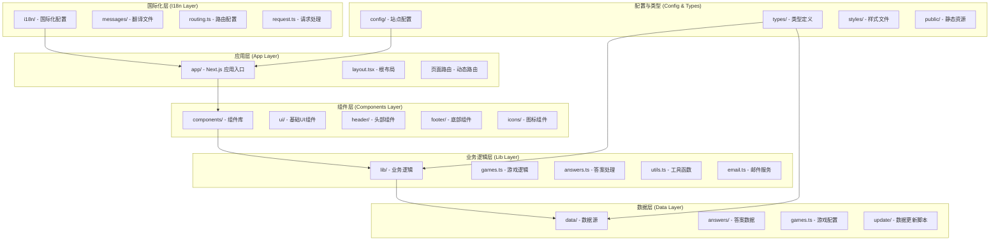
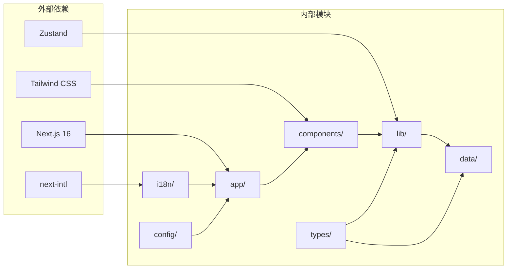
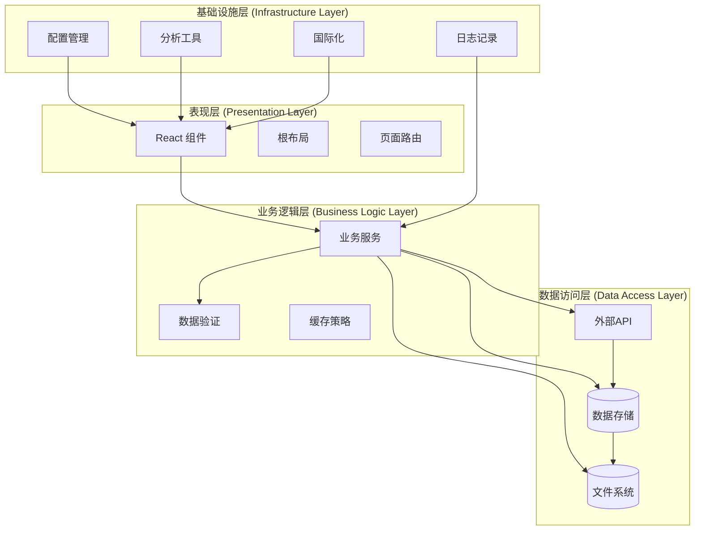
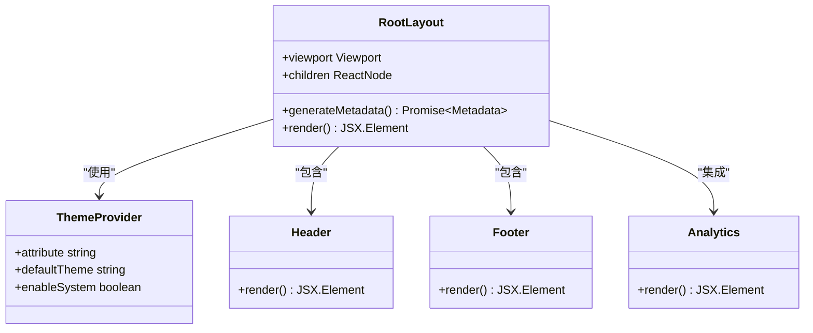
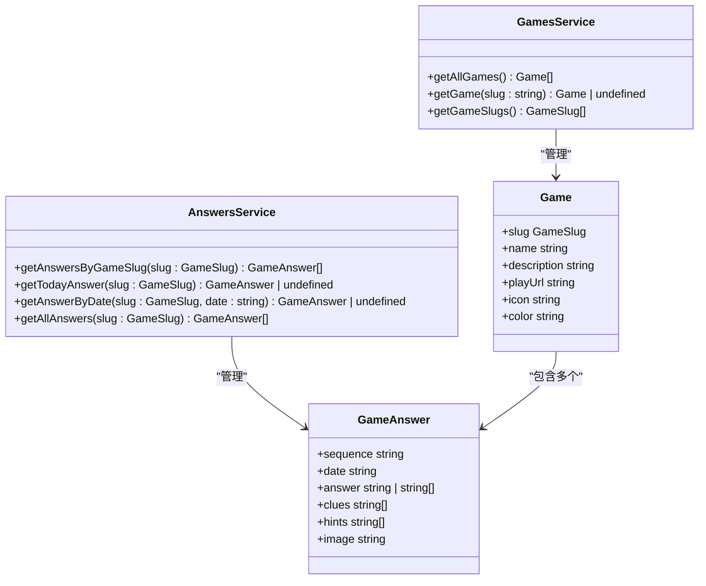
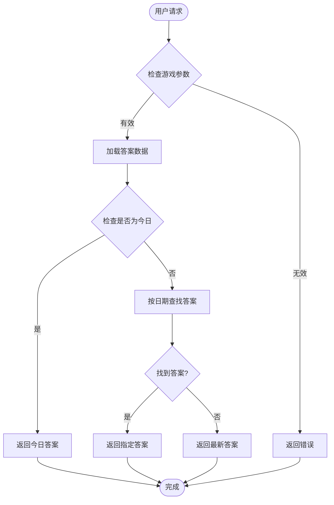
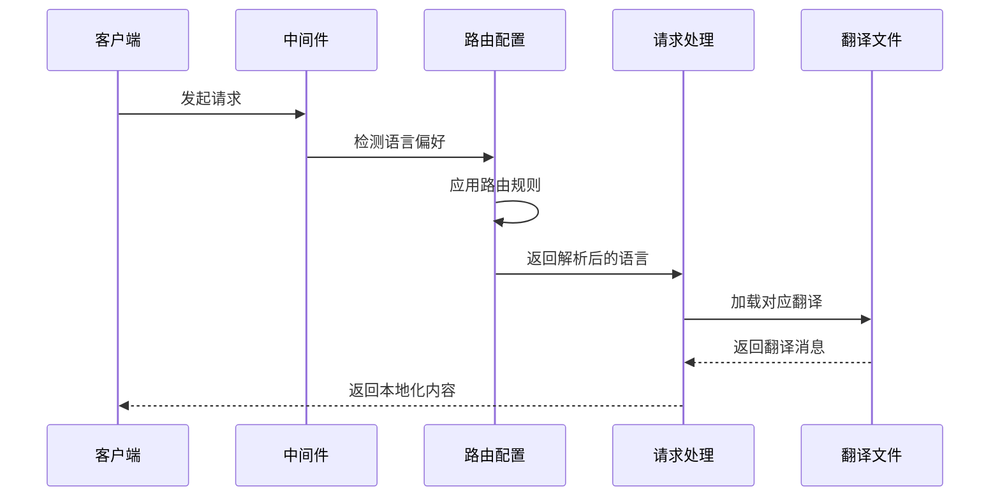
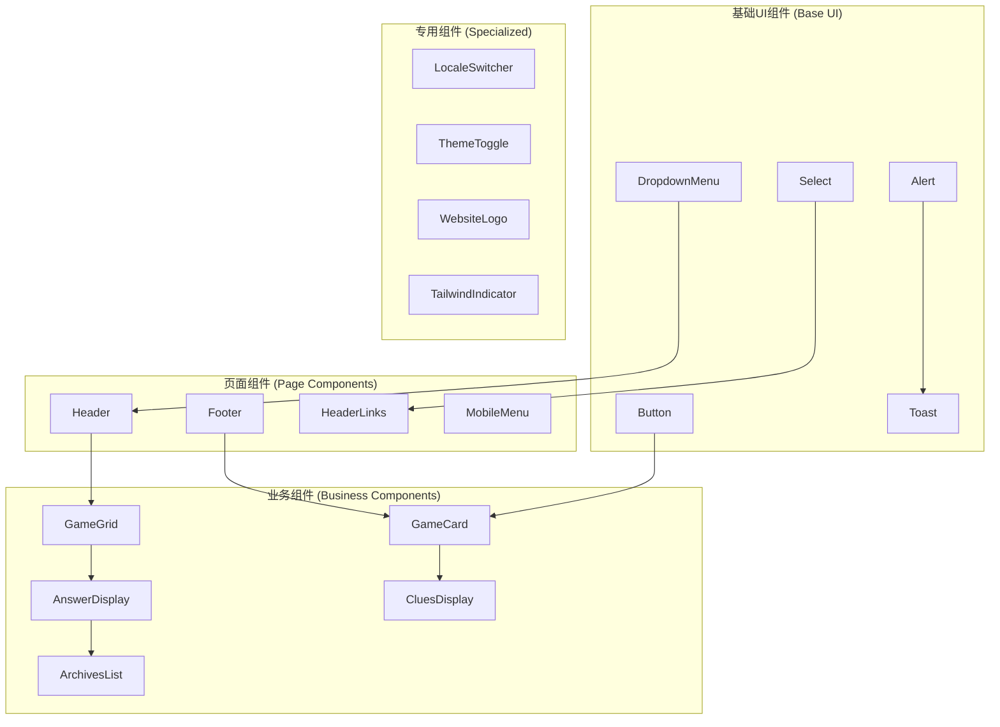
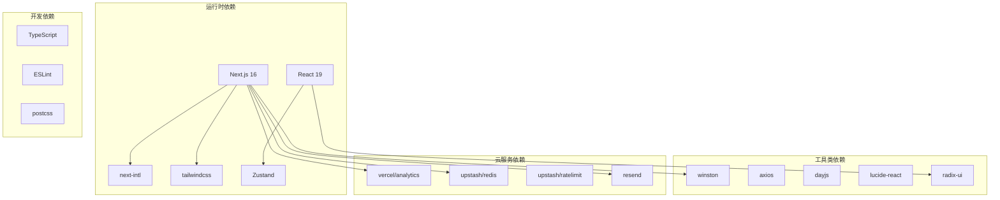

# 项目结构概览

<cite>
**本文档引用的文件**
- [README.md](file://README.md)
- [package.json](file://package.json)
- [next.config.mjs](file://next.config.mjs)
- [tailwind.config.ts](file://tailwind.config.ts)
- [tsconfig.json](file://tsconfig.json)
- [config/site.ts](file://config/site.ts)
- [i18n/routing.ts](file://i18n/routing.ts)
- [i18n/request.ts](file://i18n/request.ts)
- [app/layout.tsx](file://app/layout.tsx)
- [components/home/index.tsx](file://components/home/index.tsx)
- [lib/games.ts](file://lib/games.ts)
- [lib/answers.ts](file://lib/answers.ts)
- [types/game.ts](file://types/game.ts)
- [types/blog.ts](file://types/blog.ts)
- [data/games.ts](file://data/games.ts)
</cite>

## 目录
1. [简介](#简介)
2. [项目结构](#项目结构)
3. [核心组件](#核心组件)
4. [架构总览](#架构总览)
5. [详细组件分析](#详细组件分析)
6. [依赖关系分析](#依赖关系分析)
7. [性能考虑](#性能考虑)
8. [故障排除指南](#故障排除指南)
9. [结论](#结论)

## 简介
本项目是基于 Next.js 16 App Router 的多语言网站，专注于提供 LinkedIn 游戏（如 Pinpoint）的每日答案查询服务。项目采用模块化设计，通过清晰的目录结构实现代码的可维护性和可扩展性。项目支持英语、中文、日语三种语言，并集成了现代化的 UI 设计、SEO 优化、分析工具集成等功能。

## 项目结构
项目采用典型的 Next.js 16 App Router 结构，结合现代前端开发最佳实践。整体架构围绕以下核心目录展开：

**图表来源**
- [package.json](file://package.json#L1-L65)
- [next.config.mjs](file://next.config.mjs#L1-L28)
- [tsconfig.json](file://tsconfig.json#L1-L43)

### 目录组织说明

#### app/ - Next.js 应用程序入口
- **功能定位**: Next.js 16 App Router 的应用程序根目录
- **核心职责**: 
  - 定义全局布局和元数据
  - 管理国际化路由
  - 集成分析工具和第三方服务
  - 提供页面级路由（如 about、privacy-policy、terms-of-service）
- **特色功能**: 支持动态路由参数，如游戏详情页的 `[gameSlug]` 和日期参数 `[date]`

#### components/ - 组件库
- **功能定位**: 可复用的 React 组件集合
- **组织结构**:
  - `ui/`: 基础 UI 组件（按钮、下拉菜单、选择器等）
  - `header/` 和 `footer/`: 页面头部和底部组件
  - `games/`: 游戏相关的专用组件
  - `icons/`: 图标组件集合
  - `mdx/`: MDX 内容渲染组件
  - `social-icons/`: 社交媒体图标组件

#### lib/ - 业务逻辑层
- **功能定位**: 应用的核心业务逻辑封装
- **关键模块**:
  - `games.ts`: 游戏信息管理和查询
  - `answers.ts`: 答案数据处理和查询
  - `metadata.ts`: SEO 元数据生成
  - `email.ts`: 邮件发送服务
  - `logger.ts`: 日志记录服务
  - `utils.ts`: 通用工具函数

#### data/ - 数据源
- **功能定位**: 应用的数据存储和管理
- **内容组织**:
  - `answers/`: 各游戏的答案数据（如 pinpoint.ts、queens.ts）
  - `games.ts`: 游戏基本信息配置
  - `update/`: 数据更新脚本

#### i18n/ - 国际化配置
- **功能定位**: 多语言支持系统
- **核心组件**:
  - `messages/`: 翻译文件（en.json、zh.json、ja.json）
  - `routing.ts`: 国际化路由配置
  - `request.ts`: 请求处理和语言检测

#### config/ - 配置文件
- **功能定位**: 应用配置中心
- **核心配置**: `site.ts` 包含站点基本信息、社交媒体链接、主题设置等

#### types/ - 类型定义
- **功能定位**: TypeScript 类型安全
- **包含类型**: `game.ts`（游戏相关类型）、`blog.ts`（博客类型）、`common.ts`、`siteConfig.ts`

**章节来源**
- [README.md](file://README.md#L139-L168)
- [package.json](file://package.json#L1-L65)

## 核心组件

### 模块化设计理念
项目采用分层架构设计，通过以下原则实现模块化：

1. **关注点分离**: 每个目录负责特定领域的功能
2. **依赖倒置**: 上层组件依赖于抽象接口而非具体实现
3. **单一职责**: 每个模块专注于特定业务领域
4. **可测试性**: 清晰的边界便于单元测试和集成测试

### 目录耦合关系

**图表来源**
- [package.json](file://package.json#L16-L51)
- [tsconfig.json](file://tsconfig.json#L26-L30)

**章节来源**
- [package.json](file://package.json#L16-L51)
- [tsconfig.json](file://tsconfig.json#L26-L30)

## 架构总览

### 整体架构模式
项目采用典型的三层架构模式，结合现代前端开发框架的最佳实践：

**图表来源**
- [app/layout.tsx](file://app/layout.tsx#L1-L78)
- [lib/answers.ts](file://lib/answers.ts#L1-L42)
- [lib/games.ts](file://lib/games.ts#L1-L15)

### 技术栈集成
项目集成了多种现代前端技术栈：

- **框架**: Next.js 16 (App Router)
- **样式**: Tailwind CSS + Shadcn/ui
- **国际化**: next-intl
- **状态管理**: Zustand
- **类型系统**: TypeScript
- **构建工具**: pnpm
- **部署**: Vercel/Cloudflare

**章节来源**
- [README.md](file://README.md#L170-L179)
- [package.json](file://package.json#L16-L51)

## 详细组件分析

### 根布局组件分析
根布局组件负责整个应用的基础结构和全局配置：

**图表来源**
- [app/layout.tsx](file://app/layout.tsx#L32-L77)

#### 根布局的关键特性
1. **主题管理**: 集成 next-themes 实现明暗主题切换
2. **SEO 优化**: 自动生成元数据和视口配置
3. **分析集成**: 集成多种分析工具（Vercel Analytics、Google Analytics、Baidu Analytics等）
4. **响应式设计**: 使用 Tailwind CSS 实现移动端适配

**章节来源**
- [app/layout.tsx](file://app/layout.tsx#L1-L78)
- [config/site.ts](file://config/site.ts#L1-L45)

### 游戏管理系统分析
游戏管理系统采用模块化设计，通过清晰的接口实现游戏数据的统一管理：

**图表来源**
- [lib/games.ts](file://lib/games.ts#L1-L15)
- [lib/answers.ts](file://lib/answers.ts#L1-L42)
- [types/game.ts](file://types/game.ts#L1-L27)

#### 数据流处理流程

**图表来源**
- [lib/answers.ts](file://lib/answers.ts#L14-L26)

**章节来源**
- [lib/games.ts](file://lib/games.ts#L1-L15)
- [lib/answers.ts](file://lib/answers.ts#L1-L42)
- [types/game.ts](file://types/game.ts#L1-L27)

### 国际化系统分析
国际化系统采用 next-intl 提供的完整解决方案，支持自动语言检测和路由配置：

**图表来源**
- [i18n/routing.ts](file://i18n/routing.ts#L12-L23)
- [i18n/request.ts](file://i18n/request.ts#L4-L27)

#### 国际化配置特点
1. **语言支持**: 英语(en)、中文(zh)、日语(ja)
2. **自动检测**: 支持基于浏览器语言的自动检测
3. **路由前缀**: 使用 as-needed 策略优化 URL 结构
4. **消息管理**: 每种语言独立的翻译文件管理

**章节来源**
- [i18n/routing.ts](file://i18n/routing.ts#L1-L37)
- [i18n/request.ts](file://i18n/request.ts#L1-L28)

### 组件库架构分析
组件库采用分层设计，从基础 UI 组件到业务组件形成完整的组件体系：

**图表来源**
- [components/home/index.tsx](file://components/home/index.tsx#L1-L12)

**章节来源**
- [components/home/index.tsx](file://components/home/index.tsx#L1-L12)

## 依赖关系分析

### 核心依赖关系图

**图表来源**
- [package.json](file://package.json#L16-L51)

### 依赖版本管理
项目采用 pnpm 作为包管理器，具有以下优势：
1. **安装速度**: 快速的依赖安装和链接
2. **磁盘空间**: 高效的依赖存储
3. **一致性**: 确保团队成员使用相同版本
4. **工作区**: 支持 monorepo 管理

**章节来源**
- [package.json](file://package.json#L1-L65)
- [README.md](file://README.md#L40-L45)

## 性能考虑
项目在多个层面考虑了性能优化：

### 构建时优化
- **静态导出**: 配置为静态站点生成，减少服务器负载
- **图片优化**: 在静态导出模式下禁用图片优化以确保兼容性
- **控制台移除**: 生产环境自动移除控制台日志

### 运行时优化
- **代码分割**: Next.js 自动进行代码分割
- **懒加载**: 组件和页面支持懒加载
- **缓存策略**: Redis 缓存用于数据存储
- **CDN 集成**: 支持 R2 存储服务

### 开发体验优化
- **热重载**: 开发服务器支持实时更新
- **类型检查**: TypeScript 提供编译时类型安全
- **代码格式化**: ESLint 和 Prettier 保持代码风格一致

## 故障排除指南

### 常见问题诊断
1. **包管理器版本不匹配**
   - 症状: 安装失败或依赖不兼容
   - 解决方案: 启用 Corepack 并使用推荐的 pnpm 版本

2. **MDX 文件不显示**
   - 症状: 博客内容无法渲染
   - 解决方案: 检查文件路径、frontmatter 格式和可见性设置

3. **国际化路由问题**
   - 症状: 语言切换异常
   - 解决方案: 使用 i18n/routing.ts 中的 Link 组件，检查 middleware 配置

4. **样式不生效**
   - 症状: 组件样式异常
   - 解决方案: 验证 Tailwind CSS 类名，重启开发服务器

### 环境变量配置
确保 .env 文件包含必要的配置项：
- 分析工具 ID
- 数据库连接信息
- 第三方服务密钥

**章节来源**
- [README.md](file://README.md#L239-L271)

## 结论
LinkedIn Answer Today 项目通过精心设计的目录结构和模块化架构，成功实现了高内聚、低耦合的代码组织。项目的核心优势包括：

1. **清晰的层次结构**: 从应用层到数据层的明确分工
2. **强大的国际化支持**: 基于 next-intl 的完整多语言解决方案
3. **现代化的技术栈**: 集成最新的前端开发技术和最佳实践
4. **良好的可维护性**: 通过类型安全和模块化设计提升代码质量
5. **优秀的开发体验**: 完善的工具链和配置支持高效开发

这种架构设计不仅满足了当前的功能需求，也为未来的功能扩展和技术演进奠定了坚实的基础。新加入的开发者可以快速理解项目结构，按照既定的设计原则进行功能开发和维护。